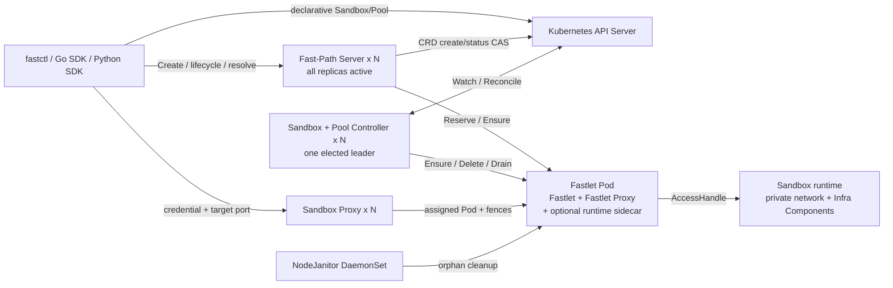
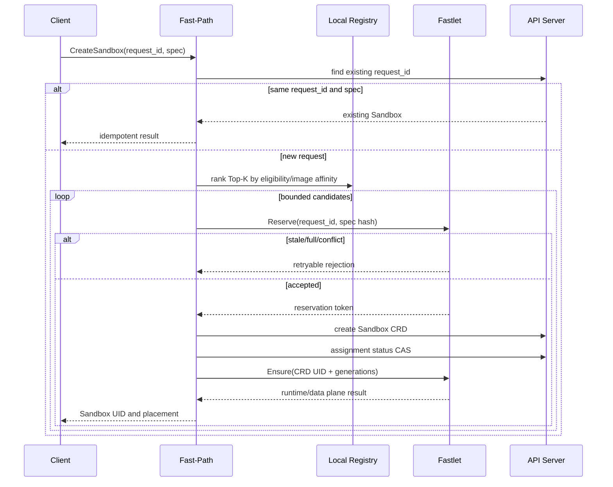

# Fast Sandbox Architecture

This document describes the current post-refactor architecture. The design decisions and implementation history remain available under [docs/superpowers](docs/superpowers).

## 1. System boundaries

Fast Sandbox owns:

- Sandbox lifecycle state and placement;
- Pool capacity and fixed per-Sandbox resource profiles;
- runtime creation through containerd, Kata/gVisor profiles, or BoxLite adapters;
- per-Sandbox private networking and an internal AccessHandle;
- Infra Component injection and readiness coordination;
- endpoint resolution, short-lived route credentials, and transparent proxying;
- cleanup of resources left by lost Fastlet Pods or nodes.

Fast Sandbox does not define a user-facing Exec/File/PTY protocol. Execd, Envd, or another injected component owns those semantics. Fast Sandbox also does not currently promise cross-Fastlet instance survival, snapshots, pause/resume, or persistent storage.

## 2. Deployment topology



### 2.1 Control-plane roles

One `controller` binary is deployed in separate roles:

| Role | Leader election | Public Service | Subcomponents |
|---|---:|---:|---|
| `fastpath` | No | gRPC `:9090` | FastPath API, local Registry, Top-K orchestrator, route credential issuer |
| `controller` | Yes | No | SandboxReconciler, SandboxPoolReconciler, local Registry, heartbeat loop |
| `all` | No | Optional | Development/compatibility combination of both roles |

Fast-Path and Controller deliberately maintain independent, eventually convergent Registries. A scheduling decision is only a hint until Fastlet accepts a reservation atomically. This is what makes multi-active Fast-Path safe without a distributed Registry lock.

### 2.2 Fastlet Pod

A Pool creates Fastlet Pods. The platform owns these subcomponents:

- **Fastlet control server (`:5758`)**: reserve/cancel/ensure/delete/status, cache heartbeat, runtime and network orchestration.
- **Atomic admission store**: serializes reservation and active-slot transitions; enforces `maxSandboxesPerPod` against concurrent callers.
- **Runtime Manager**: selects the immutable Pool RuntimeProfile and reconciles runtime identity.
- **NetworkManager / SlotPool**: allocates and recovers private network slots and produces an AccessHandle.
- **Infra Manager**: materializes platform artifacts, instance config, internal credentials, and readiness policy.
- **Fastlet Proxy (`:5780`)**: validates route credentials/fences and forwards to the runtime-local access address. Metrics use the separate `:9093` port.
- **BoxLite runtime sidecar**: present only for `runtime: boxlite`; exposes a Pod-local UDS control protocol and authenticated local-forward tunnel.

The Fastlet Pod is the lifetime boundary. When the Pod UID changes, old assignment and route fences are invalid even if Kubernetes reuses the Pod name.

### 2.3 NodeJanitor

NodeJanitor runs as a privileged DaemonSet and handles resources that a lost Fastlet can no longer clean. Backends cover containerd resources, network state/netns, Infra instance artifacts, and BoxLite state. Each deletion is preceded by a fresh Kubernetes ownership check and a minimum orphan-age gate.

## 3. Source-of-truth model

### 3.1 Sandbox CRD

`Sandbox.spec` is desired lifecycle state. The authoritative active identity is:

```text
Sandbox CRD UID
+ instanceGeneration
+ assignment.fastletPodUID
+ assignment.attempt
+ routeGeneration
```

`status.assignment` is written using Kubernetes resourceVersion compare-and-swap. Runtime, data-plane, and user-process states are independent observations; the old monolithic `status.phase` remains only as a compatibility projection.

### 3.2 SandboxPool CRD

One Pool fixes:

- `runtime`;
- `sandboxResources` (`cpu`, `memory`, `pids`);
- `infraProfile`;
- `maxSandboxesPerPod`;
- `warmImages` and Fastlet Pod template;
- minimum, maximum, and buffer sizing.

Runtime, resource, and Infra profiles are immutable because changing any of them would alter the meaning of already assigned Sandboxes. Runtime handlers and binary paths are owned by the internal RuntimeCatalog, not exposed as user overrides.

## 4. Create and reconciliation

### 4.1 Fast-Path Create



Fast failure before a reservation is accepted creates no CRD. Once a valid reservation is owned, the CRD is committed before runtime Ensure. There is no Fast/Strong mode switch. A stable request ID is required; a retry with the same request ID and a different create spec is rejected.

### 4.2 Declarative Create

When a user creates a Sandbox CRD directly, SandboxReconciler uses the same Orchestrator and Fastlet admission protocol. Fast-Path is therefore an optional latency optimization, not the only creator.

### 4.3 Delete, reset, expiry, and failure policy

These operations are declarative:

- Delete sets Kubernetes deletion state; the finalizer drains the route and removes runtime/network/Infra resources.
- Reset changes `resetRevision`; reconciliation increments instance and route generations before creating a replacement.
- Expiry is represented in `spec.expireTime` and reconciled to an expired, cleaned state.
- A lost Fastlet produces `Lost` under `Manual`; `AutoRecreate` clears the stale assignment after the configured recovery window and schedules a new instance.

Fastlet Pod replacement never implies Sandbox survival. The new instance has a different Pod UID fence and must be explicitly reconciled.

## 5. Registry and scheduling

Every Fast-Path and Controller replica maintains a local Registry from two channels:

1. Kubernetes Pod/Sandbox watches provide membership, assignments, Pool/runtime labels, and Pod UID changes.
2. Low-frequency jittered heartbeats provide exact Fastlet capacity, reservation/phase inventory, image-cache snapshot, and cache revision.

There is no high-frequency full polling per Fast-Path replica. Watch events update topology immediately; heartbeats repair drift and refresh runtime/cache facts.

The Orchestrator filters incompatible Pool/runtime/Infra profiles and ranks a bounded Top-K set. Available capacity is mandatory. Image-cache affinity is a primary latency signal, then load/tie-break ordering applies. A candidate rejected by Fastlet admission is recorded and the next candidate is tried; Fastlet is the only authority for final slot admission.

## 6. Runtime and resources

| Runtime | Adapter path | Isolation boundary |
|---|---|---|
| `container` | containerd task | host kernel namespaces/cgroups |
| `gvisor` | containerd `runsc` handler | user-space kernel |
| `kata-qemu` | Kata containerd handler | QEMU VM |
| `kata-clh` | Kata containerd handler | Cloud Hypervisor VM |
| `kata-fc` | Kata containerd handler | Firecracker VM |
| `boxlite` | BoxLite sidecar UDS | BoxLite VM/runtime |

Fastlet passes the Pool resource profile to the runtime adapter and fails closed when the selected runtime cannot prove support. The Pool Controller also sizes the resource-owning Fastlet/runtime container from per-Sandbox resources multiplied by capacity plus profile overhead.

The current BoxLite v0.9.7 API cannot prove an unescapable host-side per-Box resource boundary. Consequently BoxLite advertises `resource-limits-v1=false`, and Pool readiness rejects it instead of silently weakening the contract.

## 7. Private network and proxy path

Container-based runtimes receive one network slot containing a netns, veth pair, private address, bridge attachment, and NAT egress. Sandboxes may all listen on the same internal port. Neither scheduling nor Registry state includes a global host-port reservation.

The user access path is:

```text
Infra SDK
  -> ResolveEndpoint(Sandbox UID, target port)
  -> Sandbox Proxy /v1/sandboxes/{uid}/ports/{port}/...
  -> Fastlet Proxy on assigned Pod
  -> DirectIP(private IP:target port) or LocalForward
  -> injected Infra Component / user service
```

The signed credential contains namespace, Sandbox UID, target port, Fastlet Pod UID, assignment attempt, route generation, and expiry. Both proxy hops verify the applicable fences. Reset, reassignment, or deletion invalidates old credentials and cached routes. Reverse proxies use streaming transports and do not buffer entire SSE/WebSocket/file bodies.

BoxLite uses a Pod-local port forward because its guest network is not a Linux netns managed by Fastlet. A per-Box random credential is sent through the local tunnel preamble, preventing a different Box from reusing the forward.

## 8. Runtime Augmentation

The abstraction is: start the user's OCI image while augmenting it with platform-owned control helpers so the resulting Sandbox has both the user workload and selected management capability.

An InfraProfile resolves to component artifacts and policy. Before runtime creation, Fastlet:

1. prepares immutable component binaries in a Pod-local artifact store;
2. creates a generation-fenced instance directory and config;
3. injects files/mounts/environment into the OCI or BoxLite request;
4. optionally wraps the original entrypoint with `sandbox-init`;
5. waits for component readiness separately from runtime start;
6. publishes a route only after the data-plane state is ready.

Adapters translate existing component protocols:

- OpenSandbox `execd`: command/SSE and file operations;
- E2B `envd`: native client endpoint hand-off;
- custom components: catalog profile plus an SDK adapter.

Startup cost consists of artifact preparation, OCI-spec mutation, supervisor start, component process start, and readiness probing. Artifacts and warm images are cached; cached artifacts, Pool warm images, and hot images are protected from ordinary cache GC. Fastlet readiness does not wait for all warm images to finish pulling.

## 9. Security and availability

- Fast-Path owns the route-signing private key. Other components receive only verification public keys.
- Proxy data ports never expose Prometheus metrics; metrics use dedicated administrative ports.
- Platform-owned Fastlet environment variables, sidecar names, mounts, runtime handlers, and security settings cannot be overridden by a Pool template.
- Controller replicas use Lease leader election; Fast-Path and Sandbox Proxy are independently horizontally scalable and have PDB/HPA examples.
- Fastlet and Janitor are privileged components and must be isolated onto trusted nodes with appropriate Kubernetes and host controls.
- NetworkPolicy examples are intentionally opt-in because Fastlet Pods may live in tenant namespaces and egress/DNS requirements are deployment-specific.

## 10. Observability

Prometheus metrics cover Create accepted/data-plane-ready latency, Registry candidates and heartbeat age, Top-K retry outcomes, Fastlet admission and active slots, runtime/Infra/network/cache latency and state, both proxy hops, and Janitor cleanup.

Identity values such as request ID, Sandbox UID, assignment attempt, and route generation must remain in structured logs/traces, not metric labels. `user_process_start_latency` is emitted only when the runtime adapter can prove the original user process started; sandbox-init paths are marked unavailable until a trustworthy callback exists.

## 11. Deployment and migration

- `config/default`: CRDs, RBAC, split control-plane deployments, Sandbox Proxy, PDB/HPA, and NodeJanitor. Supply route keys separately.
- `config/dev`: default resources plus a development-only fixed route key.
- `config/network-policy`: opt-in policy examples for a single namespace topology.
- `config/samples`: canonical Pool and Sandbox examples.

Legacy Pool fields can be converted with `fastctl migrate pool`. See [docs/migration-guide.md](docs/migration-guide.md) for compatibility and dry-run instructions.
