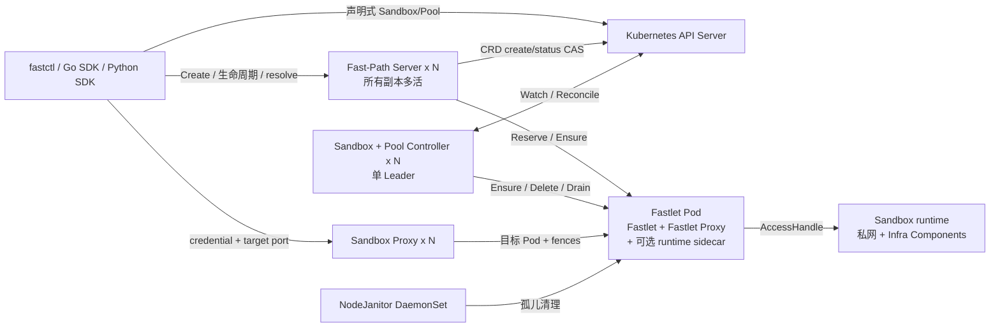
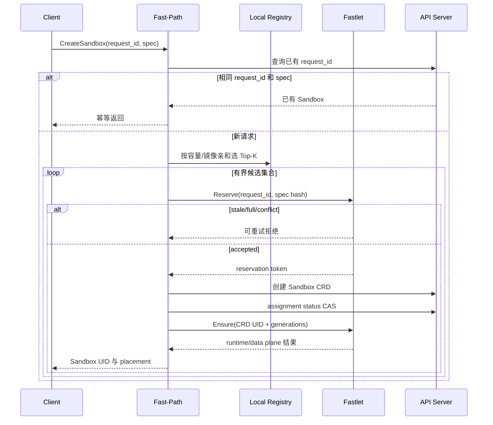

# Fast Sandbox 架构

本文描述当前重构后的架构。设计决策和实施过程保留在 [docs/superpowers](docs/superpowers) 下。

## 1. 系统边界

Fast Sandbox 负责：

- Sandbox 生命周期状态与调度；
- Pool 容量和固定的单 Sandbox 资源规格；
- 通过 containerd、Kata/gVisor profile 或 BoxLite adapter 创建 runtime；
- 每 Sandbox 私有网络和内部 AccessHandle；
- Infra Component 注入与 readiness 协调；
- endpoint 解析、短期路由凭证和透明代理；
- Fastlet Pod 或节点丢失后的残留资源清理。

Fast Sandbox 不定义面向用户的 Exec/File/PTY 协议。这些语义由 Execd、Envd 或其他注入组件负责。当前也不承诺 Sandbox 实例跨 Fastlet 存活，不包含 snapshot、pause/resume 和持久化 storage。

## 2. 部署拓扑



### 2.1 控制面角色

同一个 `controller` 二进制按不同角色部署：

| 角色 | 选主 | 对外 Service | 内部子组件 |
|---|---:|---:|---|
| `fastpath` | 否 | gRPC `:9090` | FastPath API、本地 Registry、Top-K Orchestrator、路由凭证签发 |
| `controller` | 是 | 否 | SandboxReconciler、SandboxPoolReconciler、本地 Registry、心跳循环 |
| `all` | 否 | 可选 | 开发模式，在单进程组合前两种角色 |

Fast-Path 与 Controller 故意维护各自独立、最终收敛的 Registry。调度结果只有在 Fastlet 原子接纳 reservation 后才成为有效分配。这使多活 Fast-Path 无需分布式 Registry 锁也不会突破单 Pod 容量。

### 2.2 Fastlet Pod

SandboxPool 创建 Fastlet Pod，其中平台拥有以下子组件：

- **Fastlet 控制服务（`:5758`）**：reserve/cancel/ensure/delete/status、缓存心跳、runtime 与网络编排；
- **原子 Admission Store**：串行化 reservation 和 active slot 状态转换，面对并发调用仍严格执行 `maxSandboxesPerPod`；
- **Runtime Manager**：根据 Pool 的不可变 RuntimeProfile 创建、检查和恢复 runtime；
- **NetworkManager / SlotPool**：分配、恢复私网 slot，生成 AccessHandle；
- **Infra Manager**：物化平台 artifact、实例配置、内部凭证和 readiness policy；
- **Fastlet Proxy（`:5780`）**：校验路由凭证和代际 fence，代理到 runtime-local 地址；metrics 使用独立 `:9093`；
- **BoxLite runtime sidecar**：仅 `runtime: boxlite` 注入，通过 Pod 内 UDS 和带鉴权 local-forward 工作。

Fastlet Pod 是生命周期边界。即使 Kubernetes 复用了 Pod 名称，只要 Pod UID 改变，旧 assignment 与旧 route 都必须失效。

### 2.3 NodeJanitor

NodeJanitor 以特权 DaemonSet 部署，处理已经丢失的 Fastlet 无法自行清理的资源。Backend 覆盖 containerd、network/netns、Infra 实例 artifact 和 BoxLite 状态。每次删除前都会重新读取 Kubernetes 所有权，并执行最小 orphan age 保护。

## 3. 权威状态模型

### 3.1 Sandbox CRD

`Sandbox.spec` 表示期望生命周期。当前实例的权威 identity 是：

```text
Sandbox CRD UID
+ instanceGeneration
+ assignment.fastletPodUID
+ assignment.attempt
+ routeGeneration
```

`status.assignment` 通过 Kubernetes resourceVersion compare-and-swap 写入。runtime、data plane、user process 是三个独立观测状态，由 canonical status 字段和 Conditions 表达。

### 3.2 SandboxPool CRD

一个 Pool 固定：

- `runtime`；
- `sandboxResources`（`cpu`、`memory`、`pids`）；
- `infraProfile`；
- `maxSandboxesPerPod`；
- `warmImages` 与 Fastlet Pod template；
- Pool 最小、最大和 buffer 容量。

Runtime、资源和 Infra profile 不可变，因为修改任一项都会改变已分配 Sandbox 的语义。runtime handler 与二进制路径归内部 RuntimeCatalog 管理，普通用户不能覆盖。

## 4. Create 与 Reconcile

### 4.1 Fast-Path Create



reservation 接纳前的快速失败不会创建 CRD。持有合法 reservation 后，Fast-Path 必须先提交 CRD，再调用 runtime Ensure。系统不再存在 Fast/Strong 模式分支。稳定 request ID 是必需的；相同 request ID 搭配不同 create spec 会被拒绝。

### 4.2 声明式 Create

用户直接创建 Sandbox CRD 时，SandboxReconciler 使用同一个 Orchestrator 和 Fastlet admission 协议。因此 Fast-Path 是可选的低延迟入口，不是唯一创建路径。

### 4.3 Delete、reset、过期和故障策略

这些操作全部是声明式的：

- Delete 进入 Kubernetes 删除状态，finalizer 先 drain route，再清理 runtime/network/Infra；
- Reset 修改 `resetRevision`，Reconcile 先递增 instance/route generation，再创建替代实例；
- 过期由 `spec.expireTime` 表达，最终进入已清理的 Expired 状态；
- Fastlet 丢失后，`Manual` 进入 `Lost`；`AutoRecreate` 在 recovery window 后清除旧 assignment 并调度新实例。

Fastlet Pod replacement 不意味着 Sandbox 存活。新 Pod UID 是新的 fence，必须显式 Reconcile 新实例。

## 5. Registry 与调度

每个 Fast-Path 和 Controller 副本通过两种信息源维护本地 Registry：

1. Kubernetes Pod/Sandbox Watch 提供成员关系、assignment、Pool/runtime 标签和 Pod UID 变化；
2. 低频、带抖动的 heartbeat 提供精确容量、reservation/runtime phase inventory、镜像缓存快照与 cache revision。

系统不会让每个 Fast-Path 高频全量轮询所有 Fastlet。Watch 立即更新拓扑，heartbeat 用来修复偏差并刷新 runtime/cache 事实。

Orchestrator 先过滤 Pool/runtime/Infra 不兼容节点，再对有界 Top-K 排序。可用容量是硬条件；镜像缓存亲和是关键启动延迟信号，之后才考虑负载与稳定 tie-break。Fastlet 拒绝 admission 后记录原因并尝试下一个候选；最终 slot authority 始终在 Fastlet。

## 6. Runtime 与资源

| Runtime | Adapter 路径 | 隔离边界 |
|---|---|---|
| `container` | containerd task | host kernel namespace/cgroup |
| `gvisor` | containerd `runsc` handler | user-space kernel |
| `kata-qemu` | Kata containerd handler | QEMU VM |
| `kata-clh` | Kata containerd handler | Cloud Hypervisor VM |
| `kata-fc` | Kata containerd handler | Firecracker VM |
| `boxlite` | BoxLite sidecar UDS | BoxLite VM/runtime |

Fastlet 把 Pool 资源规格传给 runtime adapter；如果 runtime 无法证明支持就失败关闭。Pool Controller 同时按照“单 Sandbox 规格 × capacity + profile overhead”设置承担 runtime 资源的 Fastlet/sidecar 容器资源。

上表定义的是 canonical runtime identity，不等于无条件支持声明。当前已验证的 Kata profile 是 QEMU 和 Cloud Hypervisor；`kata-fc` 在现有环境中继续以 `KataFirecrackerNotValidated` fail closed。

当前 BoxLite v0.9.7 API 无法证明不可逃逸的 host 侧 per-Box 资源边界。因此 BoxLite 报告 `resource-limits-v1=false`，Pool Ready gate 会拒绝它，不会静默降级资源契约。

## 7. 私网与代理路径

容器类 runtime 的 network slot 包含独立 netns、veth、私有 IP、bridge attachment 与 NAT egress。所有 Sandbox 可以监听相同内部端口，调度和 Registry 都不维护全局 host port reservation。

用户访问路径为：

```text
Infra SDK
  -> ResolveEndpoint(Sandbox UID, target port)
  -> Sandbox Proxy /v1/sandboxes/{uid}/ports/{port}/...
  -> 目标 Fastlet Pod 内 Fastlet Proxy
  -> DirectIP(private IP:target port) 或 LocalForward
  -> 注入的 Infra Component / 用户服务
```

签名凭证包含 namespace、Sandbox UID、target port、Fastlet Pod UID、assignment attempt、route generation 和 expiry。两个代理分别验证适用的 fence。reset、重新调度或删除都会让旧 credential 和缓存 route 失效。代理使用流式 transport，不会整包缓存 SSE、WebSocket 或文件内容。

BoxLite guest network 不属于 Fastlet 管理的 Linux netns，因此通过 Pod-local port forward 接入。每个 Box 使用独立随机 credential，先写入 tunnel preamble，另一个 Box 不能复用该 forward。

## 8. Runtime Augmentation

它的真实抽象是：基于用户 OCI 镜像启动 workload，同时注入平台管理 helper，让最终 Sandbox 同时具备用户程序和选定的管理能力。

InfraProfile 解析为 component artifact 和策略。创建 runtime 前，Fastlet：

1. 把不可变 component 二进制准备到 Pod-local artifact store；
2. 创建带 generation fence 的实例目录和配置；
3. 把文件、mount、环境变量注入 OCI 或 BoxLite 请求；
4. 必要时用 `sandbox-init` 包装原始 entrypoint；
5. 把 component readiness 与 runtime start 分开等待；
6. 只有 DataPlane Ready 后才发布 route。

Adapter 复用既有组件协议：

- OpenSandbox `execd`：command/SSE 和 file 操作；
- E2B `envd`：把解析后的 endpoint 交给原生 client；
- 自定义组件：增加 catalog profile 与 SDK adapter。

启动额外成本包括 artifact 准备、OCI spec mutation、supervisor 启动、component 进程启动和 readiness probe。artifact 与 warm image 会缓存；Pool warm image、缓存 artifact 和热点镜像受普通 GC 保护。Fastlet Ready 不等待所有 warm image 拉取完成。

## 9. 安全与可用性

- Fast-Path 独占路由签名私钥，其他组件只持有验签公钥；
- Proxy 数据端口不暴露 Prometheus metrics，metrics 使用独立管理端口；
- Pool template 不能覆盖平台拥有的 Fastlet 环境变量、sidecar 名称、mount、runtime handler 和安全设置；
- Controller 通过 Lease 选主；Fast-Path 与 Sandbox Proxy 可独立水平扩缩，清单提供 PDB/HPA；
- Fastlet 和 Janitor 是特权组件，应调度到可信节点并配套 Kubernetes/host 安全控制；
- NetworkPolicy 样例默认不启用，因为 Fastlet 可能位于租户 namespace，egress/DNS 需求也依赖部署环境。

## 10. 可观测性

Prometheus metrics 覆盖 Create accepted/data-plane-ready latency、Registry candidate 与 heartbeat age、Top-K retry、Fastlet admission 与 slot、runtime/Infra/network/cache、两跳 proxy 和 Janitor cleanup。

request ID、Sandbox UID、assignment attempt、route generation 等 identity 必须进入结构化日志或 trace，不能作为 metrics label。只有 runtime adapter 能证明用户原始进程已经启动时才记录 `user_process_start_latency`；sandbox-init 路径在可信回调实现前明确标记 unavailable。

## 11. 部署

- `config/default`：CRD、RBAC、拆分控制面、Sandbox Proxy、PDB/HPA 和 NodeJanitor；route keys 由外部提供；
- `config/dev`：default 资源加开发专用固定 route key；
- `config/network-policy`：单 namespace 拓扑的可选策略样例；
- `config/samples`：canonical Pool/Sandbox 示例。

`config/all-in-one` 只用于本地开发，把两种控制面角色组合进一个进程，不是生产 HA 拓扑。
