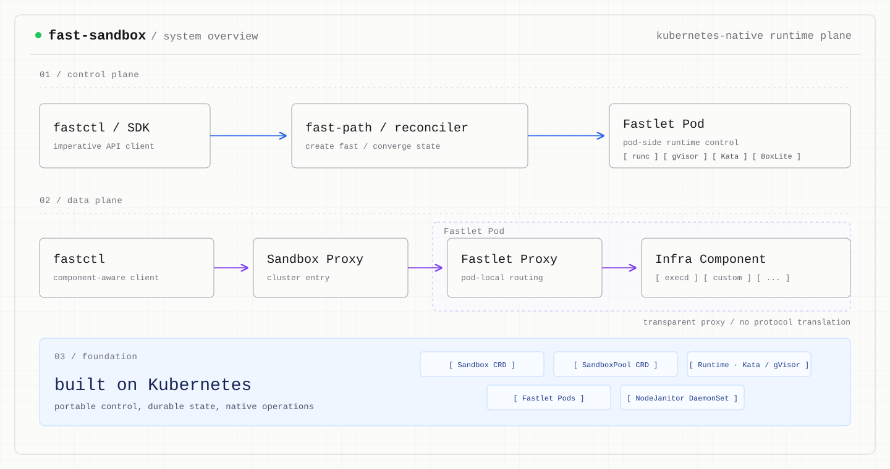

# Fast Sandbox

A Kubernetes-native runtime plane for creating isolated container, gVisor, and
Kata sandboxes inside warm Fastlet Pods.

[Chinese](README_ZH.md) | [Quick Start](docs/getting-started/quickstart.md) | [Documentation](docs/README.md) | [Architecture](docs/concepts/architecture.md)



Fast Sandbox combines a multi-active imperative Create path with declarative
CRD lifecycle management. The Create request persists its initial intent before
a Fastlet atomically admits and starts the runtime; delete, reset, expiry,
recovery, and Pool management converge through Kubernetes reconciliation.

The user image remains in control of the workload. Pool-defined
[Infra Components](docs/concepts/infra-components.md) add managed processes,
health-checked named endpoints, and protocol-transparent data-plane access
without rebuilding that image.

## Why Fast Sandbox

- **Warm runtime pools** reuse ready Fastlet Pods instead of creating one
  Kubernetes Pod for every Sandbox.
- **Multiple isolation runtimes** select container, gVisor, Kata QEMU, or Kata
  Cloud Hypervisor through one immutable Pool runtime.
- **Atomic CRD-first Create** persists image, command, expiry, metadata, and
  placement intent before runtime creation, with request-level idempotency.
- **Composable Infra Components** inject immutable artifacts and supervised
  processes directly from the Pool contract.
- **Sandbox Actions** reconcile opaque per-Sandbox state through Pod-local,
  generation-fenced lifecycle handlers.
- **Private Sandbox networking** gives every instance a private address space
  and NAT egress without global host-port allocation.
- **Named, protocol-transparent routes** expose component-native HTTP, SSE, and
  WebSocket traffic through authenticated proxies without translating the
  application protocol.
- **Kubernetes-native lifecycle** continues to work through CRDs when the
  optional Fast-Path deployment is absent.

## Quick Start

Quick Start prepares an interactive kind environment on a Linux host. It does
not run an E2E suite or create a Sandbox automatically.

```bash
make quickstart
```

Keep the local endpoints exposed in terminal 1:

```bash
make quickstart-forward
```

In terminal 2, create a Sandbox and use its Pool-provided `execd` component:

```bash
bin/fastctl run quickstart-execd-sandbox \
  --image docker.io/library/alpine:latest \
  --pool quickstart-execd-pool -- /bin/sleep 3600

bin/fastctl opensandbox exec quickstart-execd-sandbox \
  --component execd -- uname -a

bin/fastctl delete quickstart-execd-sandbox
```

On the first run, Quick Start creates a local `.fastctl/config.json` containing
the forwarded endpoints. An existing file is never modified; the command output
shows the environment-variable override when manual configuration is needed.

Select another runtime with:

```bash
make quickstart RUNTIME=gvisor
make quickstart RUNTIME=kata-qemu
make quickstart RUNTIME=kata-clh
make quickstart RUNTIME=kata-fc
make quickstart RUNTIME=kata-dragonball
```

See the [full Quick Start](docs/getting-started/quickstart.md) for file transfer,
diagnostics, declarative CRD creation, and troubleshooting.

## Architecture

The control plane separates latency-sensitive creation from declarative
convergence:

```text
fastctl / SDK
      |
      v
Multi-active Fast-Path ---- persist intent ----> Sandbox CRD
      |                                            ^
      | atomic admission                           |
      v                                            |
Fastlet Pod <---------- leader-elected Reconciler -+
```

- **Fast-Path Servers** are multi-active. They provide idempotent Create,
  in-memory Top-K placement, direct Fastlet admission, readiness waits, and
  endpoint resolution.
- **Reconcilers** are leader-elected. They converge Sandbox and SandboxPool
  lifecycle, including declarative creation, deletion, expiry, drain, and
  recovery.
- **Fastlet Pods** are Pool-managed runtime boundaries. Each one hosts multiple
  isolated runtimes and owns their admission, private networking, Infra
  processes, health, and local proxy.

The data plane supports a centralized path and a direct trusted-integration
path:

```text
Native client
  -> Sandbox Proxy
  -> Fastlet Proxy
  -> Sandbox private network
  -> named Infra Component

OpenSandbox client
  -> OpenSandbox Ingress
  -> Fastlet Proxy
  -> Sandbox private network
  -> named Infra Component
```

The direct OpenSandbox path resolves a generation-fenced route through
Fast-Path, then connects to the assigned Fastlet Proxy. It does not require an
extra hop through Sandbox Proxy.

| Deployment unit | Availability | Responsibility |
|---|---|---|
| Fast-Path Server | Multi-active Deployment | Create, placement, readiness and endpoint resolution |
| Sandbox/Pool Reconcilers | Leader-elected Deployment | Declarative lifecycle, Pool scaling, drain and recovery |
| Sandbox Proxy | Optional multi-active Deployment | Central authenticated HTTP and streaming entry point |
| Fastlet Pod | Pool-managed Pod | Atomic admission, runtime, network, Infra supervision and local proxy |
| NodeJanitor | Per-node DaemonSet | Fenced orphan cleanup |

Read [Architecture](docs/concepts/architecture.md),
[Control plane](docs/concepts/control-plane.md), and
[Private networking](docs/concepts/networking.md) for the complete model.

## Infra Components

An Infra Component augments the user image with one immutable artifact, one
supervised process, one health check, and one named endpoint:

```yaml
apiVersion: sandbox.fast.io/v1alpha2
kind: SandboxPool
metadata:
  name: opensandbox-pool
  namespace: fast-sandbox
spec:
  runtime: container
  infraComponents:
    - name: execd
      artifact:
        source:
          image:
            reference: ghcr.io/opensandbox/execd@sha256:<digest>
        mappings:
          - sourcePath: /execd
            targetPath: /.fast/components/execd/execd
      process:
        command: [/.fast/components/execd/execd, --port, "44772"]
        restartPolicy: OnFailure
        healthCheck:
          httpGet:
            path: /ping
          timeoutSeconds: 10
      endpoint:
        protocol: HTTP
        port: 44772
```

The component name is an immutable routing key, not a display label. Fastlet
state, health, Fast-Path resolution, proxies, SDK adapters, and fastctl all use
the same name. A Pool update creates a new immutable component revision;
existing Sandboxes are not hot-patched.

`RuntimeReady` means the concrete runtime and its private network identity are
available. `ComponentReady` means one component passed health.
`DataPlaneReady` means Infra Components are ready and the interaction route is
published. Aggregate `Ready` additionally requires every Action Binding to
have applied its input and reached subscribed lifecycle Hooks. Create defaults
to this aggregate boundary; callers may explicitly request `RuntimeReady` for
an earlier return without waiting for CRD status propagation.

See [Infra Components](docs/concepts/infra-components.md) for artifact mapping,
process supervision, health, and named-routing semantics.
See [Sandbox Actions](docs/guides/sandbox-actions.md) for generic Pod-local
lifecycle handlers and opaque desired input.

## OpenSandbox integration

[OpenSandbox](https://github.com/opensandbox-group/OpenSandbox) is a first-class
integration, not a protocol dependency:

- lifecycle operations use the Fast-Path API;
- OpenSandbox Ingress resolves `namespace/name/component` into a complete
  upstream route;
- trusted ingress traffic can connect directly to Fastlet Proxy;
- OpenSandbox Execd is a Pool-defined Infra Component named `execd`;
- fastctl uses the official OpenSandbox SDK for exec and file operations;
- Execd's optional access-token mechanism is disabled. Fast Sandbox route
  credentials protect external access while application headers pass through
  unchanged.

Fast Sandbox does not define Exec or File protocols. Another component may
provide a different native API under another component name.

See [OpenSandbox integration](docs/guides/opensandbox-integration.md) for the
backend and direct-ingress contract, and
[OpenSandbox Execd](docs/guides/opensandbox-execd.md) for exec and file usage.

## Runtime support

| Runtime | Pool value | Quick Start | Fast Sandbox status |
|---|---|---:|---|
| OCI container | `container` | Yes | Validated |
| gVisor | `gvisor` | Yes | Validated |
| Kata QEMU | `kata-qemu` | Yes | Validated |
| Kata Cloud Hypervisor | `kata-clh` | Yes | Validated |
| Kata Firecracker | `kata-fc` | Yes | Validated; block snapshotter required |
| Kata Dragonball | `kata-dragonball` | Yes | Validated; compatibility binding required |
| BoxLite | `boxlite` | No | Experimental integration; fail closed |

This table describes Fast Sandbox validation status, not the upstream runtimes'
general capabilities.

Secure-runtime latency is strongly environment-dependent. In the current warm,
concurrency-1 engineering measurements, `kata-fc` reached `RuntimeReady` in
about 561 ms on a non-nested KVM host and 5.47 s in a resource-constrained
nested-KVM VM. These are diagnostic baselines, not release claims. See
[Performance](docs/guides/performance.md#kata-331-secure-runtime-comparison).

## Fast Sandbox and Agent Sandbox

[Kubernetes SIGs Agent Sandbox](https://github.com/kubernetes-sigs/agent-sandbox)
and Fast Sandbox solve adjacent problems with different workload units:

| | Fast Sandbox | Agent Sandbox |
|---|---|---|
| Primary abstraction | Runtime instance inside a warm Fastlet Pod | Stateful singleton Sandbox Pod |
| Warm capacity | One Fastlet Pod hosts multiple runtimes | `SandboxWarmPool` prepares Sandbox Pods |
| Main focus | High-density runtime creation and a separate component data plane | Stable Pod identity, persistence, and hibernation workflows |

This is an architectural comparison, not a performance claim.

## Performance

The latest published warm, concurrency-1 engineering sample is summarized
below. It was reported on 2026-08-09 at commit
`cde6d5c8e82f568ae3dbfd919ea7284713603f13`; it used a warm Alpine image,
pre-created network slots, no Infra Components, a single-node Kind cluster with
containerd 1.7.18, and a non-nested KVM host with 104 vCPUs and 187 GiB RAM.

| Runtime | Boundary | N | Mean | p50 | p95 | Max |
|---|---|---:|---:|---:|---:|---:|
| container (`runc`) | `RUNTIME_READY` | 20 | 72.4 ms | 72.7 ms | 80.2 ms | 83.1 ms |
| Kata Firecracker | `RUNTIME_READY` | 20 | 560.6 ms | 559.6 ms | 622.8 ms | 626.9 ms |

With only 20 samples, this report uses maximum rather than presenting an
unstable p99. Aggregate `READY`, `ResolveEndpoint`, and sustained concurrent
throughput were not measured in that run and are not implied by this table.
These are reproducible engineering observations, not a production SLA. See the
[full report and benchmark command](docs/guides/performance.md#create-load-tool).

The default Create latency ends at aggregate `Ready`. Performance experiments
may explicitly request the earlier `RuntimeReady` boundary; component health,
route publication and Action convergence then continue independently. Reports
must always name the selected completion boundary.

Fast Sandbox does not publish an unqualified headline latency. Results must
record the commit, environment, runtime, cache state, concurrency, measurement
boundary, and percentile distribution. See
[Performance](docs/guides/performance.md).

## API status and current scope

- The current CRD and Fast-Path API version is `v1alpha2`. It is an alpha API
  and may evolve; this branch does not accept `v1alpha1` objects.
- SandboxPool and Sandbox are namespace-scoped resources. Namespace isolation
  is a resource boundary, not a complete tenant authentication model.
- A Sandbox is bound to one Fastlet Pod. Pod loss destroys that instance;
  `AutoRecreate` may create a new generation.
- Public named-component routing currently supports HTTP, including SSE and
  WebSocket upgrade. Generic raw TCP, gRPC, and upstream TLS are not part of
  the first component contract.
- Snapshots publish a running Sandbox as a bootable image; pause/resume
  checkpoints one Sandbox instance to the artifact store and resumes it on any
  Fastlet (same Sandbox identity). Persistent storage and live migration are
  not current capabilities.
- BoxLite remains an explicit capability gate.

Private registry credentials are configured per namespace through a static
ConfigMap and referenced Secrets; Pools do not embed credentials. See
[Private registries](docs/guides/private-registries.md).

## Documentation

- [Documentation index](docs/README.md)
- [Architecture](docs/concepts/architecture.md)
- [Runtime model](docs/concepts/runtimes.md)
- [Private networking](docs/concepts/networking.md)
- [Infra Components](docs/concepts/infra-components.md)
- [OpenSandbox integration](docs/guides/opensandbox-integration.md)
- [OpenSandbox Execd](docs/guides/opensandbox-execd.md)
- [Infra Components reference](docs/reference/infra-components.md)
- [Private registries](docs/guides/private-registries.md)
- [Deployment](docs/guides/deployment.md)
- [Testing](docs/guides/testing.md)
- [API reference](docs/reference/api.md)

## License

[Apache-2.0](LICENSE)
