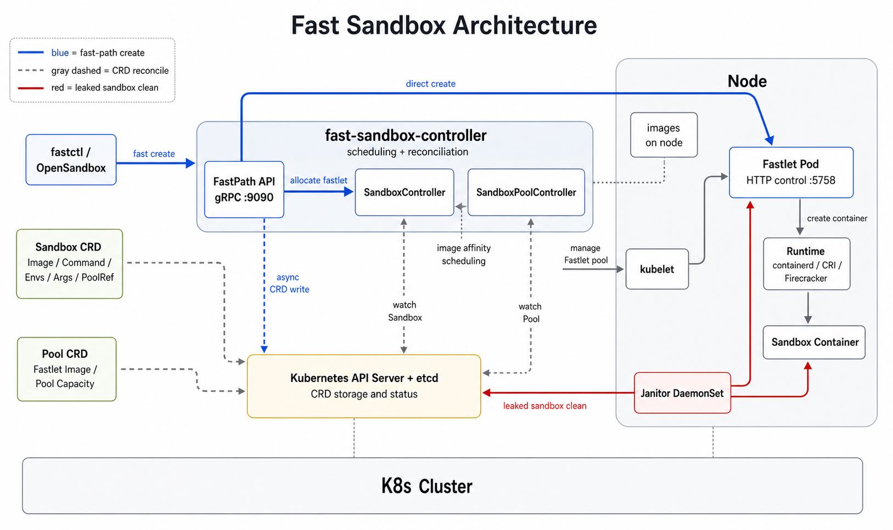

# Fast Sandbox

> **迁移说明（2026-07-19）**：本文描述当前 `master` 实现。多活控制面、Sandbox 私有网络、透明代理、统一 Runtime 与 Infra Component 的目标架构以[跨模块架构决策](docs/superpowers/specs/2026-07-19-fast-sandbox-cross-cutting-architecture-decisions.md)为准。下文的 Fast/Strong 双模式与 host port 冲突语义已被重构方案替代。

Fast Sandbox 是一个高性能、云原生（Kubernetes-native）的沙箱管理系统，旨在为 AI Agent、Serverless 函数和计算密集型任务提供**毫秒级的容器冷启动**与**受控自愈**能力。

通过预热 "Fastlet Pod" 资源池并直接集成宿主机层面的容器管理能力，Fast Sandbox 绕过了传统 Kubernetes Pod 创建的巨大开销，实现了极速的任务分发与物理隔离。

## 核心特性

- **⚡ Fast-Path API**: 引入 gRPC Fast-Path 机制，支持 **<50ms** 的端到端启动延迟。支持 **Fast Mode** (Fastlet-First, 极速) 和 **Strong Mode** (CRD-First, 强一致) 双模切换。
- **🛠️ 开发者 CLI (`fastctl`)**: 提供类似 Docker 的命令行体验。支持交互式创建、配置管理、日志流式查看 (`logs -f`) 和状态查询。
- **💾 零拉取启动**: 利用 **Host Containerd 集成** 技术，直接在宿主机上启动微容器，复用节点镜像缓存。
- **⚖️ 智能调度**: 基于 **镜像亲和性 (Image Affinity)** 和 **原子插槽 (Slot)** 的调度算法，彻底消除镜像拉取延迟并避免端口冲突。
- **🛡️ 健壮性设计**:
  - **受控自愈**: 支持 `AutoRecreate` 策略和手动 `resetRevision`。
  - **优雅关闭**: 完整的 SIGTERM → SIGKILL 流程，防止僵尸进程。
  - **Node Janitor**: 独立 DaemonSet 自动回收孤儿容器与残留文件。

## 系统架构

系统采用"控制面集中决策，数据面极速执行"的架构：


### 控制面 (Control Plane)

- **Fast-Path Server (gRPC)**: 处理高并发的沙箱创建/删除请求，直接对接 CLI
  - 端口: `9090`
  - 服务: `CreateSandbox`, `DeleteSandbox`, `UpdateSandbox`, `ListSandboxes`, `GetSandbox`
- **SandboxController**: 负责 CRD 状态机维护、Finalizer 资源回收及双模一致性协调
- **SandboxPoolController**: 管理 Fastlet Pod 资源池（Min/Max 容量）
- **Atomic Registry**: 内存级的状态中心，支持高并发下的互斥分配与镜像权重计算

### 数据面 (Data Plane - Fastlet)

- 运行在宿主机上的特权 Pod，通过 HTTP 与控制面通信
- **Runtime Integration**: 直接调用宿主机 Containerd Socket，实现容器生命周期管理和**日志持久化**
- **HTTP Server**: 监听端口 `5758`
  - `POST /api/v1/fastlet/create` - 创建沙箱
  - `POST /api/v1/fastlet/delete` - 删除沙箱
  - `GET /api/v1/fastlet/status` - 获取 Fastlet 状态
  - `GET /api/v1/fastlet/logs?follow=true` - 流式日志

### 工具链 (Tooling)

- **fastctl**: 开发者 CLI，支持 `run`, `list`, `get`, `logs`, `delete` 等命令

## 快速开始

### 1. 安装 CLI

```bash
make build
# 生成 bin/fastctl
export PATH=$PWD/bin:$PATH
```

### 2. 创建沙箱（交互模式）

```bash
fastctl run my-sandbox
# 将自动打开编辑器供您配置镜像、端口和命令
```

### 3. 查看实时日志

```bash
fastctl logs my-sandbox -f
```

### 4. 声明式定义 (YAML)

您也可以直接操作 Kubernetes CRD：

```yaml
apiVersion: sandbox.fast.io/v1alpha1
kind: Sandbox
metadata:
  name: my-sandbox
  namespace: default
spec:
  image: alpine:latest
  exposedPorts: [8080]
  poolRef: default-pool
  consistencyMode: fast  # 或 strong
  failurePolicy: AutoRecreate
```

## 一致性模式

### Fast Mode (默认)

1. CLI → Controller gRPC 请求
2. Registry 分配 Fastlet
3. Controller → Fastlet HTTP 创建请求
4. Fastlet 通过 Containerd 启动容器
5. Controller 返回成功给 CLI
6. Controller *异步* 创建 K8s CRD

**延迟**: <50ms
**权衡**: CRD 创建失败可能导致孤儿（由 Janitor 清理）

### Strong Mode

1. CLI → Controller gRPC 请求
2. Controller 创建 K8s CRD (Pending 阶段)
3. Controller Watch 触发
4. Controller → Fastlet HTTP 创建请求
5. Fastlet 启动容器
6. CRD 状态更新为 Running

**延迟**: ~200ms
**保证**: 强一致性，无孤儿

## 配置项

### Controller 参数


| 参数                          | 默认值  | 说明                       |
| ----------------------------- | ------- | -------------------------- |
| `--fastlet-port`                | `5758`  | Fastlet HTTP 服务器端口      |
| `--metrics-bind-address`      | `:9091` | Prometheus 指标端点        |
| `--health-probe-bind-address` | `:5758` | 健康检查端点               |
| `--fastpath-consistency-mode` | `fast`  | 一致性模式: fast 或 strong |
| `--fastpath-orphan-timeout`   | `10s`   | Fast 模式孤儿清理超时      |

### Fastlet 参数


| 参数                  | 默认值                            | 说明                   |
| --------------------- | --------------------------------- | ---------------------- |
| `--containerd-socket` | `/run/containerd/containerd.sock` | Containerd socket 路径 |
| `--http-port`         | `5758`                            | HTTP 服务器端口        |

### 环境变量


| 变量             | 说明                             |
| ---------------- | -------------------------------- |
| `FASTLET_CAPACITY` | 每个 Fastlet 最大沙箱数（默认: 5） |

## gRPC API

```protobuf
service FastPathService {
  rpc CreateSandbox(CreateRequest) returns (CreateResponse);
  rpc DeleteSandbox(DeleteRequest) returns (DeleteResponse);
  rpc UpdateSandbox(UpdateRequest) returns (UpdateResponse);
  rpc ListSandboxes(ListRequest) returns (ListResponse);
  rpc GetSandbox(GetRequest) returns (SandboxInfo);
}
```

### ConsistencyMode

- `FAST`: 先创建容器，异步写 CRD
- `STRONG`: 先写 CRD，后创建容器

### FailurePolicy

- `MANUAL`: 仅报告状态，不自动恢复
- `AUTO_RECREATE`: 故障时自动重新调度

## 开发

### 运行测试

```bash
# 所有测试
go test ./... -v

# 带覆盖率
go test ./... -coverprofile=coverage.out

# 特定模块
go test ./internal/controller/fastletpool/ -v
```

详细测试文档请参考 [docs/TESTING.md](docs/TESTING.md)

### 性能分析

```bash
# CPU 性能分析
go tool pprof http://localhost:6060/debug/pprof/profile?seconds=30 > cpu.prof

# 查看分析结果
go tool pprof -http=:8080 cpu.prof
```

详细性能分析请参考 [docs/PERFORMANCE.md](docs/PERFORMANCE.md)

## 开发计划

- [x] **Phase 1**: 核心 Runtime (Containerd) 与 gRPC 框架
- [x] **Phase 2**: Fast-Path API 与 Registry 调度
- [x] **Phase 3**: CLI (`fastctl`) 与交互式体验
- [x] **Phase 4**: 日志流式传输与自动隧道
- [x] **Phase 5**: 统一日志框架 (klog)
- [x] **Phase 6**: 性能指标与单元测试
- [ ] **Phase 7**: 支持自定义卷挂载 (Custom Volume Mounting)
- [ ] **Phase 8**: 容器检查点/恢复 (Checkpoint/Restore with CRIU)
- [ ] **Phase 9**: Web 控制台与流量代理
- [ ] **Phase 10**: gVisor 安全沙箱支持
- [ ] **Phase 11**: CLI exec bash 与 Python SDK (类似 Modal)
- [ ] **Phase 12**: GPU 容器支持

## 许可证

[MIT](LICENSE)
