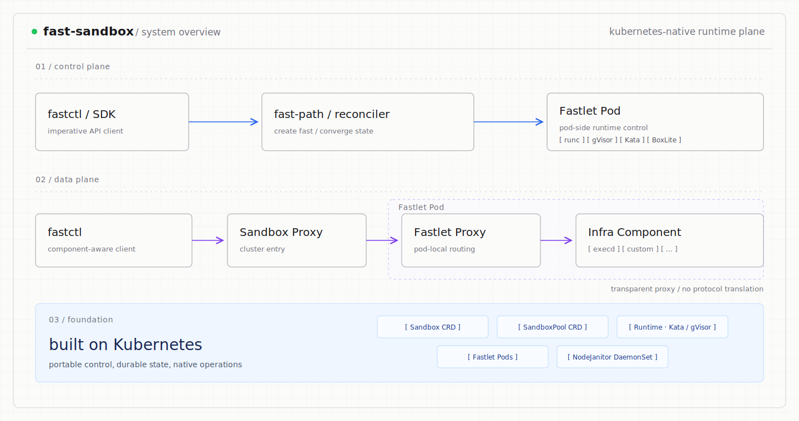
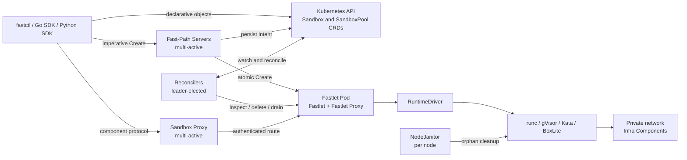
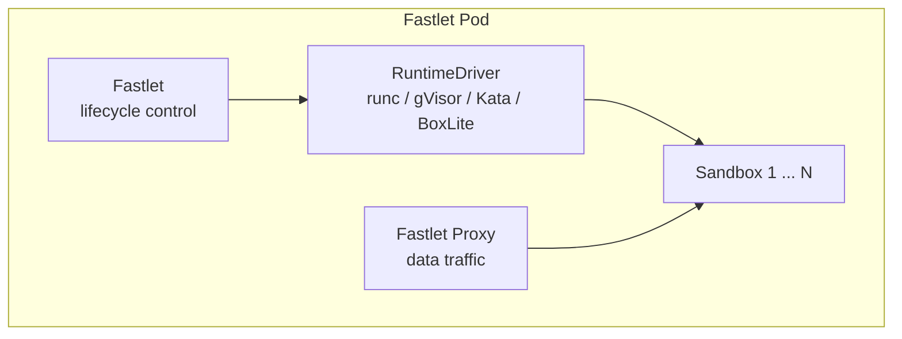

# Architecture

Fast Sandbox is a Kubernetes-native runtime plane for creating many isolated execution environments from warm runtime pools. It separates the latency-sensitive Create path, declarative lifecycle convergence, and user data protocols.



## System boundary

Fast Sandbox owns:

- Sandbox lifecycle state, identity, and placement;
- Pool capacity and fixed per-Sandbox resources;
- runtime creation through RuntimeDriver implementations;
- per-Sandbox private networking and access handles;
- Infra Component injection and readiness;
- endpoint resolution, route credentials, and transparent proxying;
- cleanup after a Fastlet Pod or node disappears.

Fast Sandbox does not define an Exec/File/PTY protocol. An injected component such as OpenSandbox Execd owns those semantics. Fast Sandbox also does not provide cross-Fastlet instance survival, snapshots, pause/resume, or persistent Sandbox storage.

## Deployment topology



## Deployment units

| Unit | Availability | Responsibility |
|---|---|---|
| Fast-Path Server | Multi-active Deployment | gRPC API, idempotent Create, local Registry, Top-K placement, route credentials |
| Sandbox and Pool Reconcilers | Leader-elected Deployment | Declarative lifecycle, Pool scaling and drain, recovery, status projection |
| Sandbox Proxy | Multi-active Deployment | Authenticated transparent HTTP and streaming proxy |
| Fastlet Pod | Pool-managed Pod | Atomic admission, runtime/network/Infra orchestration, local Fastlet Proxy |
| NodeJanitor | Per-node DaemonSet | Fenced cleanup that a lost Fastlet can no longer perform |

One `controller` binary provides three deployment roles:

- `--role=fastpath` runs Fast-Path without leader election;
- `--role=controller` runs leader-elected Reconcilers;
- `--role=all` combines both for development.

The all-in-one role is not a production high-availability topology.

## Control and data paths

Lifecycle and data traffic are separate:

```text
Lifecycle:
client -> Fast-Path or Kubernetes API -> CRD -> Reconciler/Fastlet

Data:
upstream SDK -> Sandbox Proxy -> Fastlet Proxy -> private address -> Infra Component
```

Create is the only synchronous imperative lifecycle operation. Delete, reset, expiry, and recovery are declarative CRD transitions.

## Source of truth

The Kubernetes API stores desired lifecycle state and durable placement identity. Fastlet owns authoritative local admission and runtime state. Fast-Path and Reconcilers maintain independent, eventually convergent scheduling Registries.

This split avoids a distributed Registry lock:

- Registry state proposes a candidate;
- the assignment stored with the Sandbox fences the chosen generation;
- Fastlet atomically decides whether capacity and identity can be admitted;
- Reconciliation resumes incomplete work from durable state.

See [Control plane](control-plane.md), [Sandbox lifecycle](sandbox-lifecycle.md), and [Scheduling and capacity](scheduling-and-capacity.md) for the detailed contracts.

## Fastlet Pod



A Fastlet Pod contains:

- the Fastlet control server;
- an atomic admission store;
- Runtime, Network, Infra, and cache managers;
- a Fastlet Proxy sidecar;
- an optional BoxLite runtime sidecar.

The Fastlet Pod UID is a physical ownership fence. Reusing a Pod name never makes an old runtime or route valid.

## NodeJanitor

NodeJanitor runs on trusted nodes and cleans orphan containerd resources, network namespaces and rules, Infra instance state, and BoxLite state. It performs a fresh Kubernetes ownership check and an orphan-age check before deletion.

## Further reading

- [Control plane](control-plane.md)
- [Runtime model](runtimes.md)
- [Private networking](networking.md)
- [Data plane](data-plane.md)
- [Infra Components](infra-components.md)
- [Deployment guide](../guides/deployment.md)
