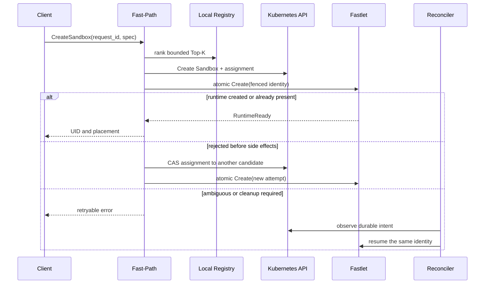

# Control plane

Fast Sandbox separates a multi-active Fast-Path from leader-elected Reconcilers. They use the same codebase and orchestration rules but serve different consistency and latency requirements.

## Roles

| Role | Leader election | Service membership | Main work |
|---|---:|---:|---|
| Fast-Path | No | Yes | Synchronous Create, lifecycle intent updates, diagnostics, endpoint resolution |
| Reconciler | Yes | No | Sandbox and SandboxPool convergence, recovery, drain, status projection |
| All-in-one | No | Development only | Both roles in one process |

Every Fast-Path replica is active. Only the elected Controller replica runs Reconcilers.

## Imperative and declarative operations

Create has a synchronous Fast-Path because clients need a runtime identity quickly. The remaining lifecycle operations are declarative:

- Delete marks the Kubernetes object for deletion.
- Reset updates `spec.resetRevision`.
- Expiry updates `spec.expireTime`.
- Failure behavior updates `spec.failurePolicy` and `spec.recoveryTimeoutSeconds`.

The Controller observes these changes and converges runtime, network, route, and Infra state.

Creating a Sandbox CRD directly is supported. Fast-Path is a latency optimization, not the only creation path.

## CRD-first Create

The successful Fast-Path path has two downstream operations:

1. create the Sandbox CRD with the complete durable assignment annotation;
2. call the selected Fastlet's atomic Create operation.

Fast-Path does not write status on the request path.

## Request identity

`request_id` is required and is the canonical Sandbox CRD name. Retries must reuse it with the same immutable Create spec.

- A matching existing object is an idempotent replay.
- A different spec under the same request ID is rejected.
- A failure that occurs before candidate selection creates no CRD.
- A failure after the CRD Create leaves durable intent for retry and reconciliation.

Transport ambiguity never authorizes reassignment. Only an explicit Fastlet rejection before side effects permits Fast-Path to CAS the assignment to the next bounded candidate.

## Assignment and status

The initial assignment is stored with the Sandbox Create. Reassignment changes it with Kubernetes resource-version compare-and-swap. Reconcilers project the durable assignment and independently observed subsystem states into status.

Runtime, data plane, and user process are deliberately separate:

- `runtimeState` reports the runtime adapter;
- `dataPlaneState` reports required Infra readiness and route publication;
- `userProcessState` is populated only when the runtime can prove it.

Create returns at `RuntimeReady`. `DataPlaneReady` and status projection may follow asynchronously.

## Local Registry

Each Fast-Path and Controller replica owns a local Registry. It receives:

- topology and identity changes from Kubernetes watches;
- admission, runtime, and cache facts from low-frequency jittered Fastlet heartbeats;
- immediate local feedback from placement attempts.

Registries need not be perfectly synchronized. They produce candidates; Fastlet admission is the capacity authority.

## Failure properties

| Failure | Result |
|---|---|
| Fast-Path crashes before CRD Create | No durable object or runtime exists |
| Fast-Path crashes after CRD Create | Reconciler observes and resumes the assignment |
| Fast-Path loses the Fastlet response | The same identity is retried; no speculative reassignment |
| Fastlet explicitly rejects before side effects | Fast-Path may CAS to another Top-K candidate |
| Controller leader is lost | Another Controller becomes leader; Fast-Path remains available |
| A Fast-Path replica is lost | Other replicas continue serving through the Service |

The model relies on Kubernetes persistence and fenced idempotency, not a distributed execution lease.
