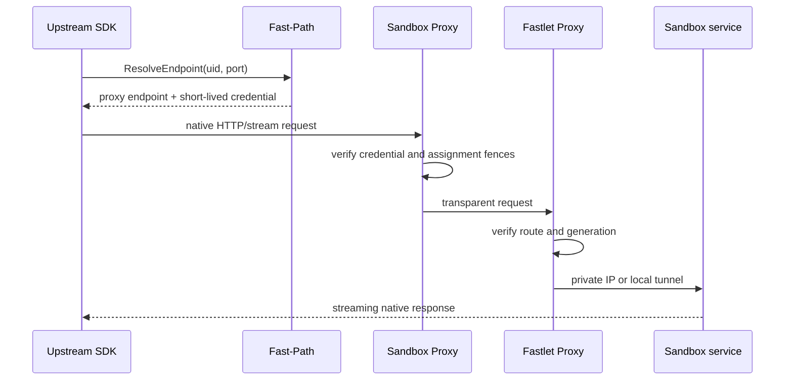

# Data plane

Fast Sandbox separates lifecycle control from user data protocols. It resolves and authenticates a path to a Sandbox service but does not interpret that service's API.

## Proxy path

```text
Upstream SDK
  -> ResolveEndpoint(Sandbox UID, target port)
  -> Sandbox Proxy
  -> Fastlet Proxy
  -> DirectIP or LocalForward
  -> Infra Component or user service
```



## Sandbox Proxy

Sandbox Proxy is a multi-active cluster entry point. It:

- validates the signed route credential;
- resolves the assigned Fastlet Pod;
- validates Sandbox UID, target port, Fastlet Pod UID, assignment attempt, route generation, and expiry;
- forwards HTTP, SSE, WebSocket, and file streams without full-response buffering.

Sandbox Proxy does not translate Execd, envd, or another service protocol.

## Fastlet Proxy

Fastlet Proxy is a platform-owned sidecar in every Fastlet Pod. It:

- receives route publications from Fastlet over a Pod-local control channel;
- verifies the same physical and generation fences;
- selects the local AccessDescriptor;
- injects component-facing internal headers without revealing their value to callers;
- dials the private IP or runtime-local tunnel.

Keeping it separate from the Fastlet process isolates streaming/data-plane lifetime from runtime control operations while retaining one Fastlet Pod deployment unit.

## Route identity

A route credential binds:

- namespace;
- Sandbox UID;
- target port;
- Fastlet Pod UID;
- assignment attempt;
- route generation;
- expiry.

Reset, reassignment, deletion, and Fastlet Pod replacement invalidate old credentials and cached routes.

## DirectIP and LocalForward

`DirectIP` is used by runtimes that consume a Fastlet-owned network slot. The proxy dials the private IP with the caller's target port.

`LocalForward` is used when the runtime owns guest networking. The proxy connects to a loopback tunnel, sends a target-port and credential preamble, and the runtime sidecar forwards to the correct guest.

## Protocol ownership

The caller must know the service protocol. For example, `fastctl opensandbox` uses the OpenSandbox Go SDK for Execd command and file operations.

Fast Sandbox owns:

- route discovery;
- short-lived caller credentials;
- internal component credentials;
- assignment and generation fencing;
- transparent transport.

The Infra Component owns:

- request and response schema;
- command execution;
- file operations;
- PTY behavior;
- process output and service-specific errors.

## Diagnostics

`fastctl diagnostics sandbox` uses the lifecycle control plane and a bounded Fastlet event ring. It does not depend on the Sandbox data plane and does not represent user process stdout.
