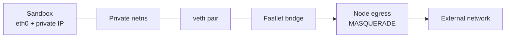

# Private networking

Fast Sandbox gives every Sandbox its own private network plane. Sandboxes can use the full private port range without a cluster-wide host-port registry.

## Linux network slot

Container, gVisor, and Kata profiles consume a prepared network slot containing:

- one Linux network namespace;
- one veth pair;
- a bridge attachment;
- a private IP address and default gateway;
- per-slot resolver state;
- an egress device and NAT rule;
- durable owner and phase metadata.

The runtime receives the namespace path. For Kata, the containerd shim translates the namespace interface into a guest NIC.

## Slot lifecycle

A slot has three phases:

- `Clean`: prepared and available;
- `Bound`: owned by one Sandbox identity;
- `Destroying`: cleanup is in progress and capacity cannot be reused.

The owner contains Sandbox UID, instance generation, runtime instance ID, and assignment attempt. A stale create or delete cannot acquire a slot that belongs to a newer generation.

Slots are prepared before demand where possible. Admission fails fast when no clean slot is available.

## Address and port model

Each Sandbox has its own private IP. The application and Infra Components can listen on any internal port, including a port used by another Sandbox.

Fast Sandbox does not:

- allocate a unique host port for every Sandbox service;
- include port conflicts in Top-K scheduling;
- expose the private IP in the Sandbox CRD;
- route external traffic directly to a host-published container port.

Service access is resolved by Sandbox UID and target port through the proxy path.

## Egress

Fastlet creates an idempotent MASQUERADE rule for the private CIDR and the node's egress interface. Traffic leaves through the Fastlet node network.

The default namespace policy:

- allows the private gateway;
- rejects direct traffic to sibling private Sandbox addresses;
- permits routed egress outside the private CIDR.

Deployment owners remain responsible for cluster NetworkPolicy, DNS, registry, metadata-service, and tenant-specific egress restrictions.

## Access descriptors

Networking produces a local AccessDescriptor for Fastlet Proxy:

- `DirectIP` contains a private IP; Fastlet Proxy appends the requested target port.
- `LocalForward` contains a loopback host/port and per-Sandbox credential for a runtime-owned tunnel.

Access descriptors are local Fastlet state. They are not stored in the Sandbox CRD.

BoxLite uses `LocalForward` because its guest network is owned by BoxLite/gvproxy rather than the Linux netns driver.

## Recovery

At Fastlet startup, the NetworkManager loads durable slots, validates kernel state, compares slot owners with managed runtimes, and either recovers or destroys inconsistent state.

NodeJanitor provides the final cleanup boundary when the Fastlet Pod can no longer act. Repeated cleanup treats missing netns, veth, resolver, and rule state as success.

## Security boundary

Private networking removes host-port collisions, but it is not a complete tenant firewall by itself. Fastlet and NodeJanitor require privileged node access, and production deployments must isolate them onto trusted nodes.
