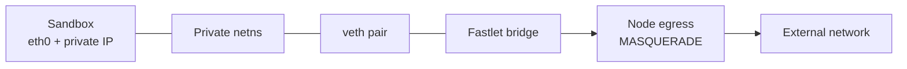

# Private networking

Fast Sandbox gives every Sandbox its own private network plane. Sandboxes can use the full private port range without a cluster-wide host-port registry.

## Linux network slot

Container, gVisor, and Kata profiles consume a prepared network slot containing:

- one Linux network namespace;
- one veth pair;
- a bridge attachment;
- a private IP address and default gateway;
- per-slot resolver state;
- an egress device and NAT rule;
- durable owner and phase metadata.

```mermaid
flowchart LR
  SB["Sandbox<br/>eth0 + private IP"]
  NS["Private netns"]
  VETH["veth pair"]
  BR["Fastlet bridge"]
  NAT["Node egress<br/>MASQUERADE"]
  EXT["External network"]

  SB --- NS --- VETH --- BR --> NAT --> EXT
```

The runtime receives the namespace path. For Kata, the containerd shim translates the namespace interface into a guest NIC.

## Firecracker gateway identity

Firecracker snapshots preserve the guest NIC configuration and neighbour cache.
The template builder and runtime therefore use `02:00:00:00:00:02` for the
guest-facing TAP MAC, distinct from the baked guest NIC MAC. Proxy ARP on the
runtime TAP advertises this stable identity for the guest's default gateway.
Each TAP lives in a separate slot network namespace and is not attached directly
to the shared bridge, so this MAC can be reused across concurrent sandboxes.

Fastlet validates this identity when loading durable network slots. Invalid
`Clean` slots are destroyed and prepared again before admission. An invalid
`Bound` slot prevents startup; Fastlet does not rewrite an active TAP's MAC.

Roll out the updated template builder and Fastlets together, draining live
Firecracker sandboxes before replacing their Fastlets. Rebuild templates with
the updated builder and create new checkpoints from those templates. Checkpoints
that already contain a different cached gateway MAC are not migrated by this
change. Validate the first network request after restore, including concurrent
restores, rather than relying on runtime Ready alone.

## Firecracker guest NAT updates

New guest-VM slots prepare dedicated `FSB_GUEST_DNAT` and `FSB_GUEST_SNAT`
chains and their hooks before admission. Restore replaces only these chains in
one `iptables-restore --noflush` batch; unrelated NAT chains and all filter rules
are preserved. Reapplying the same guest address does not accumulate rules.
The guest route uses `ip -n <namespace> route replace`.

The durable slot records `guestNATBatch` only after chain preparation succeeds.
Old slots without this optional field keep the legacy check-then-add path until
they are destroyed and replenished. Recovery validates the new hooks without
rewriting active rules. A failed restore is not committed as successfully
applied guest state. Slot ownership/generation checks remain unchanged.

The default Fastlet image includes `iptables-restore` matching `iptables`.
If the executable is unavailable, new slots retain the legacy path; once a slot
has batch chains, a failed batch is an error rather than a fallback that could
leave conflicting rules. Injected command runners can support stdin batches
through `RunInput`; runners without it retain the legacy path.

`fast_sandbox_network_guest_apply_stage_latency_seconds{stage,result}` further
separates owner lookup, driver apply, persistence lock wait/write, and the
guest-VM driver's route, NAT, and best-effort ARP warm-up. New batch slots
record the combined `nat_apply` stage; legacy slots retain `dnat` and `snat`.
Do not compare a missing legacy stage to zero latency. Driver apply
contains the route/NAT/ARP leaves; these must also not be added twice.

## Slot lifecycle

A slot has three phases:

- `Clean`: prepared and available;
- `Bound`: owned by one Sandbox identity;
- `Destroying`: cleanup is in progress and capacity cannot be reused.

The owner contains Sandbox UID, instance generation, runtime instance ID, and assignment attempt. A stale create or delete cannot acquire a slot that belongs to a newer generation.

Slots are prepared before demand where possible. Admission fails fast when no clean slot is available.

## Address and port model

Each Sandbox has its own private IP. The application and Infra Components can listen on any internal port, including a port used by another Sandbox.

Fast Sandbox does not:

- allocate a unique host port for every Sandbox service;
- include port conflicts in Top-K scheduling;
- expose the private IP in the Sandbox CRD;
- route external traffic directly to a host-published container port.

Service access is resolved by Sandbox UID and target port through the proxy path.

## Egress

Fastlet creates an idempotent MASQUERADE rule for the private CIDR and the node's egress interface. Traffic leaves through the Fastlet node network.

The default namespace policy:

- allows the private gateway;
- rejects direct traffic to sibling private Sandbox addresses;
- permits routed egress outside the private CIDR.

Deployment owners remain responsible for cluster NetworkPolicy, DNS, registry, metadata-service, and tenant-specific egress restrictions.

## Access descriptors

Networking produces a local `DirectIP` AccessDescriptor for Fastlet Proxy. It
contains a private IP; Fastlet Proxy appends the requested target port.

Access descriptors are local Fastlet state. They are not stored in the Sandbox CRD.

## Recovery

At Fastlet startup, the NetworkManager loads durable slots, validates kernel state, compares slot owners with managed runtimes, and either recovers or destroys inconsistent state.

NodeJanitor provides the final cleanup boundary when the Fastlet Pod can no longer act. Repeated cleanup treats missing netns, veth, resolver, and rule state as success.

## Security boundary

Private networking removes host-port collisions, but it is not a complete tenant firewall by itself. Fastlet and NodeJanitor require privileged node access, and production deployments must isolate them onto trusted nodes.
