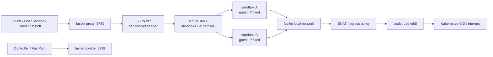

# Fastlet 网络架构设计

## 背景

Fast Sandbox 的目标是作为 OpenSandbox 的底层 sandbox provider，提供低延迟、高密度、可支持安全容器的 sandbox 运行能力。

当前系统已经具备 controller、agent pod、SandboxPool、Sandbox CRD、fast-path API 和 containerd runtime 集成。但现有网络模型仍然带有早期端口映射思路：

- `Sandbox.Spec.ExposedPorts` 表示 sandbox 需要暴露的端口。
- controller 调度时会检查同一个 agent pod 上的端口冲突。
- `Sandbox.Status.Endpoints` 会被更新为 `agentPodIP:port`。

这个模型不适合后续目标。我们希望一个 fastlet pod 内可以运行多个 sandbox，每个 sandbox 都有完整网络栈。多个 sandbox 内部同时监听 `8080` 应该天然合法，端口不应该成为 fastlet 维度的调度资源。

因此，网络层需要从“按端口暴露 sandbox”转向“fastlet 作为统一 L7 网关，按 sandbox id 路由到 sandbox 内部网络”。

## 核心决策

### 1. 数据面组件命名为 fastlet

原先的 `agent` 概念改名为 `fastlet`。

含义：

- 一个 `fastlet pod` 运行在 Kubernetes 集群中。
- 一个 `fastlet pod` 可以承载多个 sandbox。
- fastlet 负责 sandbox runtime、local network、L7 proxy、状态上报、资源清理协作。

推荐命名体系：

```text
agent pod       -> fastlet pod
agent server    -> fastlet control server
agent proxy     -> fastlet sandbox proxy
agent registry  -> fastlet registry
agentpool       -> fastletpool
fsb-ctl         -> fastctl
```

### 2. fastlet 控制面和 sandbox 访问面分端口

控制面继续使用 `5758`。

```text
fastlet control: 5758
```

用于 controller、fast-path server、janitor 或内部控制组件访问 fastlet：

```text
POST /api/v1/fastlet/create
POST /api/v1/fastlet/delete
GET  /api/v1/fastlet/status
GET  /api/v1/fastlet/logs
```

sandbox L7 proxy 使用独立端口：

```text
fastlet proxy: 5780
```

用于访问 sandbox 内部 HTTP/SSE/WebSocket 服务：

```text
http://<fastlet-pod-ip>:5780/...
X-Fast-Sandbox-ID: <sandbox-id>
```

`5758` 不承载用户流量，`5780` 不承载 fastlet 管理 API。这样能避免控制面和数据访问面混在一起，也避免未来权限、审计、限流策略互相污染。

### 3. 去掉 exposedPorts 作为核心模型

`exposedPorts` 不再作为 sandbox 创建、调度和 endpoint 生成的核心字段。

原因：

- 每个 sandbox 有完整网络栈，端口属于 sandbox 内部命名空间。
- 同一个 fastlet 内多个 sandbox 同时监听同一端口应该允许。
- 对外访问统一走 fastlet L7 proxy，不需要预先把某个端口映射到 fastlet pod。
- 数据库、Redis 等 TCP 服务默认留在 sandbox 内部，外部如需读取数据，通过 execd 执行命令或脚本。

新模型中，如果用户要访问 sandbox 内部某个 HTTP 服务，可以在请求时通过 L7 route 指明目标端口。该端口只是 sandbox 内部端口，不参与调度，也不是“暴露端口”。

### 4. 对外默认只承诺 L7

Fast Sandbox 对 OpenSandbox/provider 层默认承诺：

- HTTP
- SSE
- WebSocket
- execd/control API

不默认承诺 raw TCP 公网访问。

这与 OpenSandbox、E2B、CubeSandbox 的产品边界一致：sandbox 是执行环境，外部主要通过控制 API、exec、文件 API、HTTP preview 访问。数据库这类 TCP 服务可以运行在 sandbox 内部，外部通过 execd 进入 sandbox 内部操作即可。

raw TCP tunnel 可以作为未来 escape hatch，但不进入第一阶段设计。

## 目标架构



fastlet 内部由以下模块组成：

```text
FastletControlServer
  - sandbox create/delete/status/logs
  - controller 和 fast-path 调用

FastletProxy
  - HTTP/SSE/WebSocket reverse proxy
  - 根据 X-Fast-Sandbox-ID 路由
  - 可选根据 X-Fast-Sandbox-Port 选择 sandbox 内部端口

RouteStore
  - sandboxID -> network handle
  - sandboxID -> netns path
  - sandboxID -> sandbox IP / gateway / runtime state

NetworkManager
  - bridge/veth/netns 创建和删除
  - sandbox IPAM
  - NAT/egress policy
  - pause/resume/snapshot 网络状态管理

SandboxRuntime
  - containerd 集成
  - runc/gVisor/kata runtime driver
  - 使用 NetworkManager 创建的 netns path

Janitor Integration
  - agent/fastlet 消失后的 orphan runtime 清理
  - orphan netns/veth/nftables 兜底清理
```

## 访问模型

### fastlet control

控制面访问 fastlet control port：

```text
http://<fastlet-pod-ip>:5758/api/v1/fastlet/status
http://<fastlet-pod-ip>:5758/api/v1/fastlet/create
http://<fastlet-pod-ip>:5758/api/v1/fastlet/delete
```

这些接口只用于系统内部，不直接作为 sandbox 用户访问面。

### sandbox proxy

sandbox 用户访问面统一走 fastlet proxy：

```text
http://<fastlet-pod-ip>:5780/<path>
X-Fast-Sandbox-ID: <sandbox-id>
```

可选 header：

```text
X-Fast-Sandbox-Port: <port>
```

语义：

- `X-Fast-Sandbox-ID` 必填，用于选择 sandbox。
- `X-Fast-Sandbox-Port` 可选，用于访问 sandbox 内部某个 HTTP 服务端口。
- 如果不传 port，proxy 使用默认服务路由，例如 execd 或 sandbox default app。
- port 是 sandbox 内部端口，不是 fastlet pod 端口，也不是调度资源。

### execd 路由

execd 是 fast-sandbox/OpenSandbox provider 的核心能力，应当提供稳定路径，不要求调用方理解端口。

建议：

```text
POST /api/v1/sandbox/exec
GET  /api/v1/sandbox/files
POST /api/v1/sandbox/files
```

请求必须带：

```text
X-Fast-Sandbox-ID: <sandbox-id>
```

fastlet proxy 内部将请求路由到该 sandbox 的 execd 固定地址。

## sandbox 本地网络模型

每个 sandbox 拥有独立网络上下文：

```text
sandbox-id -> netns path
sandbox-id -> veth/tap
sandbox-id -> route state
sandbox-id -> egress policy
```

基础创建流程：

1. fastlet 收到 create sandbox 请求。
2. `NetworkManager` 为 sandbox 创建网络资源。
3. 创建或打开 sandbox netns。
4. 为 sandbox 配置 veth/tap 接入 fastlet local network。
5. 配置 sandbox 内部 IP、gateway 和默认路由。
6. containerd 创建 sandbox task 时使用该 netns path。
7. `RouteStore` 写入 `sandboxID -> netns/network handle`。
8. fastlet control 返回 sandbox 创建成功。

删除流程：

1. fastlet 收到 delete sandbox 请求。
2. runtime 删除 containerd task/container/snapshot。
3. `NetworkManager` 删除 sandbox 对应 veth/tap、netns、route 和 NAT 状态。
4. `RouteStore` 删除 sandbox route。
5. fastlet 上报 sandbox 不再存在。

## 同 guest IP 方案

CubeVS 使用 eBPF 支持多个 sandbox 内部 IP 完全相同，这对 VM snapshot 很有价值：业务进程在 pause/resume 或 snapshot/restore 后看到的网络栈不变。

Fast Sandbox 第一阶段不直接复制 CubeVS 的 eBPF 方案。推荐采用低成本方案：

```text
每个 sandbox 内部看到相同 guest IP 和 gateway。

guest IP: 169.254.240.2
gateway:  169.254.240.1
```

关键点：

- 相同 IP 只在 sandbox 自己的 netns 内成立。
- fastlet 不通过全局路由直接访问 `169.254.240.2`。
- fastlet proxy 根据 `sandbox-id` 找到对应 netns 或 network handle。
- proxy 在该 sandbox 的网络上下文中访问 `169.254.240.2:<port>`。

这样可以满足大部分 snapshot 诉求：

- sandbox 内部程序看到的 IP 不变。
- 默认网关不变。
- DNS 配置可保持不变。
- 恢复后业务不需要适配新的 IP。

这种方案比 eBPF 同 IP 多租户简单很多，但要求 fastlet proxy 具备“按 sandbox 网络上下文 dial”的能力。

长期可选方向：

- 如果需要更高性能或更复杂的同 IP 多租户，可再评估 eBPF/CubeVS 类实现。
- 如果 kata/firecracker 的网络接入不适合 netns dial，需要单独 runtime driver。

## NAT 和 egress

fastlet local network 对外出网使用 SNAT/MASQUERADE。

默认策略：

```text
sandbox -> internet: allow by policy, SNAT to fastlet pod network
internet -> sandbox: deny by default
sandbox -> sandbox: deny by default
fastlet proxy -> sandbox: allow by sandbox-id route
```

第一阶段目标：

- 允许 sandbox 基础出网。
- 支持按 sandbox 维度关闭出网。
- 支持 allow/deny CIDR 的数据结构预留。
- 不实现 raw TCP 入站暴露。

后续可扩展：

- DNS policy。
- per-sandbox egress allowlist。
- egress audit。
- bandwidth/QoS。
- sandbox 间显式网络联通。

## netns 与宿主机关系

containerd 运行在宿主机层面，因此 sandbox netns path 必须对宿主机 containerd 可见。

fastlet pod 需要具备：

```text
privileged 或必要的 CAP_NET_ADMIN/CAP_SYS_ADMIN
hostPath: /run/containerd
hostPath: /var/lib/containerd
hostPath: /run/fast-sandbox/netns
hostPath: /run/fast-sandbox/network
```

建议 netns 路径：

```text
/run/fast-sandbox/netns/<sandbox-id>
```

网络状态路径：

```text
/run/fast-sandbox/network/<sandbox-id>.json
```

这些路径用于：

- fastlet 正常生命周期管理。
- janitor 在 fastlet pod 消失后发现 orphan 资源。
- pause/resume/snapshot 恢复网络元数据。

## janitor 责任

janitor 是 node 侧兜底清理组件。它不参与正常 create/delete 主路径。

当前 janitor 已经负责：

- 扫描 containerd 中带 `fast-sandbox.io/managed=true` label 的容器。
- 当 fastlet pod 消失、Sandbox CRD 消失或 UID mismatch 时清理 orphan container。
- 删除 task/container/snapshot 和 FIFO。

网络架构引入后，janitor 需要扩展兜底清理能力：

```text
清理 /run/fast-sandbox/netns/<sandbox-id>
清理 /run/fast-sandbox/network/<sandbox-id>.json
清理 orphan veth/tap 设备
清理 nftables/iptables 中带 sandbox-id 标记的规则
清理 fastlet local bridge 上的残留端口
```

建议所有网络资源都带 sandbox id 标记，便于 janitor 判断所有权：

```text
veth name: fsb-<short-sandbox-id>
nft set/comment: fast-sandbox:<sandbox-id>
netns path: /run/fast-sandbox/netns/<sandbox-id>
state file: /run/fast-sandbox/network/<sandbox-id>.json
```

janitor 清理前仍需做二次确认：

- Sandbox CRD 是否还存在。
- fastlet pod UID 是否仍存在。
- containerd container label 是否属于该 sandbox。
- state file 中记录的 owner UID 是否匹配。

## Runtime 适配

### runc/container

优先支持。

预期路径：

1. fastlet 创建 netns。
2. fastlet 配置 veth 和路由。
3. containerd 使用 netns path 创建 task。
4. fastlet proxy 按 sandbox-id 进入对应网络上下文访问 sandbox。

### gVisor

目标与 runc 一致，但需要远端 e2e 验证。

关注点：

- gVisor 对 netns path 的支持。
- gVisor 网络栈与 veth/tap 的兼容性。
- 长连接、WebSocket、DNS、出网策略。

### kata-qemu / kata-clh / kata-fc

kata 是最大不确定点。

理论目标：

- 上层 fastlet proxy、RouteStore、control API 不感知 runtime 差异。
- 底层通过 runtime-specific network driver 接入 sandbox 网络。

可能路径：

```text
LinuxNetnsDriver
  - runc/gVisor 默认实现

KataNetDriver
  - kata-qemu/kata-clh/kata-fc 分别验证
  - 可能使用 tap/macvtap/TC/filter 等不同接入方式

FallbackDriver
  - 如 kata 某些形态无法复用 netns，则保留单独 fallback
```

原则：

- 不让 kata 的复杂性污染 fastlet proxy 和 CRD/API。
- runtime 差异收敛在 `NetworkDriver` 和 `RuntimeDriver` 边界内。
- 所有 secure runtime 行为必须通过远端 Linux VM e2e 验证。

## CRD 和 API 变化

### SandboxSpec

计划移除或废弃：

```text
spec.exposedPorts
```

新增或调整：

```yaml
spec:
  network:
    allowInternetAccess: true
    allowOut:
      - 10.0.0.0/8
    denyOut:
      - 169.254.169.254/32
```

第一阶段可以只保留内部 Go 类型，不急于把完整 policy 暴露到 CRD。

### SandboxStatus

旧模型：

```yaml
status:
  endpoints:
    - 10.244.1.23:8080
```

新模型：

```yaml
status:
  assignedFastlet: fastlet-abc
  fastletPodIP: 10.244.1.23
  sandboxID: sb_xxx
  network:
    proxyEndpoint: http://10.244.1.23:5780
    guestIP: 169.254.240.2
    gatewayIP: 169.254.240.1
    mode: fastlet-l7-proxy
```

`assignedPod` 可以作为兼容字段短期保留，但对外语义应迁移到 `assignedFastlet`。

### FastPath API

`CreateResponse` 不再返回 `agentIP:port` 形式的 endpoints。

建议返回：

```protobuf
message SandboxAccess {
  string fastlet_pod = 1;
  string fastlet_pod_ip = 2;
  string proxy_endpoint = 3;
  map<string, string> required_headers = 4;
}
```

其中：

```text
proxy_endpoint = http://<fastlet-pod-ip>:5780
required_headers["X-Fast-Sandbox-ID"] = <sandbox-id>
```

## 与 OpenSandbox 的关系

Fast Sandbox 作为 OpenSandbox provider 时，OpenSandbox Server 不需要感知底层 netns、veth、NAT 或 kata 网络细节。

Provider 只需要知道：

```text
sandbox id
fastlet proxy endpoint
required header: X-Fast-Sandbox-ID
execd API path
```

OpenSandbox Server 对外仍提供自己的 API、鉴权、生命周期、文件、exec、snapshot 等产品能力。fastlet 是底层执行与网络承载组件。

## 错误处理

### 缺少 sandbox id header

返回：

```text
400 Bad Request
message: missing X-Fast-Sandbox-ID
```

### sandbox 不存在

返回：

```text
404 Not Found
message: sandbox route not found
```

### sandbox 正在创建或恢复

返回：

```text
409 Conflict 或 503 Service Unavailable
message: sandbox network is not ready
```

### 目标端口不可达

返回：

```text
502 Bad Gateway
message: sandbox upstream unavailable
```

### runtime/network driver 不支持

create sandbox 阶段失败，并在 Sandbox condition 中记录：

```text
NetworkReady=False
Reason=UnsupportedRuntimeNetwork
```

## 测试策略

### 单元测试

覆盖：

- header 解析。
- route table 查找。
- sandbox route 不存在。
- proxy upstream 错误映射。
- network state serialization。
- janitor orphan state 匹配。
- `exposedPorts` 不参与调度。

### 集成测试

覆盖：

- 同一个 fastlet 内创建两个 sandbox，内部都监听 `8080`。
- 通过 `X-Fast-Sandbox-ID` 分别访问两个 sandbox。
- 不带 header 返回 400。
- 错误 sandbox id 返回 404。
- sandbox 删除后 proxy route 被移除。
- fastlet 重启后从 state/containerd 恢复 route。

### e2e 测试

必须通过远端 Linux VM 执行，不能在本地 macOS 验证。

覆盖：

- runc/container runtime。
- gVisor runtime。
- kata-qemu。
- kata-clh。
- kata-fc。
- pause/resume 后网络可用。
- snapshot/restore 后 guest IP/gateway 不变。
- janitor 清理 fastlet pod 消失后的 orphan 网络资源。

## 实施阶段

### Phase 1: 命名收敛

只做重命名，不改变行为：

```text
agent -> fastlet
fsb-ctl -> fastctl
agentpool -> fastletpool
agentcontrol -> fastletcontrol
AGENT_* env -> FASTLET_* env
```

目标是先统一概念语言，降低后续网络改造的沟通成本。

### Phase 2: endpoint 语义改造

目标：

- 废弃 `exposedPorts` 调度冲突。
- 不再生成 `agentPodIP:port` endpoints。
- status/API 返回 fastlet proxy endpoint 和 required headers。
- 保留旧字段兼容或做一次性迁移，具体在实现计划中决定。

### Phase 3: fastlet proxy

目标：

- 新增 `5780` proxy server。
- 强制 `X-Fast-Sandbox-ID`。
- 支持 HTTP/SSE/WebSocket。
- 支持 execd 固定路由。
- route table 与 sandbox lifecycle 绑定。

### Phase 4: NetworkManager

目标：

- 创建 bridge/veth/netns。
- 支持 sandbox 内固定 guest IP/gateway。
- 支持 SNAT 出网。
- 支持 delete 清理。
- 支持 runc/container e2e。

### Phase 5: secure runtime 适配

目标：

- gVisor 网络 e2e。
- kata-qemu 网络 e2e。
- kata-clh 网络 e2e。
- kata-fc 网络 e2e。
- 必要时引入 runtime-specific network driver。

### Phase 6: pause/resume/snapshot

目标：

- pause/resume 后 route table 恢复。
- snapshot/restore 后 guest IP/gateway 不变。
- 长连接断开语义明确。
- janitor 可清理异常中断后的残留网络资源。

## 未决问题

1. `assignedPod` 是否直接改为 `assignedFastlet`，还是先保留兼容字段。
2. `X-Fast-Sandbox-Port` 是否作为通用入口，还是只提供固定 path 到 execd/default app。
3. fastlet proxy 是否需要支持 host-based routing，例如 `<sandbox-id>.domain` 或 `<port>-<sandbox-id>.domain`。
4. 同 guest IP 方案下，proxy “按 netns dial” 的具体实现选型。
5. kata-qemu/kata-clh/kata-fc 是否都能使用同一套 netns/network driver。
6. 第一阶段是否需要在 CRD 暴露 network policy，还是仅内部预留。

## 总结

Fast Sandbox 的网络方向应当是：

```text
外部访问 fastlet proxy，不直接访问 sandbox IP/port。
fastlet proxy 根据 X-Fast-Sandbox-ID 做 L7 路由。
每个 sandbox 拥有完整网络栈。
exposedPorts 不再是核心模型。
sandbox 内部可以低成本保持相同 guest IP/gateway。
出网通过 fastlet local NAT。
janitor 负责宿主机侧 orphan 网络资源兜底清理。
```

这条路线能同时服务三个目标：

- 作为 OpenSandbox provider 时保持清晰的 L7 产品边界。
- 支持一个 fastlet pod 下多个 sandbox 的高密度架构。
- 为 pause/resume/rootfs 或 VM snapshot 保留稳定网络栈的演进空间。
