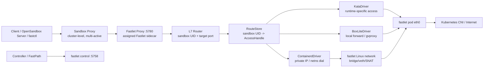

# Fastlet 网络架构设计

## 背景

Fast Sandbox 的目标是作为 OpenSandbox 的底层 sandbox provider，提供低延迟、高密度、可支持安全容器的 sandbox 运行能力。

当前系统已经具备 controller、agent pod、SandboxPool、Sandbox CRD、fast-path API 和 containerd runtime 集成。但现有网络模型仍然带有早期端口映射思路：

- `Sandbox.Spec.ExposedPorts` 表示 sandbox 需要暴露的端口。
- controller 调度时会检查同一个 agent pod 上的端口冲突。
- `Sandbox.Status.Endpoints` 会被更新为 `agentPodIP:port`。

这个模型不适合后续目标。我们希望一个 fastlet pod 内可以运行多个 sandbox，每个 sandbox 都有完整网络栈。多个 sandbox 内部同时监听 `8080` 应该天然合法，端口不应该成为 fastlet 维度的调度资源。

因此，网络层需要从“在 Fastlet Pod 上占用 host port”转向“每个 sandbox 拥有独立私网，由集群级 Sandbox Proxy 和本地 Fastlet Proxy 按 Sandbox UID + target port 路由到对应 runtime 的访问端点”。

本文在 2026-07-18 的方案讨论中补充了 BoxLite runtime。这个接入带来一个重要约束：fastlet 不能假设所有 runtime 都使用由 fastlet 创建的 Linux netns/veth。containerd、Kata 和 BoxLite 可以采用不同网络实现，但必须收敛到统一的路由和访问抽象。

控制面、Sandbox Proxy、Fastlet Proxy 和 Infra Component 的完整职责边界见 [控制面与数据面分离设计](./2026-07-19-control-data-plane-separation-design.md)。

## 核心决策

### 1. 数据面组件命名为 fastlet

原先的 `agent` 概念改名为 `fastlet`。

含义：

- 一个 `fastlet pod` 运行在 Kubernetes 集群中。
- 一个 `fastlet pod` 可以承载多个 sandbox。
- fastlet 负责 sandbox runtime、local network、L7 proxy、状态上报、资源清理协作。

推荐命名体系：

```text
agent pod       -> fastlet pod
agent server    -> fastlet control server
agent proxy     -> fastlet sandbox proxy
agent registry  -> fastlet registry
agentpool       -> fastletpool
fsb-ctl         -> fastctl
```

### 2. fastlet 控制面和 sandbox 访问面分端口

控制面继续使用 `5758`。

```text
fastlet control: 5758
```

用于 controller、fast-path server、janitor 或内部控制组件访问 fastlet：

```text
POST /api/v1/fastlet/create
POST /api/v1/fastlet/delete
GET  /api/v1/fastlet/status
GET  /api/v1/fastlet/diagnostics/logs
```

Fastlet Proxy 使用独立端口：

```text
fastlet proxy: 5780
```

用于 Sandbox Proxy 到 assigned Fastlet 的最后一跳，以及访问 Sandbox 内部 HTTP/SSE/WebSocket 服务：

```text
http://<fastlet-pod-ip>:5780/v1/sandboxes/<sandbox-uid>/ports/<target-port>/...
```

客户端通常不直接访问 `5780`，而是通过集群级多活 Sandbox Proxy 进入。`5758` 不承载用户流量，`5780` 不承载 Fastlet 管理 API。Fastlet Control 与 Fastlet Proxy 以同一 Pod 内不同容器运行，拥有独立进程、端口、资源限制和故障边界。

### 3. 去掉 exposedPorts 作为核心模型

`exposedPorts` 不再作为 sandbox 创建、调度和 endpoint 生成的核心字段。

原因：

- 每个 sandbox 有完整网络栈，端口属于 sandbox 内部命名空间。
- 同一个 fastlet 内多个 sandbox 同时监听同一端口应该允许。
- 对外访问统一走 Sandbox Proxy 和 Fastlet Proxy，不需要预先把某个端口映射到 fastlet pod。
- 数据库、Redis 等 TCP 服务默认留在 sandbox 内部，外部如需读取数据，通过 execd 执行命令或脚本。

新模型中，底层透明代理直接使用 `Sandbox UID + target port` 路由。逻辑 `service name` 只存在于受控 InfraProfile 和 SDK Adapter 中，用来解析组件约定端口，不进入 RouteStore，也不参与调度。

### 4. 对外默认只承诺 L7

Fast Sandbox 对 OpenSandbox/provider 层默认承诺：

- HTTP
- SSE
- WebSocket
- execd/control API

不默认承诺 raw TCP 公网访问。

这与 OpenSandbox、E2B、CubeSandbox 的产品边界一致：sandbox 是执行环境，外部主要通过控制 API、exec、文件 API、HTTP preview 访问。数据库这类 TCP 服务可以运行在 sandbox 内部，外部通过 execd 进入 sandbox 内部操作即可。

raw TCP tunnel 可以作为未来 escape hatch，但不进入第一阶段设计。

### 5. runtime 负责网络实现，fastlet 负责统一访问语义

不同 runtime 的网络实现允许不同：

```text
containerd/runc  -> Linux netns + veth + bridge + SNAT
Kata             -> runtime-specific network driver
BoxLite          -> microVM NIC + gvproxy/libslirp NAT
```

fastlet 不要求所有 runtime 返回 `netnsPath` 或私有 IP。runtime 创建完成后统一返回 `SandboxHandle`，其中的 `AccessHandle` 表示 fastlet proxy 如何连接该 sandbox。

```go
type SandboxHandle struct {
    RuntimeID string
    Access    AccessHandle
}

type AccessHandle interface {
    Dial(ctx context.Context, protocol string, port uint16) (net.Conn, error)
}
```

典型实现：

```text
DirectIP       -> containerd sandbox private IP
NetNSDial      -> 进入指定 netns 后连接 guest IP
LocalForward   -> BoxLite gvproxy 的 fastlet 本地临时端口
UnixSocket     -> 未来可扩展的本地 socket upstream
```

`AccessHandle` 是内部抽象，不进入 CRD。CRD 只保存 runtime 类型、assignment 和可恢复的 runtime/network 元数据。

## 目标架构



fastlet 内部由以下模块组成：

```text
FastletControlServer
  - sandbox create/delete/status/runtime diagnostics
  - controller 和 fast-path 调用

FastletProxy
  - 与 Fastlet Control 分容器部署
  - HTTP/SSE/WebSocket reverse proxy
  - 根据 sandbox UID + target port 路由
  - 透明转发，不理解 execd/envd/rocklet payload

RouteStore
  - sandbox UID -> runtime handle
  - sandbox UID -> AccessHandle
  - 路由发布、摘除和恢复

NetworkManager
  - 仅管理 fastlet-owned Linux 网络资源
  - bridge/veth/netns/IPAM 创建和删除
  - NAT/egress policy
  - NetworkSlotPool

SandboxRuntime
  - 统一 RuntimeDriver 生命周期接口
  - ContainerdDriver / KataDriver / BoxLiteDriver
  - 创建后返回 SandboxHandle 和 AccessHandle

RuntimeResourcePool
  - runtime-specific 预热和容量管理
  - containerd 使用 NetworkSlotPool
  - BoxLite 使用 KVM/VM/backend capacity

Janitor Integration
  - fastlet 消失后的 orphan runtime 清理
  - 按 runtime 执行 containerd/BoxLite 清理
  - orphan netns/veth/nftables/shim/state 兜底清理
```

## 访问模型

### fastlet control

控制面访问 fastlet control port：

```text
http://<fastlet-pod-ip>:5758/api/v1/fastlet/status
http://<fastlet-pod-ip>:5758/api/v1/fastlet/create
http://<fastlet-pod-ip>:5758/api/v1/fastlet/delete
```

这些接口只用于系统内部，不直接作为 sandbox 用户访问面。

### Sandbox Proxy 与 Fastlet Proxy

Sandbox 用户访问面首先进入集群级 Sandbox Proxy，再由它根据 CRD assignment 转发到 assigned Fastlet Proxy：

```text
Client
  -> /v1/sandboxes/<sandbox-uid>/ports/<target-port>/...
  -> Sandbox Proxy
  -> http://<assigned-fastlet-pod-ip>:5780/...
  -> Infra Component
```

路由使用 Sandbox UID 和目标端口。Fastlet Proxy 根据本地 RouteStore 找到 Sandbox 的 `AccessHandle`，再通过请求中的目标端口建立连接。`execd`、`browser` 等 service name 由 InfraProfile/SDK Adapter 在客户端侧解析为约定端口。代理层不定义 Exec/File API，也不解析 Infra Component payload。

OpenSandbox 部署可以用其 Ingress/Server Proxy 替代集群级 Sandbox Proxy，但最后一跳仍经过 Fastlet Proxy。

## sandbox 本地网络模型

每个 sandbox 拥有独立网络上下文和完整端口空间，但其实现由 runtime 决定。

### fastlet-owned Linux 网络

containerd/runc 等 runtime 使用 fastlet 管理的 Linux 网络：

```text
sandbox-id -> netns path
sandbox-id -> veth
sandbox-id -> private IP
sandbox-id -> route state
sandbox-id -> egress policy
```

基础创建流程：

1. fastlet 收到 create sandbox 请求。
2. `NetworkSlotPool` 原子获取一个已准备好的 clean slot。
3. slot 包含 netns、veth、私有 IP、route、DNS 和 MTU。
4. containerd 创建 sandbox task 时使用 slot 的 netns path。
5. runtime ready 后生成 `AccessHandle`。
6. `RouteStore` 发布 `sandbox UID -> AccessHandle`，代理请求携带 target port。
7. fastlet control 返回 sandbox 创建成功。

删除流程：

1. `RouteStore` 先摘除 route，拒绝新连接。
2. fastlet drain 或关闭存量连接。
3. runtime 删除 containerd task/container/snapshot。
4. `NetworkManager` 删除对应 veth、netns、route 和 NAT 状态。
5. 已使用 slot 不直接作为 clean slot 复用，而是销毁后异步补充。
6. fastlet 上报 sandbox 不再存在。

### NetworkSlotPool

创建 netns、veth、地址和规则不应全部进入同步 CreateSandbox 热路径。每个 fastlet 维护一个本地 `NetworkSlotPool`：

```text
Prepare -> Clean Slot -> Acquire -> Bound to Sandbox -> Destroy -> Replenish
```

池中只保存未绑定 sandbox 的 clean slot。slot 一旦使用过，就可能残留 socket、conntrack、route 或 namespace 内状态，因此删除 sandbox 后销毁并异步创建新 slot，不直接回池。

`NetworkSlotPool` 容量是 fastlet admission 的一部分。没有可用 slot 时，fastlet 返回明确的 capacity rejection，由 Fast-Path/Controller 从 Top-K 中选择其他候选，而不是突破容量强行创建。

### runtime-owned 网络

BoxLite 等 runtime 自己管理虚拟 NIC、NAT、DHCP 和 DNS。fastlet 不为它再创建 Linux NetworkSlot，也不重复配置第二层 bridge/SNAT。runtime 只需要向上返回可被 fastlet proxy 使用的 `AccessHandle`。

## 私有 IP 策略

第一阶段，fastlet-owned Linux 网络为每个活跃 slot 分配唯一私有 IP：

```text
fastlet pod A:
  sandbox-1 -> 172.30.0.2
  sandbox-2 -> 172.30.0.3

fastlet pod B:
  sandbox-3 -> 172.30.0.2  # 不同 Pod netns 内可以复用相同网段
```

采用唯一私有 IP 的原因：

- fastlet proxy 可以直接 dial private IP，不需要每次进入目标 netns。
- route、连接池、故障定位和 metrics 更简单。
- 适合 veth/bridge 池化。
- 每个 fastlet pod 位于独立 Pod netns，不同 fastlet 之间可以复用同一私网段。

CubeVS 使用 eBPF 支持多个 sandbox 使用完全相同的 guest IP，这对 VM snapshot 有价值，但不是第一阶段默认方案。未来如果 snapshot 要求 guest 内网络配置完全不变，可以增加 `NetNSDial` 或 eBPF driver：

```text
guest IP: 169.254.240.2
gateway:  169.254.240.1
```

这个模式要求 proxy 按 sandbox 的 `AccessHandle` 进入对应网络上下文。是否启用由 runtime/network driver 决定，不能成为所有 runtime 的统一假设。

## NAT 和 egress

fastlet-owned Linux 网络对外出网使用 SNAT/MASQUERADE：

```text
sandbox netns -> fsb0 -> SNAT -> fastlet pod eth0 -> Kubernetes CNI
```

BoxLite 使用 runtime-owned NAT：

```text
Box eth0 -> gvproxy/libslirp NAT -> fastlet pod eth0 -> Kubernetes CNI
```

BoxLite 第一阶段不再叠加 fastlet bridge/SNAT。其出向连接是否稳定表现为 Fastlet Pod 源地址，以及 Kubernetes NetworkPolicy、conntrack 的行为，需要在远端 Linux/Kubernetes 环境验证。

默认策略：

```text
sandbox -> internet: allow by policy, SNAT to fastlet pod network
internet -> sandbox: deny by default
sandbox -> sandbox: deny by default
fastlet proxy -> sandbox: allow by sandbox-id route
```

第一阶段目标：

- 允许 sandbox 基础出网。
- 支持按 sandbox 维度关闭出网。
- 支持 allow/deny CIDR 的数据结构预留。
- 不实现 raw TCP 入站暴露。

后续可扩展：

- DNS policy。
- per-sandbox egress allowlist。
- egress audit。
- bandwidth/QoS。
- sandbox 间显式网络联通。

## netns 与宿主机关系

containerd 运行在宿主机层面，因此 sandbox netns path 必须对宿主机 containerd 可见。

fastlet pod 需要具备：

```text
privileged 或必要的 CAP_NET_ADMIN/CAP_SYS_ADMIN
hostPath: /run/containerd
hostPath: /var/lib/containerd
hostPath: /run/fast-sandbox/netns
hostPath: /run/fast-sandbox/network
```

建议 netns 路径：

```text
/run/fast-sandbox/netns/<sandbox-id>
```

网络状态路径：

```text
/run/fast-sandbox/network/<sandbox-id>.json
```

这些路径用于：

- fastlet 正常生命周期管理。
- janitor 在 fastlet pod 消失后发现 orphan 资源。
- pause/resume/snapshot 恢复网络元数据。

## janitor 责任

janitor 是 node 侧兜底清理组件。它不参与正常 create/delete 主路径。

当前 janitor 已经负责：

- 扫描 containerd 中带 `fast-sandbox.io/managed=true` label 的容器。
- 当 fastlet pod 消失、Sandbox CRD 消失或 UID mismatch 时清理 orphan container。
- 删除 task/container/snapshot 和 FIFO。

网络架构引入后，janitor 需要扩展兜底清理能力：

```text
ContainerdJanitor
  - task/container/snapshot/FIFO
LinuxNetworkJanitor
  - netns/veth/nftables/state
BoxLiteJanitor
  - orphan Box/shim/runtime state

清理 /run/fast-sandbox/netns/<sandbox-id>
清理 /run/fast-sandbox/network/<sandbox-id>.json
清理 orphan veth 设备
清理 nftables/iptables 中带 sandbox-id 标记的规则
清理 fastlet local bridge 上的残留端口
```

实现时统一抽象为 `ResourceIdentity + CleanupBackend`。Containerd 与 Linux network backend 不各自解释 CRD，而是把 Pod UID、Sandbox UID、instance generation、assignment attempt 和创建时间交给 Janitor authority 层；authority 在扫描和删除前各校验一次。API 错误或 fence 不完整时 fail closed。

Linux reference path 的 bridge、host-veth 和 NAT 位于 Fastlet Pod network namespace，Pod 删除时随该 namespace 自动销毁；跨 Pod 持久的是 bind-mounted named netns、其中的 peer、DNS 文件和 JSON state。因此 LinuxNetworkJanitor 负责后者，不删除可能属于其他活跃 Fastlet 的共享宿主规则。BoxLite backend contract 已预留，但只有 BoxLiteDriver 能稳定提供 list/inspect/remove identity 后才能启用实际清理。

BoxLite 不能通过扫描 containerd 判断存活状态。`BoxLiteDriver` 必须提供 runtime-specific list/inspect/remove 能力，janitor 再结合 Sandbox CRD UID、assigned Fastlet UID、BoxLite runtime state 和 shim 进程做二次确认。

建议所有网络资源都带 sandbox id 标记，便于 janitor 判断所有权：

```text
veth name: fsb-<short-sandbox-id>
nft set/comment: fast-sandbox:<sandbox-id>
netns path: /run/fast-sandbox/netns/<sandbox-id>
state file: /run/fast-sandbox/network/<sandbox-id>.json
```

janitor 清理前仍需做二次确认：

- Sandbox CRD 是否还存在。
- fastlet pod UID 是否仍存在。
- containerd container label 是否属于该 sandbox。
- state file 中记录的 owner UID 是否匹配。

## Runtime 适配

### 统一 RuntimeDriver 边界

BoxLite 接入后，`RuntimeDriver` 不能再隐含“containerd + netns”语义。统一接口至少覆盖：

```text
Ensure / Inspect / Delete / Reset
GetAccessHandle
ListManagedSandboxes（供恢复和 Janitor 使用）
Capacity / Admission
```

CreateSandbox 使用 CRD UID 作为 runtime sandbox 的全局身份。每个 driver 都必须把 `Ensure(uid)` 实现为幂等操作，以承接 Fast-Path 重试、Controller Reconcile 和响应丢失后的恢复。

### runc/container

优先支持。

预期路径：

1. fastlet 创建 netns。
2. fastlet 配置 veth 和路由。
3. containerd 使用 netns path 创建 task。
4. fastlet proxy 按 sandbox-id 进入对应网络上下文访问 sandbox。

### gVisor

目标与 runc 一致，但需要远端 e2e 验证。

关注点：

- gVisor 对 netns path 的支持。
- gVisor 网络栈与 veth/tap 的兼容性。
- 长连接、WebSocket、DNS、出网策略。

### kata-qemu / kata-clh / kata-fc

kata 是最大不确定点。

理论目标：

- 上层 fastlet proxy、RouteStore、control API 不感知 runtime 差异。
- 底层通过 runtime-specific network driver 接入 sandbox 网络。

可能路径：

```text
LinuxNetnsDriver
  - runc/gVisor 默认实现

KataNetDriver
  - kata-qemu/kata-clh/kata-fc 分别验证
  - 可能使用 tap/macvtap/TC/filter 等不同接入方式

FallbackDriver
  - 如 kata 某些形态无法复用 netns，则保留单独 fallback
```

原则：

- 不让 kata 的复杂性污染 fastlet proxy 和 CRD/API。
- runtime 差异收敛在 `NetworkDriver` 和 `RuntimeDriver` 边界内。
- 所有 secure runtime 行为必须通过远端 Linux VM e2e 验证。

### BoxLite

BoxLite 是独立 runtime backend，不是 containerd RuntimeClass。一个 Box 是带独立内核的 microVM，内部运行 OCI container；BoxLite 自己管理 shim、guest agent、镜像、持久化状态和虚拟网络。

第一阶段推荐通过官方 Go SDK 嵌入 Fastlet：

```text
Fastlet
  -> one long-lived BoxliteRuntime
      -> one Box per Sandbox CRD UID
          -> boxlite-shim
              -> libkrun/KVM microVM
```

备选方案是在 Fastlet Pod 内运行 `boxlite serve` sidecar，由 `BoxLiteDriver` 通过 localhost REST 调用。sidecar 可以隔离 CGO/native library 和进程故障，但增加一个服务生命周期和接口层。两种方式在实现前通过原型对比，架构上保持同一个 `BoxLiteDriver` 边界。

部署约束：

- Linux 节点必须提供 `/dev/kvm`。
- Fastlet Pod 需要相应 device、securityContext 和 cgroup 权限。
- 每个 Fastlet 维护一个长期存活的 `BoxliteRuntime`。
- 每个 Fastlet 使用独立 `BOXLITE_HOME`；不同 Fastlet Pod 不共享同一目录。
- `BOXLITE_HOME` 承载 Box 状态、OCI image cache、日志和 runtime 数据，需要明确 hostPath/PVC 与 Pod 重建策略。
- Fastlet 初次接入时使用独立的 BoxLite SandboxPool，不与 containerd/Kata 混跑。

网络接入：

- Box 内部拥有独立 VM NIC 和完整端口空间。
- 默认通过 gvproxy/libslirp 提供 NAT、DHCP、DNS 和 TCP/UDP port forwarding。
- `UsedPorts` 和端口冲突检测仍应从全局 Registry/调度模型移除。
- Fastlet proxy 通过 `LocalForward` 等 `AccessHandle` 连接 Box 内服务。
- host-side 临时端口只是单 Fastlet 内部实现资源，不是用户端口，也不进入控制面调度。
- 如果 BoxLite 只能在创建 Box 时声明 port mapping，则任意目标端口的动态访问依赖 BoxLite 动态 forwarding 能力；这是实现前必须验证的接口边界。
- exec 和文件操作优先使用 BoxLite SDK/guest agent，不经过 Sandbox 业务网络。

池化和 admission：

- Linux `NetworkSlotPool` 不适用于 BoxLite。
- BoxLite admission 需要检查 `/dev/kvm`、vCPU、内存、磁盘、Box 数量和 network backend 容量。
- 如果未来需要预热 Box/VM/gvproxy，放入 `BoxLiteResourcePool`，不能伪装成 Linux NetworkSlot。

BoxLite 官方架构和接口参考：

- [BoxLite Repository](https://github.com/boxlite-ai/boxlite)
- [BoxLite Architecture Overview](https://docs.boxlite.ai/architecture)
- [BoxLite Core Components](https://docs.boxlite.ai/architecture/components)
- [BoxLite Networking & Storage](https://docs.boxlite.ai/architecture/networking-storage)

## CRD 和 API 变化

### SandboxSpec

公共 schema 不包含：

```text
spec.exposedPorts
```

当前网络策略保留在 Fastlet 内部，不暴露尚未稳定的公共 CRD；未来如需开放，应使用独立、版本化的 policy contract，例如：

```yaml
spec:
  runtime:
    type: containerd # containerd | kata | boxlite
  network:
    allowInternetAccess: true
    allowOut:
      - 10.0.0.0/8
    denyOut:
      - 169.254.169.254/32
```

当前实现只保留内部 Go 类型。

### SandboxStatus

当前权威模型：

```yaml
status:
  assignment:
    fastletName: fastlet-abc
    fastletPodUID: 01234567-89ab-cdef-0123-456789abcdef
    attempt: 1
  routeGeneration: 1
  dataPlaneState: Ready
```

`guestIP`、`gatewayIP`、AccessHandle 和 host-side forward 信息属于 runtime/Fastlet Proxy 内部状态，不是稳定的跨 runtime CRD API。诊断通过 runtime-specific diagnostics 或 metrics 暴露，不添加投影字段。

### FastPath API

`CreateResponse` 不再返回 `agentIP:port` 形式的 endpoints。Fast-Path Core 也不定义 Exec/File 数据协议。

建议返回：

```protobuf
message SandboxAccess {
  string sandbox_uid = 1;
  string proxy_endpoint = 2;
  map<string, string> required_headers = 3;
}
```

其中 `proxy_endpoint` 指向 Sandbox Proxy 或上层产品提供的等价集群代理，不暴露 Fastlet Pod IP：

```text
proxy_endpoint = https://<sandbox-proxy>/v1/sandboxes/<sandbox-uid>/ports/<target-port>
```

## 与 OpenSandbox 的关系

Fast Sandbox 作为 OpenSandbox provider 时，OpenSandbox Server 不需要感知底层 netns、veth、NAT 或 kata 网络细节。

Provider 只需要知道：

```text
sandbox UID
target port（由具体协议 SDK 或用户服务配置提供）
Sandbox Proxy endpoint 或 OpenSandbox Ingress endpoint
required access headers
```

OpenSandbox Server 对外仍提供自己的 API、鉴权、生命周期、文件、exec、snapshot 等产品能力。Fast Sandbox 注入 execd 并提供到 execd service 的透明路由，但不复制 execd API。

## 错误处理

### 缺少或非法的路由身份

返回：

```text
400 Bad Request
message: missing sandbox UID or target port
```

### sandbox 不存在

返回：

```text
404 Not Found
message: sandbox route not found
```

### sandbox 正在创建或恢复

返回：

```text
409 Conflict 或 503 Service Unavailable
message: sandbox network is not ready
```

### 目标端口不可达

返回：

```text
502 Bad Gateway
message: sandbox upstream unavailable
```

### runtime/network driver 不支持

create sandbox 阶段失败，并在 Sandbox condition 中记录：

```text
NetworkReady=False
Reason=UnsupportedRuntimeNetwork
```

## 测试策略

### 单元测试

覆盖：

- Sandbox UID + target port route 解析。
- route table 查找。
- sandbox route 不存在。
- proxy upstream 错误映射。
- network state serialization。
- janitor orphan state 匹配。
- `exposedPorts` 不参与调度。

### 集成测试

覆盖：

- 同一个 fastlet 内创建两个 sandbox，内部都监听 `8080`。
- 通过 Sandbox Proxy 和 Fastlet Proxy 分别访问两个 sandbox。
- containerd `DirectIP/NetNSDial` 和 BoxLite `LocalForward` 使用同一套 proxy route 语义。
- BoxLite 两个 Box 使用相同 guest port 时互不冲突。
- 不带 header 返回 400。
- 错误 sandbox id 返回 404。
- sandbox 删除后 proxy route 被移除。
- fastlet 重启后从 state/containerd 恢复 route。
- BoxLite runtime/sidecar 重启后可以根据 CRD UID 恢复或明确报告不可恢复状态。

### e2e 测试

必须通过远端 Linux VM 执行，不能在本地 macOS 验证。

覆盖：

- runc/container runtime。
- gVisor runtime。
- kata-qemu。
- kata-clh。
- kata-fc。
- BoxLite/KVM。
- BoxLite 出向流量的源 IP、NetworkPolicy 和 conntrack 行为。
- BoxLite port forwarding 的创建、冲突、删除和动态更新能力。
- pause/resume 后网络可用。
- snapshot/restore 后 guest IP/gateway 不变。
- janitor 清理 fastlet pod 消失后的 orphan 网络资源、Box 和 shim。

## 实施阶段

### Phase 1: 命名收敛

只做重命名，不改变行为：

```text
agent -> fastlet
fsb-ctl -> fastctl
agentpool -> fastletpool
agentcontrol -> fastletcontrol
AGENT_* env -> FASTLET_* env
```

目标是先统一概念语言，降低后续网络改造的沟通成本。

### Phase 2: endpoint 语义改造

目标：

- 从公共 schema 和调度状态中删除 `exposedPorts`。
- 不再生成 `agentPodIP:port` endpoints。
- status/API 返回 Sandbox Proxy endpoint、service descriptor 和 required headers。
- 不保留旧字段、endpoint 投影或迁移 adapter。

### Phase 3: Sandbox Proxy 和 Fastlet Proxy

目标：

- 新增独立多活 Sandbox Proxy Deployment。
- 在每个 Fastlet Pod 增加独立 Fastlet Proxy sidecar（`5780`）。
- 使用 Sandbox UID + target port 路由。
- 支持 HTTP/SSE/WebSocket。
- 透明代理到 execd/envd/rocklet，不解析其 API。
- Local RouteStore 与 Sandbox lifecycle、assignment attempt 绑定。

### Phase 4: NetworkManager

目标：

- 创建 bridge/veth/netns。
- 引入 NetworkSlotPool，预热 clean netns/veth/IP slot。
- 支持每个活跃 slot 使用唯一私有 IP。
- 支持 SNAT 出网。
- 支持 delete 清理。
- 支持 runc/container e2e。

### Phase 5: secure runtime 适配

目标：

- gVisor 网络 e2e。
- kata-qemu 网络 e2e。
- kata-clh 网络 e2e。
- kata-fc 网络 e2e。
- 必要时引入 runtime-specific network driver。

### Phase 6: BoxLite runtime 适配

目标：

- 验证 Go SDK 内嵌和 `boxlite serve` sidecar 两种方式。
- 实现 `BoxLiteDriver` 的幂等 Ensure/Delete/Inspect/GetAccessHandle/ListManagedSandboxes。
- 使用 CRD UID 作为 Box identity。
- 接入 `AccessHandle` 和 fastlet proxy。
- 验证 gvproxy port forwarding 是否支持动态目标端口。
- 建立 BoxLite admission、状态恢复和 Janitor 路径。
- 建立独立 BoxLite SandboxPool 和 `/dev/kvm` 部署模板。

### Phase 7: pause/resume/snapshot

目标：

- pause/resume 后 route table 恢复。
- snapshot/restore 后 guest IP/gateway 不变。
- 长连接断开语义明确。
- janitor 可清理异常中断后的残留网络资源。

## 后续问题

当前已确定 URI route、ResolveEndpoint descriptor、两跳代理、内部 AccessHandle、network policy 暂不进入 CRD，以及 BoxLite sidecar 形态。后续仍需分别验证：

1. kata-qemu/kata-clh/kata-fc 的 network driver 能力差异；
2. BoxLite 动态 port forwarding 对任意 target port 的覆盖范围；
3. `BOXLITE_HOME` 的持久化形态；
4. BoxLite persistent/detached Box 与 delete/reset/expireTime 的声明式语义。

## 总结

Fast Sandbox 的网络方向应当是：

```text
外部访问集群级 Sandbox Proxy，不直接访问 sandbox IP/port。
Sandbox Proxy 根据 CRD assignment 转发到 assigned Fastlet Proxy。
Fastlet Proxy 根据 Sandbox UID 查找本地 AccessHandle，并透传 SDK/调用方指定的 target port。
每个 sandbox 拥有完整网络栈。
exposedPorts 不再是核心模型。
RouteStore 保存 sandbox UID -> AccessHandle，不假设所有 runtime 都有 netns/private IP。
containerd 使用 fastlet-owned netns/veth/bridge/SNAT 和 NetworkSlotPool。
BoxLite 使用 runtime-owned microVM NIC 和 gvproxy/libslirp NAT。
janitor 按 runtime 负责 orphan 网络资源、Box、shim 和状态兜底清理。
```

这条路线能同时服务三个目标：

- 作为 OpenSandbox provider 时保持清晰的 L7 产品边界。
- 支持一个 fastlet pod 下多个 sandbox 的高密度架构。
- 允许 containerd、Kata、BoxLite 在同一控制语义下使用不同数据面实现。
- 为 pause/resume/rootfs 或 VM snapshot 保留稳定网络栈的演进空间。
