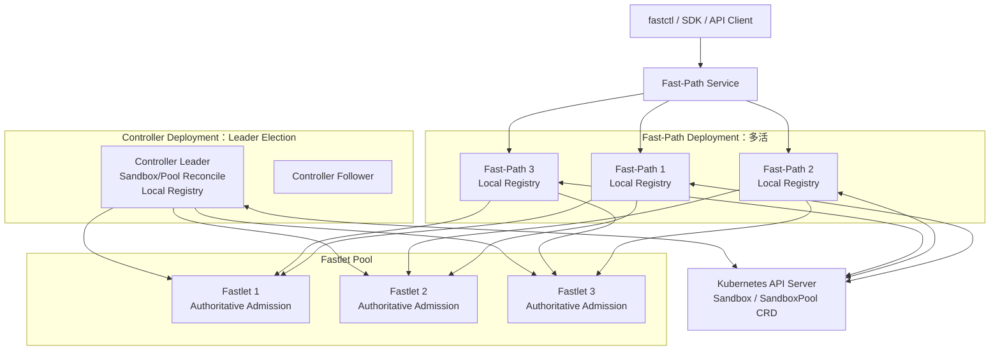
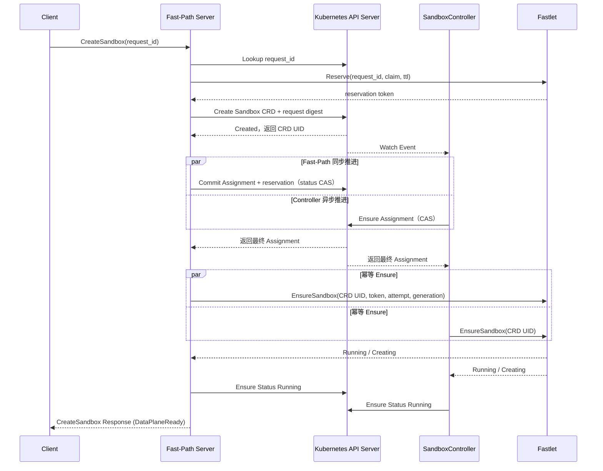

# Fast Sandbox 多活 Fast-Path 控制面设计

**日期**：2026-07-18  
**状态**：已确认并实现
**范围**：Fast-Path Server 多活、Controller 单活、Local Registry、Fastlet Admission、Sandbox 创建一致性

## 1. 背景

当前 Fast Sandbox 将以下能力运行在同一个 Controller 进程中：

- Fast-Path gRPC Server；
- SandboxController；
- SandboxPoolController；
- Fastlet Control Loop；
- In-Memory Registry。

Controller 使用 Kubernetes leader election 保证 Reconcile 单活。由于 Fast-Path Server 与 Controller 共享进程和内存 Registry，Fast-Path API 也只能由 Leader 稳定提供服务。

这带来两个问题：

1. Fast-Path API 存在单点，Controller Leader 切换期间同步创建请求不可用；
2. Fast-Path 的同步请求处理能力无法通过增加副本水平扩展。

本设计将同步 Fast-Path 与声明式 Controller 解耦：Fast-Path Server 多活处理同步创建请求，SandboxController 和 SandboxPoolController 继续使用 Kubernetes leader election 单活 Reconcile。

## 2. 设计目标

- Fast-Path Server 支持多副本同时对外服务；
- Controller Leader 故障不直接中断 Fast-Path API；
- 没有部署 Fast-Path Server 时，系统仍可仅依赖 CRD 和 Controller 正常工作；
- 支持用于开发的单进程组合部署方式；
- 不要求不同进程中的 Local Registry 强一致；
- 使用 Kubernetes API Server 保证 Sandbox 全局身份和调度状态转换的一致性；
- 使用 Fastlet Admission 保证单个 Fastlet Pod 的容量上限；
- Fast-Path 与 Controller 推进同一个 Sandbox 状态机，避免形成两套创建语义。

## 3. 非目标

以下问题不在本设计中展开：

- 每个 Sandbox 的独立私有网络；
- Sandbox 端口冲突和端口调度；
- Fastlet 内部 NetworkManager、IPAM、veth、netns 和 L7 Proxy；
- Top-K 的最终评分权重和性能参数；
- CreateSandbox 超时、重试次数等接口细节；
- 具体 CRD 字段、annotation 和 status schema。

Sandbox 独立网络架构将作为后续独立议题讨论。本设计假设每个 Sandbox 拥有独立网络和完整端口空间，端口不属于 Fastlet 调度资源。

## 4. 控制面行为分类

Fast Sandbox 的生命周期控制接口分为命令式和声明式两类。

### 4.1 同步命令式创建

`CreateSandbox` 是生命周期接口中唯一需要同步推进实际资源创建的接口。

Fast-Path Server 收到创建请求后：

1. 使用稳定 `request_id` 查询或建立本次创建的幂等身份；
2. 根据 Local Registry 的 Top-K 候选向 Fastlet 请求有时限的原子 Reservation；
3. 如果所有候选明确拒绝，直接快速失败，不创建 Sandbox CRD；
4. Reservation 成功后创建 Sandbox CRD，并通过 status CAS 持久化唯一 assignment；
5. 使用 CRD UID、assignment attempt 和 generation 请求对应 Fastlet 幂等 Ensure；
6. required Infra 和本地 route Ready 后返回结果。

Fast-Path 的价值是同步推进创建流程，不需要等待 Controller Watch、workqueue 和 Reconcile 调度。

同一个 `request_id` 必须绑定规范化请求摘要。相同 ID、相同摘要返回同一个 Sandbox；相同 ID、不同摘要返回冲突。Controller-only 路径没有 RPC 快速失败承诺，它可以先观察用户创建的 CRD，再按声明式状态机进行调度和重试。

### 4.2 声明式生命周期变更

其他生命周期变更只修改期望状态，由 Controller 异步 Reconcile：

| 操作 | Fast-Path Server 行为 | Controller 行为 |
|---|---|---|
| DeleteSandbox | 删除 Sandbox CRD，提交删除意图 | 通过 Finalizer 删除运行时资源并完成 CRD 删除 |
| ResetSandbox | 更新 `resetRevision` | 删除旧实例并重新创建 |
| Update ExpireTime | 更新 CRD Spec | 到期后清理运行时资源 |
| Update FailurePolicy | 更新 CRD Spec | 按新策略处理后续故障 |

Delete、Reset 和 Update 的同步返回表示期望状态已被 Kubernetes API Server 接受，不表示底层运行时操作已经完成。

### 4.3 查询和数据面操作

- Get/List 从 Sandbox CRD 读取状态；
- Exec、File、Session、PTY 和 command logs 是针对已有 Sandbox 的即时数据面操作，不属于生命周期 Reconcile 语义，也不进入 FastPath Service；
- 这些具体协议由 Sandbox 内注入的 execd/envd/rocklet 等 Infra Component 提供，流量通过 `Sandbox Proxy -> Fastlet Proxy` 透明转发；
- Fast Sandbox 仅保留 runtime/startup diagnostics。详细边界见 [控制面与数据面分离设计](./2026-07-19-control-data-plane-separation-design.md)。

## 5. 部署架构

同一套程序支持三种运行角色：

```text
--role=fastpath
--role=controller
--role=all
```

### 5.1 多活生产部署



Fast-Path Service 只选择 `role=fastpath` 的实例。纯 Controller 实例不加入 Fast-Path Service。

### 5.2 纯声明式部署

可以不部署 Fast-Path Server：

```text
kubectl / Kubernetes Client
  → 创建或修改 Sandbox CRD
  → SandboxController Watch/Reconcile
  → 选择 Fastlet
  → 创建或更新运行时 Sandbox
```

Fast-Path 是可选的同步加速入口，不是系统正确运行的必要组件。

### 5.3 单进程开发部署

`role=all` 在同一个进程中运行：

- Fast-Path Server；
- SandboxController；
- SandboxPoolController；
- Fastlet Control Loop；
- Registry。

该模式仅用于开发和小规模验证，不承诺生产高可用；生产部署必须拆分 Fast-Path 与 Controller。

## 6. CRD 是全局状态源

Sandbox CRD 是全局身份、期望状态和当前 assignment 的唯一持久化来源。

### 6.1 全局名称唯一性

多个 Fast-Path Server 同时创建相同 Namespace/Name 的 Sandbox 时，都先向 Kubernetes API Server 创建同名 CRD：

```text
Fast-Path 1 → Create Sandbox default/demo → Success
Fast-Path 2 → Create Sandbox default/demo → AlreadyExists
```

只有成功创建 CRD，或者确认已有 CRD 属于同一个幂等请求的调用方，才能继续推进该 Sandbox 的创建。

Sandbox CRD UID 作为运行时 `sandboxID`，避免多个 Fast-Path Server 使用本地时间戳生成不同 ID。

### 6.2 Assignment 一致性

Fast-Path Server 和 SandboxController 都可以为未调度 Sandbox 选择 Fastlet。不同进程可以拥有不同的 Local Registry，并选出不同候选。

Assignment 通过 Kubernetes `resourceVersion` 乐观并发控制提交：

```text
Fast-Path 选择 Fastlet A → CAS 写入成功
Controller 选择 Fastlet B  → CAS 冲突
Controller 重新读取 CRD    → 跟随 Fastlet A
```

系统不要求唯一的调度执行者，只要求从“未分配”到“已分配”的状态转换唯一。

Assignment 至少需要表达：

- Fastlet 名称；
- Fastlet Pod UID；
- Node；
- Assignment attempt/generation。

具体存储在 annotation 或 status 中，在实施阶段确定。

## 7. Fast-Path 与 Controller 共同推进创建

Fast-Path Server 和 SandboxController 执行相同的 Ensure 状态机：

```text
Ensure CRD Exists
  → Ensure Assignment
  → Ensure Runtime Sandbox Exists
  → Ensure CRD Status Running
```

区别在于：

- Fast-Path 在一次同步请求中主动推进并等待创建结果；
- SandboxController 通过 Watch/Reconcile 异步推进和恢复。

两者不竞争独占的“创建执行权”，因此不引入 Fast-Path owner lease。

Fast-Path 创建 CRD 后即使立即退出，Controller 也可以从 CRD 中继续完成创建。Fast-Path 与 Controller 同时调用同一个 Fastlet 时，由 Fastlet 的幂等 Ensure 语义吸收重复请求。

## 8. Local Registry

每个 Fast-Path Server 和 Controller 实例维护自己的 Local Registry。Registry 之间不进行强一致同步。

Registry 的定位从“分配事实存储”调整为“候选缓存和调度提示”：

- Fastlet 服务发现；
- Pool、Node、Runtime 等静态信息；
- 最近观察到的容量和负载；
- 镜像缓存信息；
- Ready、Draining 和心跳信息；
- Top-K 候选生成。

Registry 数据过期只允许影响调度质量和重试次数，不能破坏容量约束。

`Registry.Allocate()` 不再代表已成功占用一个全局 slot。真正的容量占用由 Fastlet Admission 完成。

## 9. Top-K 调度和重试

Local Registry 根据缓存状态生成 Top-K Fastlet 候选。初始策略保持简单：

1. 按 Pool、Runtime、Ready、Draining、心跳状态过滤；
2. 根据镜像缓存和归一化负载评分；
3. 选择 Top-K，默认可取 3；
4. 使用 Sandbox UID 对 Top-K 顺序做稳定扰动，避免所有 Fast-Path 实例集中请求同一个 Fastlet；
5. 串行调用候选 Fastlet，不并行创建；
6. 对明确的容量不足、Draining 和暂时不可用尝试下一个候选；
7. 根据 Fastlet 拒绝结果修正当前进程的 Local Registry。

Top-K 负责提高成功率和降低重试延迟，不承担调度正确性。

当 Fastlet 返回明确的 Admission 拒绝时，执行方通过 CRD `resourceVersion` CAS 更新 assignment，再尝试下一个候选。

当请求结果不确定，例如调用 Fastlet 超时，不能立即切换到另一个 Fastlet。执行方保留当前 assignment，由后续查询或 Controller Reconcile 确认实际状态，避免产生重复运行时实例。

## 10. Fastlet Admission

Fastlet 是单 Pod 容量的最终权威。

Fastlet 在本地原子执行：

```text
检查 Ready / Draining
  → 检查相同 Sandbox UID 是否已存在
  → 检查 running + creating 是否达到 maxSandboxesPerPod
  → 写入 Creating 占位并占用容量
  → 调用 containerd 创建
  → 成功转为 Running，失败释放容量
```

相同 Sandbox UID 和相同 Claim 的重复创建必须具有 Ensure 语义：

- 已 Running：幂等成功；
- 正在 Creating：返回进行中或等待同一个创建结果；
- 不存在且有容量：执行创建；
- 已达到容量：明确拒绝且保证没有创建运行时资源；
- Sandbox UID 相同但 Claim 不同：返回冲突。

Fastlet 重启后必须从 containerd 中恢复由本 Fastlet 管理的 Sandbox，否则内存容量会错误地从零开始。

## 11. 创建流程



该流程允许 Fast-Path 和 Controller 并发工作，不需要显式 owner lease，也不需要 Controller 等待 Fast-Path 故障后再接管。

## 12. 声明式变更流程

### 12.1 删除

```text
Fast-Path DeleteSandbox
  → Delete Sandbox CRD
  → 返回删除意图已接受

SandboxController
  → 观察 deletionTimestamp
  → 删除 Fastlet Runtime
  → 释放相关状态
  → 移除 Finalizer
```

### 12.2 Reset

```text
Fast-Path ResetSandbox
  → 更新 resetRevision
  → 返回更新成功

SandboxController
  → 检测新 revision
  → 清理旧实例
  → 创建新实例
  → 更新 acceptedResetRevision
```

### 12.3 ExpireTime 和 FailurePolicy

Fast-Path 只更新 Sandbox Spec，Controller 根据最新期望状态执行 Reconcile。

## 13. 故障语义

### 13.1 Fast-Path Reservation 前或所有候选明确拒绝

没有 Sandbox CRD。客户端可以使用相同 `request_id` 安全重试。Fastlet 对未提交 Reservation 按 TTL 自动回收。

### 13.2 Fast-Path 获得 Reservation、创建 CRD 前失败

没有 Sandbox CRD和 runtime；Reservation 按 TTL 回收。相同 `request_id` 重试可以复用仍有效的 Reservation 或重新选择候选。

### 13.3 Fast-Path 创建 CRD 后失败

Controller Watch 到 CRD 后继续完成 assignment、运行时创建和状态更新。

### 13.4 Fast-Path 调用 Fastlet 后响应丢失

保留当前 assignment，不立即换节点。Controller 或后续重试使用相同 Sandbox UID 向相同 Fastlet执行幂等 Ensure。

### 13.5 Local Registry 状态过期

Fastlet Admission 拒绝不合法分配，执行方尝试 Top-K 中的其他候选并修正本地缓存。

### 13.6 Controller Leader 切换

Fast-Path 多活实例继续提供同步 API。新 Controller Leader 从 CRD 和 Fastlet 状态继续 Reconcile。

## 14. 与旧高可用方案的关系

本方案不采用以下旧设计作为主要方向：

- Fast-Path Leader/Follower 请求转发；
- 按 Pool 对 Controller 进行客户端路由和分片。

Fast-Path Server 通过多活副本直接处理请求，不依赖唯一 Fast-Path Leader。Sandbox 的全局身份和 assignment 一致性由 Kubernetes API Server 提供，单 Fastlet 容量一致性由 Fastlet Admission 提供。

旧文档保留为历史设计记录，后续可在本方案确定后标记为 Superseded。

## 15. 实施阶段再确定的细节

以下内容不阻塞当前总体方案，在实施阶段结合测试进一步确定：

- Fastlet `Creating` 的等待和返回协议；
- Fast-Path 同步等待 CRD Status 的方式；
- Top-K 默认值、评分权重和最大重试次数；
- Fastlet 明确拒绝与不确定错误的错误码；
- assignment attempt 的字段和状态转换；
- 相关 metrics、tracing 和告警。

## 16. 核心结论

1. Fast-Path Server 与 Sandbox/Pool Controller 分离部署；
2. Fast-Path Server 多活并通过独立 Service 对外提供同步 API；
3. SandboxController 和 SandboxPoolController 继续 leader election 单活 Reconcile；
4. 同一套代码支持 `fastpath`、`controller` 和 `all` 三种角色；
5. Fast-Path 是可选加速路径，Controller 可以仅凭 CRD 独立工作；
6. CreateSandbox 是同步命令式生命周期接口，其他生命周期变更采用声明式语义；
7. Sandbox CRD 是全局身份和 assignment 的唯一持久化来源；
8. Kubernetes CRD Create 和 `resourceVersion` CAS 解决多 Fast-Path 的全局创建与调度竞争；
9. Local Registry 是弱一致候选缓存，不承担最终分配正确性；
10. Top-K 调度用于降低弱一致缓存带来的失败和重试成本；
11. Fastlet Admission 原子保证 `maxSandboxesPerPod`；
12. Fast-Path 和 Controller 幂等推进同一个 Ensure 状态机，不需要显式创建 owner lease；
13. RPC Create 先 Reservation、后 CRD，明确容量失败不遗留 CRD；
14. `request_id + 规范化请求摘要` 提供端到端创建幂等性；
15. assignment 的权威位置是 Sandbox status，并通过 `resourceVersion` CAS 更新。
