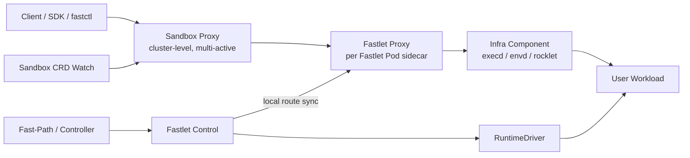
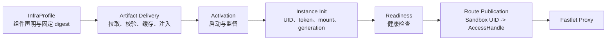

# Fast Sandbox 控制面与数据面分离设计

## 状态

本文记录 2026-07-19 已确认的总体方案。当前阶段只确定架构边界和核心语义，不进入具体接口、代理库和实现参数设计。

相关方案：

- [多活 Fast-Path 控制面设计](./2026-07-18-multi-active-fastpath-control-plane-design.md)
- [Fastlet 网络架构设计](./2026-05-05-fastlet-network-architecture-design.md)
- [Sandbox Runtime 抽象设计](./2026-07-19-sandbox-runtime-abstraction-design.md)

## 1. 背景

当前 master 已经由 Fastlet 直接提供 runtime logs。`feature/fastctl-exec` 分支进一步实现了以下调用链：

```text
fastctl / Python SDK
  -> FastPath Exec/File gRPC
  -> FastPath 查询 Sandbox CRD assignment
  -> assigned Fastlet HTTP Exec/File API
  -> SandboxManager
  -> containerd runtime exec/file operation
```

这条链路能快速提供功能，但会让生命周期控制面同时承担数据协议、长连接和大流量转发。随着能力扩展，FastPath 和 Fastlet Control 将被迫理解：

- command、session、background process；
- stdin/stdout/stderr streaming；
- PTY、resize、signal、cancel；
- file read/write/list/stat/delete；
- SSE、WebSocket 和长连接；
- code interpreter、Jupyter 和 metrics。

OpenSandbox 的 `execd`、E2B 的 `envd` 和 ROCK 的 `rocklet` 已经体现了相同的产品分层：生命周期平台负责创建和寻址，Sandbox 内部组件负责 exec、file、session 等具体行为。

因此，Fast Sandbox 不再继续建设一套自身的 Exec/File 数据协议，而是提供通用的 Infra Component 注入和透明访问基础设施。

## 2. 核心决策

### 2.1 Fast Sandbox Core 不定义 Exec/File 协议

Fast Sandbox Core 不定义和实现以下公共数据协议：

```text
Exec
FileStat / FileList / FileRead / FileWrite / FileDelete / FileMkdir
Command Session / Background Process
PTY / Terminal
Code Interpreter
Command Logs
```

这些语义由注入 Sandbox 的 Infra Component 提供，例如：

```text
execd
envd
rocklet
custom sandbox agent
```

Fast Sandbox Core 只提供：

- Infra Component 声明和注入；
- Infra Component 生命周期管理；
- service 注册和发现；
- Sandbox 数据面鉴权；
- 集群级路由；
- Fastlet 本地路由；
- HTTP/SSE/WebSocket 等透明代理；
- runtime diagnostics。

### 2.2 数据面独立于控制面

控制面不承载用户数据流量。

控制面组件：

```text
Fast-Path Server
SandboxController / SandboxPoolController
Fastlet Control
```

数据面组件：

```text
Sandbox Proxy
Fastlet Proxy
Infra Component
```

Fast-Path Server 不转发 exec、file、PTY、SSE 或 WebSocket 流量。它只负责生命周期、CRD 更新、endpoint resolution 和访问凭证签发等控制行为。

### 2.3 集群级代理命名为 Sandbox Proxy

原讨论中的 `Data Gateway` 正式命名为 `Sandbox Proxy`。

推荐工程命名：

```text
概念名称:    Sandbox Proxy
Go 类型:     SandboxProxy
二进制:      sandbox-proxy
Deployment:  fast-sandbox-proxy
Service:     fast-sandbox-proxy
代码包:      internal/sandboxproxy
```

不使用 `DataGateway`、`DataProxy` 或 `CentralProxy`：这些名称没有准确描述被代理对象，或者错误暗示单点中心。

### 2.4 Fastlet 本地代理命名为 Fastlet Proxy

每个 Fastlet Pod 内运行一个独立的 `Fastlet Proxy` sidecar。它与 Fastlet Control 共享 Pod network namespace，但拥有独立进程、端口、资源限制和故障边界。

推荐工程命名：

```text
概念名称:   Fastlet Proxy
二进制:     fastlet-proxy
Container:  fastlet-proxy
代码包:     internal/fastletproxy
```

### 2.5 底层路由基于 Sandbox UID 和 Target Port

数据面不以 Fastlet host port 或 `exposedPorts` 作为核心路由模型。

核心路由键：

```text
sandbox UID + target port
```

具体协议 SDK 或 InfraProfile 可以继续提供逻辑服务别名：

```text
execd -> 44772
envd  -> profile-defined port
```

SDK 先把别名解析为端口，再调用 `ResolveEndpoint(sandbox UID, target port)`。私有 IP、netns path 或 BoxLite local forward 仍然只是 Fastlet 内部实现，不进入用户稳定 API，也不参与控制面 Registry 调度。底层不维护全局 `service name -> port` 注册表。

### 2.6 Infra Component 使用受控 Profile

`SandboxPool` 定义平台允许的 `InfraProfile`，Sandbox 只引用 Profile。第一阶段不允许普通租户通过 Sandbox Spec 任意注入二进制和启动命令。

示例：

```text
opensandbox -> execd
e2b         -> envd
rock        -> rocklet
minimal     -> no infra component
```

这样可以统一完成 artifact 校验、池化预热、启动顺序、安全策略和兼容性验证。

### 2.7 required Infra Component 进入 CreateSandbox 成功条件

如果 InfraProfile 中的组件被声明为 `required`，CreateSandbox 只有在以下条件满足后才能成功返回：

```text
runtime ready
infra component started
infra health check passed
Fastlet local route published
Sandbox data plane ready
```

可选组件失败不阻塞 Sandbox 创建，但必须通过 Condition 和 diagnostics 暴露。

### 2.8 SDK 保留用户体验，通过 Adapter 接入具体协议

`fastctl exec/cp/files` 和 Python SDK 的高层能力可以保留，但它们不再调用 FastPath Exec/File RPC。

SDK 通过协议 Adapter 连接 Sandbox Proxy：

```text
ExecdAdapter
EnvdAdapter
RockletAdapter
CustomInfraAdapter
```

Adapter 可以与 Fast Sandbox SDK 放在同一仓库，也可以由上层产品提供；Fast Sandbox Core API 不依赖具体 Adapter。

### 2.9 Infra 注入的核心抽象是 Sandbox Runtime Augmentation

Infra Component 注入不应抽象成“容器启动后复制一个二进制”，而应抽象成 **Sandbox Runtime Augmentation（Sandbox 运行时增强）**：

> 基于用户提供的 OCI Image，在不要求用户修改原始镜像的前提下，由 Fast Sandbox 将用户工作负载、平台 Infra Component 和 runtime policy 编译、组合成一个复合 Sandbox Runtime。

概念公式：

```text
Final Sandbox Runtime
  = User OCI Image
  + Sandbox Spec
  + InfraProfile
  + Runtime Policy
```

其中：

- `User OCI Image` 提供用户 rootfs、entrypoint、args、env、user 和 working directory；
- `Sandbox Spec` 提供本次实例的资源、网络、Volume 和生命周期配置；
- `InfraProfile` 提供 execd、envd、rocklet 等平台组件及其生命周期声明；
- `Runtime Policy` 决定组件如何被投递、激活、隔离和访问；
- `RuntimeDriver` 将以上输入编译为最终 OCI Spec、VM Template 或 Guest 配置。

最终用户进程和 Infra Component 位于同一个 Sandbox 隔离边界内，共享组件所需的 filesystem、network 和 process 视图。Fastlet Proxy 是 Fastlet Pod sidecar；execd、envd、rocklet 不是 Fastlet Pod sidecar，而是每个 Sandbox 内部的运行时扩展。

## 3. 总体架构



请求链路：

```text
Client
  -> Sandbox Proxy
  -> assigned Fastlet Proxy
  -> AccessHandle
  -> Infra Component
```

控制链路：

```text
Fast-Path / Controller
  -> Fastlet Control
  -> RuntimeDriver
  -> Infra injection and lifecycle
  -> local route publication
```

## 4. Sandbox Proxy

Sandbox Proxy 是集群级数据面入口，以独立多活 Deployment 运行，通过 Kubernetes Service 或外部 Ingress 对外暴露。

职责：

- 从 URL、Host 或 Header 解析 Sandbox UID 和 target port；
- 校验数据面访问凭证；
- Watch Sandbox CRD，缓存 assignment；
- 将请求转发到 assigned Fastlet Proxy；
- 转发 request ID 和 trace context；
- 支持流式请求、响应和长连接；
- 记录路由、流量、延迟和错误 metrics；
- 在本地缓存 miss 时返回可重试错误或执行受控 fallback 查询。

Sandbox Proxy 不负责：

- 创建、删除或重置 Sandbox；
- 选择 Fastlet；
- 修改 Sandbox CRD；
- 解析 execd/envd/rocklet payload；
- 直接进入 Sandbox netns；
- 维护 runtime 生命周期。

生产环境需要 Sandbox Proxy，是因为普通 Kubernetes Service 只能在 Fastlet Pod 之间负载均衡，不能保证请求到达 assigned Fastlet。

OpenSandbox 部署可以使用其现有 Ingress/Server Proxy 替代集群级 Sandbox Proxy。Fastlet Proxy 仍然保留，作为 Fast Sandbox 私有网络的最后一跳。

## 5. Fastlet Proxy

Fastlet Proxy 是每个 Fastlet Pod 内的本地数据代理。

职责：

- 维护本 Fastlet 的 Local RouteStore；
- 校验 Sandbox UID、Fastlet assignment 和 route generation；
- 根据 Sandbox UID 找到 AccessHandle，并拨号请求中的 target port；
- 透明代理到 Sandbox 内部 Infra Component；
- 管理本地 upstream connection pool；
- 在删除、reset、pause 或迁移时 drain route；
- 对错误的旧 assignment fail closed。

Fastlet Proxy 的本地路由是最终权威。即使 Sandbox Proxy 的 CRD Watch 缓存暂时过期，旧 Fastlet 也不能把请求转发给错误或已经复用的 Sandbox。

典型 AccessHandle：

```text
DirectIP       -> containerd sandbox private IP
NetNSDial      -> 进入指定 netns 后连接 guest IP
LocalForward   -> BoxLite gvproxy local forward
UnixSocket     -> future local service endpoint
```

Fastlet Proxy 不理解 `/command`、`/files` 或 `/pty` 等业务路径，只进行透明转发。

## 6. Infra Component 注入与 Runtime Augmentation 模型

### 6.1 模型边界

Infra Component 不是一段单独的二进制声明，而是一组完整的 Runtime Extension。它至少包含四层：



这四层分别解决：

1. **Artifact**：不可变程序和配套文件从哪里来、如何校验和进入 Sandbox；
2. **Activation**：组件由谁启动、如何监督、与用户进程的启动顺序是什么；
3. **Instance Init**：如何注入本次 Sandbox 的动态身份、凭证和配置；
4. **Readiness and Route**：何时允许对外路由，以及 SDK Adapter 应把逻辑服务解析到哪个约定端口。

Fast Sandbox 只定义上述通用生命周期，不定义组件提供的 Exec、File、PTY 或 Code API。

### 6.2 InfraProfile 概念模型

以下只是概念模型，不在当前阶段固定 CRD 字段：

```yaml
name: opensandbox
components:
  - name: execd
    artifact:
      sourceType: OCIArtifact
      ref: opensandbox/execd@sha256:...
      files:
        - /execd
        - /bootstrap.sh
      deliveryMode: BindMount
    activation:
      mode: ComponentBootstrap
      command: /opt/opensandbox/bootstrap.sh
      startBeforeUser: false
      restartPolicy: OnFailure
    instanceInit:
      mode: Environment
    services:
      - name: execd
        transport: http
        port: 44772
        readiness:
          type: HTTP
          path: /ping
    lifecycle:
      required: true
```

字段最终放入 SandboxPool CRD、独立 InfraProfile CRD 还是内部配置，在实施阶段确定。当前固定以下语义：

- SandboxPool 选择并固定允许的 InfraProfile；
- Profile 引用不可变 digest，而不是只依赖可变 tag；
- Sandbox 只能引用 Pool 允许的 Profile；
- 第一阶段不允许普通租户任意注入外部 artifact 和启动命令；
- 运行中 Sandbox 不热更新 Infra Component。

### 6.3 Artifact Delivery

支持的 artifact 来源：

- 从 OCI image 中提取的 binary 或 bundle；
- 平台发布的静态二进制或 bundle；
- runtime image 或 guest image 中预装的组件；
- 构建进 VM Template 的组件；
- 经过 digest/signature 校验的内部 artifact。

支持多种 delivery mode，不要求所有 runtime 使用同一种注入方式：

```text
BindMount       -> containerd/runc 的只读 host-to-sandbox mount
RootfsCopy      -> 创建后启动前写入 rootfs
ImageLayer      -> 组合或预构建 OCI layer
TemplateBake    -> 构建进 Kata/BoxLite/VM Template
Preinstalled    -> 用户或平台镜像已经包含组件
GuestCopy       -> 通过 VM guest channel 投递
```

优先级原则：

- containerd warm path 优先使用只读 bundle mount，避免逐 Sandbox 复制；
- VM runtime 优先使用 TemplateBake 或 Preinstalled；
- GuestCopy 只作为无法共享文件或使用模板时的兼容路径；
- artifact 的下载、解压和签名校验应尽量前移到 SandboxPool/Fastlet 准备阶段。

### 6.4 Activation

Activation 描述“如何运行组件”，不描述组件提供的业务 API。总体模型至少支持：

```text
SystemService
  -> 由 guest systemd/openrc 等服务管理器启动和重启

EntrypointSupervisor
  -> 由平台 sandbox-init 管理 Infra Component 和用户 entrypoint

ComponentBootstrap
  -> 使用组件自带 bootstrap，例如 OpenSandbox bootstrap.sh

RuntimeExec
  -> runtime-native exec，仅用于 bootstrap、恢复、诊断或兼容路径
```

不应强迫 execd 和 envd 使用相同 activation mode：OpenSandbox execd 更接近 `ComponentBootstrap`，E2B envd 更接近 `SystemService`。

### 6.5 sandbox-init

对于没有 guest service manager 的普通容器，Fast Sandbox 可以提供最小的通用 `sandbox-init`。它是平台 bootstrap/supervisor，不是 Exec/File Agent。

职责：

- 从最终 Runtime Spec 中恢复原始用户 entrypoint、args、env、cwd 和 user；
- 启动并监督一个或多个 Infra Component；
- 按声明控制 Infra Component 与用户进程的启动顺序；
- 转发信号、回收子进程并保留用户退出码语义；
- 将组件启动和退出状态提供给 Fastlet diagnostics；
- 停止 Sandbox 时清理 Infra Component。

当实例配置含 root-only token 或 CA 时，`sandbox-init` 不能直接继承用户镜像的非 root `USER`，否则它无法读取平台配置。普通容器的实现应让 supervisor 以平台身份启动，仅由它读取受保护配置；随后按最终 OCI Spec 中保存的原始 UID、GID 和 supplementary groups 降权启动用户 entrypoint。Infra Component 可保持平台组件身份，内部凭证不进入用户进程环境。

默认允许 Infra Component 与用户进程并行启动，减少 `UserProcessStartLatency`：

```text
                  +-> Infra Component -> Init -> Ready
Runtime Started --+
                  +-> User Process
```

只有必须先修改 mount、CA、环境或安全策略的组件才声明 `startBeforeUser=true`：

```text
Runtime Started
  -> Infra Component Ready
  -> User Process
```

runtime-native exec 可以作为 Infra Component bootstrap 和恢复手段，但不暴露为 Fast Sandbox 公共 Exec API。

### 6.6 Instance Init

不可变 artifact 和本次实例的动态配置必须分离。每次 create、reset、resume 或新 assignment 都生成新的实例初始化上下文：

```text
Sandbox UID
lifecycle generation
assignment attempt
internal access token
default user / working directory
dynamic environment variables
volume and mount metadata
network and proxy metadata
CA / mTLS material
logging and tracing metadata
```

支持的初始化形式可以包括：

```text
HTTP init endpoint
Unix socket
tmpfs config file
environment variables
runtime/guest init command
none
```

Snapshot 或 pause/resume 不能直接复用快照中的旧 token、route generation 和实例身份。恢复后必须重新执行 `Instance Init`，再重新发布路由。

### 6.7 Readiness 与 Service Registration

InfraProfile 声明逻辑 service、Sandbox 私网端口和通用 readiness probe。例如：

```text
service name: execd
private port: 44772
readiness:    GET /ping
required:     true
```

Readiness 可以是 HTTP、TCP、Unix socket 或 exec probe。它只是平台生命周期检查，不代表 Fast Sandbox 理解组件业务协议。

required Infra Component 只有在以下条件全部满足后才算 Ready：

```text
artifact delivered
component activated
instance init succeeded
readiness probe passed
Fastlet local route published
```

同一个 Sandbox 中多个组件的启动和 readiness 应在依赖允许时并行执行。不同 Sandbox 具有独立私网，因此可以重复使用相同内部端口；同一个 InfraProfile 内部的 service name 和端口冲突在 Profile 校验阶段拒绝。

### 6.8 Fastlet 内部职责拆分

```text
Fastlet
  InfraProfile Resolver
    -> 解析 Pool 引用、版本和 digest
  Infra Artifact Store
    -> 拉取、提取、校验、content-addressed cache、GC
  Runtime Infra Injector
    -> Containerd / Kata / BoxLite 注入适配
  Infra Lifecycle Manager
    -> Activate / Init / Probe / Stop / Inspect
  Route Publisher
    -> 将 Ready service 发布给 Fastlet Proxy
  Runtime Diagnostics
    -> 注入、启动、初始化和探活失败原因
```

FastPath 和 Controller 的创建路径都调用同一套 Fastlet Runtime Augmentation 流程，不分别实现注入语义。

### 6.9 当前 fast-helper 的定位

master 上的 `infra-init` 只把 shell 版 `fs-helper` 准备到 Fastlet Pod 的 emptyDir；containerd 中计划执行 bind mount 和 entrypoint wrapper 的代码当前被注释，因此没有形成真实的 Sandbox 注入链路。

`feature/fastctl-exec` 将其推进为静态 Go 二进制：Fastlet 原子复制、计算 SHA256，并以只读 bind mount 注入 Sandbox。但它仍然是通过 `containerd task.Exec` 调用的一次性 File CLI，不具备长期服务的 activation、init、readiness、restart 和 service registration。

可以复用：

- artifact staging、原子写入和 digest 计算；
- host-visible storage 和只读 OCI mount；
- runtime-native exec 作为内部 bootstrap 工具；
- artifact/mount 相关测试。

不继续沿用：

- hard-coded 单一 helper；
- FastPath/Fastlet 对 Exec/File payload 的解释和转发；
- 将一次性 helper 等同于完整 Infra Component；
- 将 Exec/File 加入 RuntimeDriver 公共数据面接口。

后续实现应把现有能力重构为通用 Infra Artifact Store 和 Runtime Injector。若引入 `sandbox-init`，它是新的平台 supervisor 职责，不应继续承载 fast-helper 的 File API。

### 6.10 OpenSandbox execd 结合方式

OpenSandbox 的 Kubernetes 实现使用 initContainer 从 execd image 中复制 `execd`、`bootstrap.sh` 和可选 `bwrap` 到共享 emptyDir，主容器再通过 bootstrap 启动 execd 和用户入口。Docker 实现在容器启动前从 execd image 抽取相同文件并写入目标 rootfs。

Fast Sandbox 将其表达为内置、可替换的 `opensandbox-execd` InfraProfile：

```text
Artifact       -> OCI image 中提取 execd/bootstrap/bwrap
Delivery       -> containerd 只读 bundle mount；VM 使用 image/template/guest adapter
Activation     -> 第一阶段 ComponentBootstrap，后续可迁移到 EntrypointSupervisor
Instance Init  -> 环境变量或受控配置文件注入内部 token
Service        -> name=execd, port=44772
Readiness      -> GET /ping
```

第一阶段可以复用 OpenSandbox 原始 bootstrap 保持行为兼容，但 Fast Sandbox 的通用模型不能依赖它的具体进程语义。目标态由平台 supervisor 提供明确的信号转发、子进程回收、restart 和 Ready 顺序控制。

Fast Sandbox 不解析 execd 的 `/command`、`/files`、`/pty`、SSE 或 WebSocket payload；OpenSandbox SDK Adapter 通过 Sandbox Proxy 和 Fastlet Proxy 透明访问 execd。

参考：

- [OpenSandbox Kubernetes execd 注入](https://github.com/opensandbox-group/OpenSandbox/blob/main/server/opensandbox_server/services/k8s/provider_common.py)
- [OpenSandbox Docker execd 注入](https://github.com/opensandbox-group/OpenSandbox/blob/main/server/opensandbox_server/services/docker/runtime.py)
- [OpenSandbox bootstrap](https://github.com/opensandbox-group/OpenSandbox/blob/main/components/execd/bootstrap.sh)

### 6.11 E2B envd 结合方式

E2B 不在每次 Sandbox Create 时临时注入 envd，而是在 Template 构建阶段把 envd、systemd unit 和 enable symlink 写入 guest rootfs。VM 启动或恢复后，Orchestrator 调用 `/init` 写入本次实例的 token、环境变量、默认用户、工作目录、Volume 和 CA，成功后才将 Sandbox 标记为 Running 和可路由。

Fast Sandbox 将其表达为 `e2b-envd` InfraProfile：

```text
Artifact       -> envd binary + system service definition
Delivery       -> VM TemplateBake / Preinstalled
Activation     -> SystemService, restart always
Instance Init  -> POST /init
Service        -> name=envd, port=49983
Readiness      -> /init 成功 + GET /health
```

Runtime 支持策略：

- BoxLite/Kata guest 具有 systemd 时，优先使用 TemplateBake + SystemService；
- guest 没有 systemd 时，使用 guest agent 或 `sandbox-init` 适配；
- 普通 containerd 可以尝试通过 bundle + supervisor 启动 envd，但不在第一阶段承诺完整 E2B 兼容；
- Fastlet capability 必须明确声明 runtime、profile 和 delivery mode 的兼容组合，调度不能把 envd 分配给不支持其启动假设的 Fastlet。

E2B 方案中最需要吸收的不是 systemd 本身，而是“不可变 artifact 在模板中、动态身份通过每次 `/init` 注入、初始化成功后才发布路由”的生命周期语义。

参考：

- [E2B envd systemd unit](https://github.com/e2b-dev/infra/blob/main/packages/orchestrator/pkg/template/build/core/rootfs/files/envd.service.tpl)
- [E2B envd instance init](https://github.com/e2b-dev/infra/blob/main/packages/orchestrator/pkg/sandbox/envd.go)

## 7. 路由模型

### 7.1 集群路由缓存

Sandbox Proxy 通过 CRD Watch 维护：

```text
sandbox UID
  -> assigned Fastlet Pod IP
  -> Fastlet Pod UID
  -> assignment attempt / route generation
  -> Sandbox phase
```

这个缓存允许短暂过期，但 Fastlet Proxy 必须通过本地 route generation 做最终校验。

### 7.2 Fastlet Local RouteStore

Fastlet Proxy 维护：

```text
sandbox UID
  -> assignment attempt / route generation
  -> AccessHandle
  -> allowed protocol / target-port policy
  -> Ready / Draining state
  -> optional upstream authentication metadata
```

Fastlet Control 与 Fastlet Proxy 作为不同容器运行时，通过共享 Unix Domain Socket 进行路由同步：

```text
ApplyRoute
DeleteRoute
MarkDraining
SnapshotRoutes
WatchRoutes(revision)
```

具体 RPC 协议和存储格式在实施阶段确定。

### 7.3 外部路径

推荐逻辑形式：

```text
/v1/sandboxes/{sandboxUID}/services/{serviceName}/...
```

例如：

```text
/v1/sandboxes/{uid}/services/execd/command
/v1/sandboxes/{uid}/services/execd/files/...
```

Sandbox Proxy 和 Fastlet Proxy 只识别路由前缀，不解析后面的 Infra Component API。

最终 URL、Host routing 和 header 名称在实施阶段确定。

## 8. 生命周期

### 8.1 Create

SandboxPool/Fastlet 准备阶段先完成：

```text
resolve InfraProfile and immutable digests
  -> pull and verify artifacts
  -> extract into content-addressed cache
  -> prepare runtime/template-specific bundle
  -> advertise supported profile/digest capability
  -> Fastlet Ready
```

这些昂贵操作不进入正常 CreateSandbox warm path。FastPath 和 Controller 发起的创建最终都进入相同的 Fastlet Ensure 流程：

```text
Fastlet Ensure Sandbox
  -> acquire runtime/network resources
  -> compile User Image + Sandbox Spec + InfraProfile + Runtime Policy
  -> inject or attach prepared Infra Bundle
  -> start runtime
  -> activate Infra Components and user process according to start order
  -> perform per-instance init
  -> health check required components locally
  -> register Fastlet local routes
  -> set DataPlaneReady=True
  -> CreateSandbox returns success
```

默认情况下 Infra Component 与用户进程并行启动；只有 `startBeforeUser=true` 的组件才阻塞用户 entrypoint。无论用户进程是否并行启动，路由都只能在 runtime 和 required Infra Component ready 后发布，CreateSandbox 只有在 `DataPlaneReady=True` 后才能成功返回。

Fastlet local route publication 是 Create 热路径的最后一步，不等待 Sandbox Proxy 的所有副本完成 Watch 同步，也不等待全局 Registry 收敛。

### 8.2 Delete

```text
mark local route Draining
  -> reject new requests
  -> drain or terminate existing connections
  -> remove local routes
  -> stop Infra Components and runtime
  -> clean network resources
```

### 8.3 Reset / pause / resume / reassignment

每次产生新运行实例或 assignment 时递增 route generation。旧 route、旧 token 和旧连接不得进入新实例。

恢复或重建时执行：

```text
drain and remove old route
  -> resume/reset/create runtime
  -> generate new instance init context and internal credential
  -> activate or reinitialize Infra Components
  -> readiness probe
  -> publish new-generation route
```

从 snapshot 恢复的进程和文件状态可能包含旧实例配置，因此即使 Infra Component 进程已经随 snapshot 恢复，也必须重新执行 Instance Init 和 readiness。旧凭证不能因为 snapshot 恢复而继续有效。

Controller 继续通过 CRD 声明式 Reconcile reset、pause/resume、delete 和 expireTime。数据面组件不修改生命周期期望状态。

## 9. 对 Sandbox 启动速度的影响

### 9.1 启动时间的三个观察维度

“Sandbox 启动速度”需要拆成三个指标：

```text
UserProcessStartLatency -> 用户 entrypoint 多久开始运行
RuntimeReadyLatency     -> container/VM 多久启动完成
DataPlaneReadyLatency   -> required Infra Component 多久可通过代理调用
```

由于 required Infra Component Ready 是 CreateSandbox 成功条件，用户观察到的 Create 延迟近似为：

```text
T_Create =
  T_Schedule
  + T_UserImage
  + T_InfraArtifact
  + T_RuntimeCreate
  + T_InfraInject
  + T_InfraActivate
  + T_InstanceInit
  + T_Readiness
  + T_RoutePublish
```

相对没有 Infra Component 的额外延迟是：

```text
DeltaT =
  T_InfraArtifact
  + T_InfraInject
  + T_InfraActivate
  + T_InstanceInit
  + T_Readiness
  + T_RoutePublish
```

以上公式用于拆解延迟预算；采用并行 Activation 后，实际 wall-clock latency 取关键路径，而不是所有阶段机械相加。

其中最容易产生秒级或更高延迟的是 artifact cache miss、逐 Sandbox 解压/复制、guest copy 和 readiness timeout，而不是增加一个 OCI mount 或本地路由条目。

### 9.2 Artifact 冷路径

如果 CreateSandbox 时才拉取 execd/envd image，会引入 registry 访问、下载、解压、多架构 manifest 解析和失败重试。这类操作不能成为正常快路径的一部分。

优化原则：

- InfraProfile 在 SandboxPool 级固定；
- Fastlet Ready 前完成 artifact 拉取、digest/signature 校验和解压；
- 使用 content-addressed cache，多 Sandbox 和多版本安全复用；
- 调度优先选择已经具备目标 profile/digest capability 的 Fastlet；
- FastPath Server 不直接下载或分发 Infra Artifact。

Warm path 中 `T_InfraArtifact` 应接近零。Cache miss、首次部署或 profile 升级属于明确可观测的冷路径。

### 9.3 不同 Delivery Mode 的成本

| Delivery Mode | 每次 Create 的主要成本 | 推荐场景 |
| --- | --- | --- |
| `BindMount` | 增加少量 OCI mount/spec 处理 | containerd/runc warm path |
| `RootfsCopy` | 与 bundle 大小和磁盘吞吐相关 | Docker 或兼容路径 |
| `ImageLayer` | snapshotter 解压和 layer 准备 | 预构建容器镜像 |
| `TemplateBake` | Create 时几乎无投递成本 | Kata/BoxLite/VM Template |
| `Preinstalled` | 版本校验和 service 激活 | 平台管理镜像 |
| `GuestCopy` | guest channel 传输和落盘 | 无共享文件能力的 fallback |

普通 containerd 首选只读 bundle mount；VM runtime 首选 TemplateBake/Preinstalled。禁止在默认 warm path 中为每个 Sandbox 重复复制相同的大型 bundle。

### 9.4 Activation 和用户 entrypoint

如果采用严格串行：

```text
Runtime -> Infra Activate -> Infra Ready -> User Process
```

那么 Infra Component 的完整启动时间会增加到 `UserProcessStartLatency`。

默认采用并行：

```text
                  +-> Infra Component -> Init -> Ready
Runtime Started --+
                  +-> User Process
```

这样用户 entrypoint 可以接近原始启动时刻，而 CreateSandbox 仍等待 `DataPlaneReady`。仅当组件必须先修改 mount、CA、环境或安全策略时才串行启动。

多个互不依赖的 Infra Component 同样并行激活和探活：

```text
T_Activate = max(T_component_1, T_component_2, ...)
```

而不是串行累加。InfraProfile 如存在组件依赖，应显式形成启动 DAG。

### 9.5 Instance Init、Readiness 和路由成本

Instance Init 应只使用 Sandbox 本地或 Fastlet 本地通道，不依赖 apiserver、远端数据库或全局 Registry。动态配置通过小型 tmpfs 文件、Unix socket、环境变量或 Sandbox 私网请求传递。

Readiness 是启动长尾的主要来源之一：

- Fastlet 直接访问 Sandbox 私网或本地 forward 探活；
- 不经过 Sandbox Proxy 做首次 readiness；
- required component 明确 timeout 并快速暴露失败原因；
- 初始 probe 使用短间隔或事件通知，避免固定长周期轮询；
- optional component 可异步启动，但必须暴露独立 Condition。

Route publication 只写入 Fastlet Proxy Local RouteStore，不等待 CRD Watch 在所有 Sandbox Proxy 副本中收敛，因此正常成本应很低。

### 9.6 Runtime 组合的性能策略

推荐快路径：

```text
Pool/Fastlet Prepare, outside Create path
  pull -> verify -> extract -> cache -> capability ready

CreateSandbox warm path
  get prepared bundle
  -> compile final runtime spec
  -> create runtime and attach bundle
  -> start user process and Infra Components in parallel
  -> local instance init and readiness
  -> publish local route
  -> return
```

不同 runtime 的策略：

- containerd：预热 bundle + read-only bind mount + 小型 supervisor；
- OpenSandbox execd：提前抽取 execd image，Create 时不再创建临时容器或下载 image；
- E2B envd：TemplateBake + systemd activation，Create/Resume 只承担 `/init` 和 readiness；
- Kata/BoxLite：优先预构建 guest image/template，避免 Create 时 GuestCopy。

需要为三类延迟分别建立指标和 SLO，不用单一 `create_latency` 掩盖问题：

```text
runtime_ready_duration
user_process_start_duration
infra_component_ready_duration{name, profile, runtime, cache_hit}
data_plane_ready_duration
```

## 10. 鉴权边界

建议区分两层凭证：

```text
outer credential    -> Sandbox Proxy / Fastlet Proxy route access
upstream credential -> execd/envd/rocklet own authentication
```

外层 route token 至少绑定：

```text
tenant / namespace
sandbox UID
target port or permitted port scope
assignment attempt / route generation
expiration
```

Sandbox Proxy 和 Fastlet Proxy 应能本地验签，正常请求不逐次回查 Fast-Path Server。

Infra Component 的 upstream credential 由 Fastlet 生成并注入。Fastlet Proxy 根据 `Sandbox UID + target port` 作用域的 route metadata 注入 upstream header，避免把真实内部凭证直接暴露给客户端或同一 Sandbox 的其他用户端口。代理在注入前必须剥离调用方提供的同名平台 header，防止伪造或跨端口泄漏。

具体 token 格式、密钥分发和 rotation 在实施阶段确定。

## 11. 透明代理要求

Sandbox Proxy 和 Fastlet Proxy 不反序列化 Infra Component payload。第一阶段至少支持：

- HTTP/1.1 keep-alive；
- SSE，无响应缓冲；
- WebSocket 和 PTY 全双工；
- chunked request/response；
- 大文件流式传输；
- request cancellation；
- backpressure；
- 长连接 idle timeout；
- request ID 和 trace context；
- upstream connection pool；
- Header allowlist/denylist。

HTTP/2、gRPC 和 raw TCP 根据实际 Infra Component 协议后续扩展。

这里的 PTY 指代理能够透明承载由上游 Infra Component 声明的 WebSocket/PTY 扩展，不表示 Fast Sandbox Core 或通用 ExecdAdapter 定义 PTY 协议。若所选 Profile/Adapter 没有声明该扩展，SDK 和 fastctl 必须 fail closed。

## 12. Logs 边界

日志分为两类。

### 12.1 Fast Sandbox runtime diagnostics

Fast Sandbox 保留平台诊断能力：

- Sandbox 启动和用户 entrypoint stdout/stderr；
- Infra Component 启动失败和 health check；
- containerd/Kata/BoxLite/runtime shim；
- network/admission/route 错误；
- Sandbox 在 DataPlaneReady 前失败的原因。

即使 execd/envd/rocklet 没有成功启动，也必须能够读取这些诊断信息。

### 12.2 Infra Component command logs

以下日志由 Infra Component 协议负责：

- command stdout/stderr；
- background process logs；
- session/PTY output；
- code interpreter output。

Fast Sandbox 只透明代理，不定义其日志模型。

## 13. 与不同 Runtime 的关系

### 13.1 containerd / runc / gVisor

- Fastlet 通过只读 bundle mount、rootfs layer 或预装方式注入 artifact；
- 没有 guest service manager 且需要监督多个进程时，使用可选的 `sandbox-init`；
- Infra Component 监听 Sandbox 私网端口；
- Fastlet Proxy 通过 DirectIP 或 NetNSDial 连接。

### 13.2 Kata

- 注入方式和网络 AccessHandle 由 Kata RuntimeDriver 适配；
- 上层 Sandbox Proxy、Fastlet Proxy 和 service route 不感知 Kata 细节。

### 13.3 BoxLite

- BoxLite runtime-native exec/file 只作为 bootstrap 或内部 RuntimeDriver 能力；
- 对外数据协议仍可通过注入 execd/envd/rocklet 统一；
- Fastlet Proxy 通过 BoxLite LocalForward/gvproxy 访问 Infra Component；
- 如果 Infra Component 已预装在 BoxLite OCI image 中，可跳过 artifact copy，但仍注册相同 service route。

## 14. 与 OpenSandbox 的关系

OpenSandbox 已经将 lifecycle server、execd 和 ingress/server proxy 分离。接入 Fast Sandbox 时：

```text
OpenSandbox Server
  -> Fast Sandbox lifecycle provider
  -> create Sandbox with infraProfile=opensandbox

OpenSandbox SDK
  -> resolve execd endpoint
  -> OpenSandbox Ingress or Sandbox Proxy
  -> Fastlet Proxy
  -> execd
```

Fast Sandbox 不复制 execd API。OpenSandbox Execd API 继续由 OpenSandbox 项目维护：

- [OpenSandbox Architecture](https://github.com/opensandbox-group/OpenSandbox/blob/main/docs/architecture.md)
- [OpenSandbox Execd API](https://github.com/opensandbox-group/OpenSandbox/blob/main/specs/execd-api.yaml)

## 15. 对现有代码和 feature/fastctl-exec 的影响

可以保留并重新利用：

- `fastctl exec/cp/files` 的用户交互设计；
- Python SDK 的高层 Sandbox/Files 对象模型；
- streaming、cancel 和文件传输测试场景；
- Infra Manager 的 artifact 准备和只读 mount 基础；
- runtime 内部 bootstrap exec 能力。

不沿现有方向合入 master：

- FastPath Service 中的 Exec/File RPC；
- FastPath Server 对 Exec/File 请求的 payload 转换和转发；
- Fastlet Control `5758` 上的公共 Exec/File HTTP API；
- 将 Exec/File 作为 RuntimeDriver 的公共数据面接口；
- 由 FastPath 承载 file streaming、SSE、PTY 或 WebSocket。

需要新增：

- InfraProfile/InfraComponent 抽象；
- Infra Artifact Store、Runtime Injector 和可选 sandbox-init；
- Sandbox Proxy；
- Fastlet Proxy sidecar；
- Fastlet Local RouteStore 和同步协议；
- endpoint resolution 和 route credential；
- ExecdAdapter 等 SDK adapter。

## 16. 实施阶段再确定的细节

以下内容不阻塞总体方案：

- InfraProfile 放入 SandboxPool CRD、独立 CRD 还是内部配置；
- Sandbox Proxy 和 Fastlet Proxy 的具体代理库；
- local route sync 使用 gRPC、HTTP 还是自定义 UDS protocol；
- URL、Host routing 和 Header 命名；
- route token 格式、有效期和密钥 rotation；
- SSE/WebSocket idle timeout；
- upstream connection pool 参数；
- artifact 使用 bind mount、rootfs copy 或镜像预置；
- optional Infra Component 的 restart policy；
- BoxLite 动态 port forwarding；
- HTTP/2、gRPC 和 raw TCP 支持时机；
- OpenSandbox Ingress 与内置 Sandbox Proxy 的配置切换方式。

## 17. 核心结论

1. Fast Sandbox Core 不定义 Exec/File/PTY/Session/Code Interpreter 数据协议；
2. Fast Sandbox 提供 Infra Component 注入、服务发现、鉴权和透明代理；
3. Infra 注入的核心抽象是 `Sandbox Runtime Augmentation`，最终 Runtime 由 User Image、Sandbox Spec、InfraProfile 和 Runtime Policy 组合而成；
4. Runtime Extension 拆分为 Artifact Delivery、Activation、Instance Init、Readiness/Service Registration 四层；
5. 不要求 execd、envd 和不同 runtime 使用同一种 delivery 或 activation mode；
6. OpenSandbox execd 使用 OCI Artifact + ComponentBootstrap 适配，E2B envd 使用 TemplateBake + SystemService + 每实例 `/init` 适配；
7. fast-helper 只保留 artifact staging、digest、只读 mount 等基础，不继续承载 Fast Sandbox 公共 File/Exec 协议；
8. Fast-Path 和 Fastlet Control 不承载用户数据流量；
9. 集群级多活代理命名为 Sandbox Proxy，每个 Fastlet Pod 运行独立 Fastlet Proxy sidecar；
10. 数据请求链路为 `Sandbox Proxy -> Fastlet Proxy -> Infra Component`；
11. 底层路由使用 `Sandbox UID + target port`，service name 只是 InfraProfile/SDK Adapter alias，不使用 Fastlet host port 作为公共模型；
12. SandboxPool 定义受控、不可变 digest 的 InfraProfile，Sandbox 引用 Profile；
13. required Infra Component 完成 instance init、readiness 和 local route publication 是 CreateSandbox 成功条件；
14. artifact 拉取、校验和解压前移到 Pool/Fastlet Prepare，warm path 优先 mount/template/preinstalled；
15. Infra Component 与用户 entrypoint 默认并行启动，只有 `startBeforeUser=true` 时串行；
16. Create 热路径只等待 Fastlet 本地 readiness 和 route publication，不等待全局 Registry 收敛；
17. fastctl/Python SDK 可保留 exec/cp/files 用户体验，但通过协议 Adapter 实现；
18. Fast Sandbox 保留 runtime diagnostics，command/session logs 归 Infra Component；
19. `feature/fastctl-exec` 作为交互、SDK 和测试参考，不沿 FastPath 数据转发方向直接合入 master。
