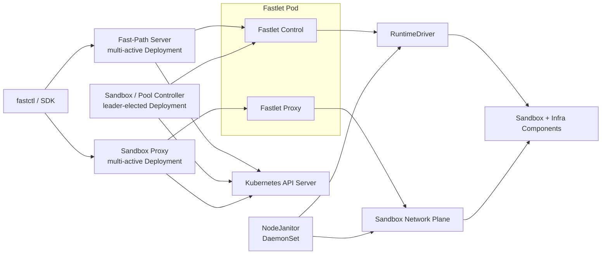

# Fast Sandbox 跨模块架构决策

## 状态

本文档记录在重新审视 Fast Sandbox master 代码和四份专题设计之后形成的跨模块架构决策。

本文档解决的是控制面、Fastlet、网络、Runtime、数据面代理和 Pool 之间的共同约束，不替代各专题文档中的完整设计。

相关专题文档：

- [Fastlet 网络架构设计](./2026-05-05-fastlet-network-architecture-design.md)
- [多活 Fast-Path 控制面设计](./2026-07-18-multi-active-fastpath-control-plane-design.md)
- [控制面与数据面分离设计](./2026-07-19-control-data-plane-separation-design.md)
- [Sandbox Runtime 抽象设计](./2026-07-19-sandbox-runtime-abstraction-design.md)

当上述专题文档与本文档的已确认横向决策发生冲突时，应先按照本文档统一专题文档，再进入实现。

## 1. 背景

四份专题设计已经分别确定：

- Fast-Path Server 多活，Sandbox/Pool Controller 通过 Leader Election 单活；
- Sandbox CRD 是逻辑身份、期望状态和 assignment 的全局状态源；
- CreateSandbox 是同步命令式接口，其他生命周期修改采用声明式 Reconcile；
- 每个 Sandbox 拥有独立私有网络和完整端口空间；
- Fast Sandbox Core 不定义 Exec/File/PTY 等数据协议；
- 数据面通过 Sandbox Proxy 和 Fastlet Proxy 透明代理；
- Infra Component 通过 Runtime Augmentation 注入；
- SandboxPool 只暴露一个不可变 `spec.runtime`；
- RuntimeProfile 和 RuntimeDriver 隔离 containerd、Kata、gVisor 和 BoxLite 差异。

重新审视 master 后发现，单独实现这些方案仍不足以保证整体架构闭环，主要缺少：

- Fastlet Pod 与 Sandbox 的故障域关系；
- Sandbox 逻辑身份、运行实例、assignment 和 route 的代际关系；
- CreateSandbox 成功与数据面立即可访问之间的语义；
- Pool 固定资源规格如何传递并落实到 Runtime；
- Local Registry 如何同时获得 Kubernetes 状态、Fastlet 心跳和镜像缓存信息；
- 去掉 `exposedPorts` 后，代理如何选择 Sandbox 内目标端口；
- Pool 缩容和 Fastlet 升级时的 Drain 语义；
- 用户进程、Infra Component、Runtime 和 Fastlet 故障如何分开表达；
- 新架构下启动性能指标如何重新定义。

本文档固化这些横向结论。

## 2. 部署拓扑

目标架构按实际部署单元划分如下：



部署责任：

| 部署单元 | 形态 | 主要职责 |
|---|---|---|
| fastctl / Python SDK | 客户端 | 生命周期调用、Endpoint 解析、具体 Infra SDK 适配 |
| Fast-Path Server | 多副本 Deployment | 同步 CreateSandbox、声明式变更入口、查询和访问解析 |
| Sandbox/Pool Controller | Leader Election 单活 Deployment | CRD Reconcile、最终一致性、Pool 生命周期 |
| Sandbox Proxy | 多副本 Deployment | 集群级 L7 路由和透明代理 |
| Fastlet Pod | Pool 管理的 Pod | Fastlet Control、Fastlet Proxy、Runtime 和本地 Admission |
| NodeJanitor | 每节点 DaemonSet | orphan runtime/network 资源兜底清理 |
| Infra Component | 每个 Sandbox 内注入 | execd、envd 等具体数据面能力 |

同一套控制面代码可以支持 `fastpath`、`controller` 和兼容迁移期的 `all` 角色，但生产部署的 Service、Leader Election、RBAC 和扩缩容必须按角色分离。

## 3. Fastlet Pod 绑定故障模型

### 3.1 核心决策

第一阶段采用 Pod 绑定模型：

```text
Fastlet Pod UID 是 Sandbox Runtime Instance 的物理所有者。
Fastlet Pod 消失或被新 Pod UID 替换时，所属 Sandbox 运行实例全部失效。
系统不支持新 Fastlet Pod 接管旧 Pod UID 管理的运行实例。
```

该决策有意放弃跨 Fastlet Pod 的原地接管，以简化：

- runtime ownership；
- network ownership；
- RouteStore 恢复；
- Janitor 判定；
- Pool 缩容和升级；
- BoxLite Home 和 containerd label 所有权。

### 3.2 Fastlet Container 重启

Fastlet Container 重启但 Pod UID 未变化时，仍属于同一个 Fastlet Pod incarnation。

Fastlet 必须在进入 Ready 前恢复本 Pod UID 管理的状态：

```text
scan RuntimeDriver.ListManagedSandboxes
  -> 校验 owner Fastlet Pod UID
  -> 恢复 running / creating 计数
  -> 恢复或重建本地 Network/AccessHandle
  -> 恢复 RouteStore
  -> 完成 capability probe
  -> Fastlet Ready
```

因此：

- Fastlet 进程内存不能作为唯一容量事实；
- runtime 资源必须带 Fastlet Pod UID、Sandbox UID 和 generation 标签；
- Fastlet readiness 必须覆盖恢复完成，而不是只检查 HTTP 端口存活。

### 3.3 Fastlet Pod 消失

当 Fastlet Pod 不存在、Pod UID 改变或明确进入不可恢复状态时：

```text
Controller observes old assignment invalid
  -> mark old runtime instance lost
  -> increment instance generation when policy requires recreation
  -> choose a new Fastlet Pod
  -> create a new runtime instance

NodeJanitor
  -> verify old Fastlet Pod UID no longer owns resources
  -> verify CRD assignment/generation no longer points to old instance
  -> clean old runtime and network resources
```

旧实例不允许被新 Pod 重新认领。计划内变更必须优先经过 Drain，避免直接触发批量重建。

## 4. Sandbox 身份和代际模型

### 4.1 四个不同维度

系统统一使用以下四类身份或代际：

| 字段 | 含义 | 变化时机 |
|---|---|---|
| Sandbox UID | 逻辑 Sandbox 的全局身份 | Sandbox CRD 重建时变化 |
| instanceGeneration | 当前运行实例代际 | reset、recreate、restore 等产生新实例时递增 |
| assignmentAttempt | 当前调度尝试 | assignment 变更或明确重新选择 Fastlet 时递增 |
| routeGeneration | 当前路由和访问凭证代际 | 新实例、reassignment、resume 或重新发布访问身份时递增 |

Kubernetes `metadata.generation` 只表示 Spec 变更，不能代替上述所有代际。

### 4.2 Fastlet Ensure 身份

Fastlet Ensure 请求至少绑定：

```text
Sandbox UID
instanceGeneration
assignmentAttempt
assigned Fastlet Pod UID
```

Fastlet 只接受目标 Pod UID 等于自身 Pod UID 的请求。

同一个身份 tuple 的重复 Ensure 具有幂等语义：

- 已 Running：返回成功；
- 正在 Creating：等待同一结果或返回明确的 InProgress；
- 不存在且容量足够：创建；
- 容量不足：明确拒绝且不产生 runtime 资源；
- Sandbox UID 相同但 generation/claim 冲突：返回冲突。

旧 generation 的 Create、Delete、Route Apply 和 token 不得影响新 generation。

### 4.3 生命周期并发优先级

CRD 中最新期望状态始终优先：

```text
DeletionTimestamp
  > 新 instanceGeneration / reset
  > 旧 generation 的 create progress
```

Controller 和 Fast-Path 在推进 Ensure 前必须重新确认 CRD 当前 generation 和 assignment。Fastlet 通过请求 tuple 做最后一道 fencing。

## 5. CreateSandbox 成功语义

### 5.1 RPC 快速失败与 CRD 声明式创建

RPC Fast-Path 和用户直接创建 Sandbox CRD 是两种不同的提交语义。

通过 `CreateSandbox` RPC 创建时：

- Fast-Path 先完成请求校验、Pool/Runtime 匹配、候选选择和当前容量接纳判断；
- 当前没有可接纳的 Fastlet、所有候选均明确拒绝或其他前置条件不满足时，立即返回可识别的失败；
- 这类快速失败不创建、也不遗留 Sandbox CRD；
- RPC 快路径不为了等待 Pool 扩容而创建一个 `Pending` CRD；
- 只有请求被快路径接纳后，才进入 CRD 身份提交和后续 runtime 创建链路。

这里要求的是对外可观察的“admission before durable commit”语义。具体采用轻量预检、短期 reservation ticket，还是失败后的同步回滚，在实施阶段确定，但快速失败返回时不能残留一个随后又被 Controller 创建出来的 Sandbox。

用户直接创建 Sandbox CRD 时，语义不同：

- CRD 本身就是已经提交的期望状态；
- 暂时无容量时可以保持 `Pending/ProvisioningCapacity`；
- PoolController 可以扩容 Fastlet；
- Sandbox Controller 在容量可用后继续 Reconcile，直到成功或进入明确的终态失败；
- 删除 CRD 才表示取消该声明式创建请求。

### 5.2 RPC Request ID 与幂等性

当前 master 的 gRPC `CreateRequest`、fastctl，以及 `feature/fastctl-exec` 中的 Python SDK 都没有 `request_id`。重构后的 RPC API 增加该字段：

```text
CreateRequest.request_id
```

统一语义：

- SDK 对一次逻辑 Create 自动生成 request ID，并在内部重试时保持不变；
- fastctl 自动生成 request ID，并在单次命令的网络重试中保持不变；
- 调用方也可以显式传入 request ID，以便跨进程恢复重试；
- Fast-Path 将成功请求的 request ID、Sandbox 身份和不可变创建参数摘要持久化到 Sandbox CRD；
- 相同 request ID、相同创建参数的重试返回同一个 Sandbox；
- 相同 request ID、不同创建参数返回 Conflict/InvalidArgument；
- 不同 request ID 使用已经存在的显式 Sandbox 名称时返回 AlreadyExists；
- 快速失败没有提交 CRD，因此不会为该 request ID 留下一个待异步完成的创建任务。

request ID 是 RPC 请求幂等键，Sandbox UID 仍然是成功创建后 runtime 的全局逻辑身份，两者不能混用。

### 5.3 同步成功条件

CreateSandbox 成功返回前必须满足：

```text
Sandbox CRD 已创建，UID 已确定
  -> assignment 已通过 resourceVersion CAS 提交
  -> Fastlet Admission 已接受
  -> Runtime Instance 已启动
  -> required Infra Components 已完成 Instance Init 和 readiness
  -> Fastlet local AccessHandle 已生成
  -> Fastlet Proxy local route 已发布
  -> DataPlaneReady=True
```

CreateSandbox 不等待：

- 所有 Sandbox Proxy 副本完成 Watch 同步；
- 所有 Local Registry 收敛；
- 非 required Infra Component Ready。

### 5.4 Read-after-create

CreateSandbox 返回后，客户端第一次访问可能命中尚未收到最新 Watch Event 的 Sandbox Proxy 副本。

统一语义：

- Sandbox Proxy route cache miss 或 generation 落后时执行一次权威补查或定向重试；
- Fastlet Proxy 使用 Pod UID、assignment attempt 和 route generation 做最终校验；
- 暂时未同步返回明确的 retryable 错误，不返回永久 NotFound；
- SDK 对短暂未同步执行有界重试；
- Create 不通过等待所有 Proxy ACK 来建立全局同步屏障。

### 5.5 纯声明式部署的访问解析

Fast-Path 是可选加速路径。用户直接创建 Sandbox CRD 时，同样需要获取数据面 endpoint 和 route credential。

因此访问解析必须是独立能力：

```text
ResolveEndpoint / IssueRouteCredential
  -> input: Sandbox UID + target port
  -> output: proxy URL + required headers + expiration
```

凭证不写入 Sandbox Status。该能力可以由生命周期 API 或 Sandbox Proxy 的受控接口提供，但不能依赖 CreateSandbox Response 才能使用。

## 6. Pool 固定 Sandbox Resource 模型

### 6.1 核心决策

第一阶段同一个 SandboxPool 内的 Sandbox 使用固定资源规格：

```yaml
spec:
  runtime: kata-clh
  sandboxResources:
    cpu: "1"
    memory: 2Gi
  maxSandboxesPerPod: 8
```

具体 API 字段名在实现阶段确定，但语义固定：

- `runtime` 固定 RuntimeProfile；
- `sandboxResources` 固定单 Sandbox 资源规格；
- `maxSandboxesPerPod` 固定单 Fastlet Pod 的 slot 上限；
- 第一阶段不允许同一 Pool 中每个 Sandbox 使用不同 CPU/Memory；
- 不同规格通过不同 SandboxPool 表达；
- `runtime` 和 `sandboxResources` 第一阶段不可变。

### 6.2 ResourceProfile 传递链路

Pool 资源规格不是只用于调度估算，它必须成为 Fastlet 创建 runtime 的实际参数：

```text
SandboxPool.spec.sandboxResources
  -> Pool Controller resolves ResourceProfile
  -> Fastlet Pod receives immutable ResourceProfile + profile hash
  -> FastPath / Controller resolves the same Pool ResourceProfile
  -> EnsureSandboxRequest carries resolved resources + profile hash
  -> Fastlet validates profile hash
  -> Fastlet Admission reserves one slot
  -> RuntimeDriver creates runtime with resolved resources
```

内部模型建议表达为：

```text
ResolvedSandboxResources
  CPU
  Memory
  optional runtime-specific validated extensions
```

Fastlet 不接受普通用户在单次 Create 中覆盖 Pool ResourceProfile。

### 6.3 Kubernetes 资源预留与 Runtime 限制

两者职责不同但来源一致：

```text
Fastlet Pod Kubernetes requests
  = Fastlet overhead
  + maxSandboxesPerPod × sandboxResources
```

Kubernetes requests 用于让 Kubernetes Scheduler 预留 Fastlet Pod 的 Node 容量。

每个 Sandbox 的实际资源限制最终由 Fastlet Pod 内的 Fastlet 进程负责执行。Fastlet 根据不可变 ResourceProfile 调用对应 RuntimeDriver，并落实容器 cgroup、VM 或 runtime-specific 限制：

```text
container / gVisor
  -> OCI cgroup CPU / memory / pids

Kata
  -> RuntimeProfile 编译为 Kata VM 和 guest container 资源参数

BoxLite
  -> BoxOptions cpus / memory_mib
```

控制面不直接管理单 Sandbox cgroup，也不绕过 Fastlet 修改 runtime 资源。不同 RuntimeDriver 的具体参数和 cgroup 布局在实施阶段确定，不再作为本轮方案讨论项。

### 6.4 Admission

第一阶段不引入全局多维资源调度。Fastlet 的原子 admission 仍以整数 slot 为核心：

```text
check Ready / Draining
  -> idempotency check
  -> running + creating < maxSandboxesPerPod
  -> validate ResourceProfile / runtime capability
  -> reserve Creating slot
  -> create runtime with fixed resources
  -> commit Running or release reservation
```

KVM、VM memory、disk、network backend 等 runtime-specific 约束由 Fastlet capability/admission 检查，但第一阶段不把它们暴露为用户可组合的全局 ResourceVector。

### 6.5 与 E2B 的对应关系

E2B 在 Template Build 时固定 `cpuCount` 和 `memoryMB`，创建 Sandbox 时用户主要选择 Template；内部 Orchestrator 的 `SandboxConfig` 仍然接收 `vcpu`、`ram_mb` 和 disk size，作为实际 VM 创建参数。

对应关系：

```text
E2B Template               ~= SandboxPool
Template cpuCount/memoryMB ~= Pool sandboxResources
E2B Orchestrator           ~= Fastlet
SandboxConfig vcpu/ram_mb  ~= EnsureSandboxRequest.resources
```

参考：

- [E2B Template Quickstart](https://e2b.dev/docs/template/quickstart)
- [E2B Orchestrator Protocol](https://github.com/e2b-dev/infra/blob/main/packages/orchestrator/orchestrator.proto)

## 7. Fastlet Drain

Pool 缩容、Fastlet 升级和计划内维护必须经过 Drain：

```text
Ready
  -> Draining
  -> reject new Admission
  -> wait for existing Sandbox completion/deletion
  -> apply configured timeout policy
  -> remove Fastlet Pod
```

第一阶段不做跨 Fastlet Pod 的原地迁移。

Drain 期间：

- Local Registry 必须将 Fastlet 从新候选中过滤；
- 已有 Sandbox 可以继续运行到正常结束或超时；
- 长连接遵循 Sandbox Proxy/Fastlet Proxy 的 draining 语义；
- 超时后的强制删除会触发 Pod 绑定故障模型和相应 recreate policy；
- PoolController 不得直接随机删除仍承载 Sandbox 的 Fastlet Pod。

具体超时值、排序策略和 Pod disruption 配置在实现阶段确定。

## 8. Local Registry、Watch 和 Heartbeat

### 8.1 Registry 定位

Local Registry 是候选缓存和调度提示，不是全局容量事实。

每个 Fast-Path Server 和 Controller 实例维护自己的 Registry，允许短暂不一致。正确性由以下机制保证：

- CRD assignment CAS；
- Fastlet 原子 Admission；
- Pod UID 和 generation fencing；
- 不确定请求不立即换 Fastlet。

### 8.2 Kubernetes Watch 数据源

Registry 通过 Watch 获取结构性事实：

```text
SandboxPool Watch
  -> runtime
  -> maxSandboxesPerPod
  -> ResourceProfile

Fastlet Pod Watch
  -> Pod Name / UID / IP
  -> Node / Pool
  -> Pod Ready

Sandbox Watch
  -> assignment
  -> assignment attempt
  -> approximate allocated count
```

Watch 不能替代 Fastlet Heartbeat，因为 Kubernetes 对象不包含完整的 runtime live state 和 cache inventory。

### 8.3 Fastlet Heartbeat 数据源

保留低频 Fastlet Heartbeat。第一阶段由每个需要 Local Registry 的 Fast-Path/Controller 实例主动拉取。

Heartbeat 至少包含：

```text
Fastlet Pod UID
sequence / observed timestamp
Ready / Draining
runtime name
runtime profile hash
resource profile hash
capacity max / creating / running
cache revision
cached image inventory when changed
managed Sandbox runtime summary
```

原则：

- 从 master 当前的高频全量扫描调整为低频、有 jitter、有限并发；
- 建议初始周期为 10～30 秒，最终值通过规模和延迟测试确定；
- 连续丢失若干周期后标记 `HeartbeatStale`；
- 心跳失败影响候选过滤和评分，但不单独改变 CRD ownership；
- Pod Watch 仍负责成员新增、删除和 Pod UID 变化；
- Controller 角色只有实际需要 Reconcile 的 leader 承担相应主动探测；
- 所有 Fast-Path 副本维护自己的心跳视图。

第一阶段接受 `Fast-Path replica count × Fastlet count` 的低频轻量请求，不新增中心化 Registry Server。若未来规模证明该模型不可接受，再引入共享 FastletStatus feed 或事件总线。

### 8.4 Cache Revision 和增量获取

镜像亲和是 Sandbox 启动性能的核心能力，不能移除。

Fastlet 维护：

```text
cacheRevision
cachedImages[]
```

控制面携带已知 revision：

```text
Heartbeat(knownCacheRevision)
```

未变化时只返回当前 revision；发生 image pull、unpack 或 GC 后，返回新 revision 和新的 cache inventory。实现上可以放在同一个 Heartbeat Response，也可以拆成独立 cache endpoint。

某个 Fast-Path 实例成功在 Fastlet 创建 Sandbox 后，应立即在自己的 Local Registry 中记录该 image hit；其他实例在下一次 Heartbeat 后收敛。

缓存 key 第一阶段至少包含：

```text
normalized image reference
content digest when available
```

CreateSandbox 热路径不主动把用户提供的 image reference 解析成不可变 digest，避免增加 registry 请求和解析延迟。Runtime 或本地 cache 已经获得 digest 时可以将其作为更精确的命中信息上报，否则按 normalized image reference 做亲和判断。

### 8.5 Warm Images 和缓存生命周期

镜像缓存同时来自两条路径：

```text
SandboxPool.spec.warmImages
  +
历史 CreateSandbox 请求自然形成的缓存
```

统一策略：

- Pool 可以声明 `warmImages`，由 Fastlet 异步拉取和保持；
- 普通用户请求的镜像在实际创建过程中自然进入缓存，并形成后续 image affinity；
- Infra Component artifact、Pool `warmImages` 和热点用户镜像受缓存 GC 保护；
- 正在被 Sandbox 使用的镜像不得被 GC；
- 热点判定、保护窗口、磁盘水位和淘汰顺序在实施阶段确定；
- 新扩容 Fastlet 不等待 `warmImages` 全部预热完成即可进入 Ready；
- 预热在 Ready 后异步进行，调度端根据 Heartbeat 中的真实 cache inventory 判断命中，不假设新 Fastlet 已完成预热。

私有镜像凭证的下发和刷新机制暂不在本轮讨论。

### 8.6 Cache Scope

缓存作用域由 RuntimeProfile 决定：

```text
container / gVisor / containerd-backed Kata
  -> OCI image cache 通常是 Node scope

BoxLite with isolated BOXLITE_HOME
  -> image/runtime cache 可以是 Fastlet scope

VM template / snapshot runtime
  -> affinity key 可能是 template/build/layer ID
```

第一阶段可以只实现 OCI image affinity，但内部模型应允许未来扩展为：

```text
CacheInventory
  OCIImage
  RuntimeTemplate
  InfraArtifact
  SnapshotLayer
```

E2B Orchestrator 暴露 `ListCachedBuilds`，说明 Template/Build 驻留信息和 CPU/Memory 一样是节点选择的重要输入。Fast Sandbox 的 image affinity 与其 cached build affinity 属于同类调度问题。

### 8.7 Top-K 评分顺序

Top-K 初始评分顺序：

```text
1. hard filter
   Pool / Runtime / Pod Ready / !Draining / !HeartbeatStale / capacity hint

2. cache affinity
   exact digest hit
   normalized image ref hit
   cache miss

3. load
   creating + running
   available slots

4. stable perturbation
   Sandbox UID hash
```

镜像命中优先级高于简单 least-loaded，但不能绕过 Ready、Draining、capacity 和 stale 等硬约束。

Fastlet Admission 拒绝后，调用方修正本地负载状态并尝试 Top-K 中下一个候选。Fastlet 请求超时属于结果不确定，不能立即换候选。

## 9. Sandbox UID + Target Port 路由模型

### 9.1 核心决策

去掉 `exposedPorts` 后，底层路由不建立 `service name -> port` 注册表。

核心路由身份是：

```text
Sandbox UID + target port
```

例如：

```text
Execd SDK knows port 44772
  -> ResolveEndpoint(Sandbox UID, 44772)
  -> Sandbox Proxy
  -> assigned Fastlet Proxy
  -> AccessHandle.Dial(44772)
  -> execd inside Sandbox private network
```

用户服务监听 8080 时使用同一条链路：

```text
ResolveEndpoint(Sandbox UID, 8080)
```

### 9.2 RouteStore

Sandbox Proxy 的集群路由缓存：

```text
Sandbox UID
  -> assigned Fastlet Pod IP / UID
  -> assignment attempt
  -> route generation
  -> DataPlaneReady
```

Fastlet Proxy 的本地 RouteStore：

```text
Sandbox UID + route generation
  -> AccessHandle
  -> Ready / Draining
  -> route authentication metadata
```

AccessHandle 提供 runtime-neutral 的目标访问能力：

```text
Dial(ctx, targetPort)
```

具体实现可以是 DirectIP、NetNSDial、Kata channel 或 BoxLite dynamic forward，但代理上层不感知。

### 9.3 Service Name 的定位

InfraProfile 可以保留便利别名：

```text
execd -> 44772
envd  -> 49983
```

别名用于：

- SDK adapter；
- InfraProfile 校验；
- readiness；
- endpoint discovery 的用户体验。

它不成为底层 RouteStore 的必要 key。知道目标端口的 Infra SDK 可以直接解析该端口的 endpoint。

### 9.4 与 OpenSandbox 的关系

该模型参考 OpenSandbox：生命周期 API 根据 Sandbox ID 和目标端口解析 endpoint，Ingress/Server Proxy 根据 Sandbox ID + port 透明转发 HTTP/WebSocket 流量。

Fast Sandbox 的区别是增加 Fastlet Proxy 这一跳，用于进入一个 Fastlet Pod 内多个 Sandbox 的独立私有网络平面。

推荐外部形式：

```text
/v1/sandboxes/{sandboxUID}/endpoints/{port}
/v1/sandboxes/{sandboxUID}/proxy/{port}/...
```

返回 endpoint URL 和 required headers，不返回 Fastlet Pod IP，也不要求目标端口参与调度。

参考：

- [OpenSandbox Architecture](https://github.com/alibaba/OpenSandbox/blob/main/docs/architecture.md)
- [OpenSandbox Server](https://github.com/alibaba/OpenSandbox/blob/main/server/README.md)

### 9.5 exposedPorts

`spec.exposedPorts` 从核心模型移除，因为 target port：

- 不参与 Fastlet 调度；
- 不占用 Fastlet Pod 同名端口；
- 不参与 Registry 冲突检测；
- 不要求在 Create 前声明；
- 只表示访问 Sandbox 私有网络时的目标端口。

第一阶段对外默认承诺 HTTP/1.1、SSE 和 WebSocket 等 L7 透明代理。HTTP/2、gRPC、CONNECT 和 raw TCP 的支持时机保持为实施阶段或后续产品决策。

## 10. Network Policy 方向

Sandbox 拥有独立网络平面，egress policy 不能只依赖 Kubernetes NetworkPolicy，因为 Fastlet NAT 后 Kubernetes CNI 通常只看到 Fastlet Pod 身份。

行为语义参考 OpenSandbox 的 per-Sandbox egress 设计：

- 每个 Sandbox 独立表达 allow/deny；
- DNS、CIDR、domain 和 metadata endpoint 保护属于 Sandbox 网络平面；
- 用户流量不能修改其他 Sandbox 的网络规则；
- policy enforcement 与 Sandbox network namespace/runtime network 绑定；
- ingress endpoint resolution 和 egress enforcement 分离。

Fast Sandbox 不要求复制 OpenSandbox 的具体 sidecar 部署方式。containerd、Kata 和 BoxLite 可以由不同 NetworkDriver 实现相同策略语义。

具体 network policy API、动态更新和审计能力不阻塞本轮重构，第一阶段只需要保留正确的 NetworkDriver 边界。

## 11. 生命周期状态拆分

Sandbox 是运行环境，不应只用一个字符串 Phase 混合所有故障。

状态至少分为：

```text
Runtime state
  Creating / Running / Stopped / Failed

Data plane state
  InfraInitializing / Ready / Degraded / Unavailable

User process state
  NotStarted / Running / Exited / Failed

Fastlet state
  Ready / Draining / Unreachable / PodLost
```

建议通过 Conditions 和独立的 observed state 表达，而不是继续扩展一个全局 Phase。

### 11.1 默认行为

- 用户进程退出不等于 Fastlet 或 Runtime 丢失；
- 用户进程退出码和状态独立记录；
- 默认不因为用户进程退出自动重建整个 Sandbox；
- 用户进程重启由独立 `restartPolicy` 表达，不能复用 Fastlet `FailurePolicy`；
- required Infra Component 退出后先执行 InfraProfile restart policy；
- required Infra 无法恢复时 `DataPlaneReady=False`；
- Runtime 崩溃属于 runtime instance failure；
- Fastlet Pod 消失属于 PodLost，并按照 Pod 绑定模型处理；
- `AutoRecreate` 只处理被明确纳入基础设施恢复策略的实例丢失，不隐式等同于用户进程 restart。

具体 Condition 名称和 CRD schema 在实现阶段确定。

## 12. 性能和 SLO

旧架构中的单一 `CreateSandbox < 50ms` 无法准确描述新链路。

统一拆成三个时间点：

```text
CreateAcceptedLatency
  request accepted -> CRD identity and assignment committed

UserProcessStartLatency
  request accepted -> user entrypoint starts

DataPlaneReadyLatency
  request accepted -> required Infra ready + local route published
```

CreateSandbox 同步成功以 DataPlaneReady 为准，但性能分析必须保留三段指标，避免把 CRD、runtime、用户进程和 Infra readiness 混成一个延迟。

所有指标至少按以下维度区分：

- warm / cold；
- image cache hit / miss；
- runtime name；
- InfraProfile；
- NetworkSlot hit / miss；
- FastPath / Controller declarative path。

旧的 `<50ms` 可以继续作为特定 warm container profile 的目标，而不能作为所有 Runtime 和 InfraProfile 的统一承诺。

## 13. 文档一致性修正

后续更新四份专题文档时必须统一以下内容：

1. RuntimeDriver 公共边界不包含面向用户的 Exec/File 数据协议；
2. Runtime 由 SandboxPool 的不可变 `spec.runtime` 决定，不在单个 Sandbox 上再次选择；
3. Pool 固定 `sandboxResources`，并将其传递给 Fastlet RuntimeDriver；
4. Fastlet Pod UID 是第一阶段 runtime instance 的物理所有者；
5. Fastlet Pod 消失后不接管旧实例，由 Controller 重建、Janitor 清理；
6. Local Registry 同时使用 Kubernetes Watch 和低频 Fastlet Heartbeat；
7. 镜像缓存亲和是 Top-K 的核心输入，不能移除；
8. RPC 快速失败不创建或遗留 Sandbox CRD，直接创建 CRD 则允许 Pending 并等待扩容；
9. RPC Create 增加 request ID，SDK/fastctl 在逻辑请求重试期间保持其稳定；
10. Pool 同时支持声明 `warmImages` 和请求自然形成缓存，新 Fastlet Ready 不等待预热完成；
11. RouteStore 保存 Sandbox UID 到 AccessHandle，不要求每个 service 注册独立 route；
12. 目标端口通过请求传入，不参与调度或全局端口冲突检测；
13. Create 成功不等待所有 Sandbox Proxy Watch 同步，但必须定义可重试的 read-after-create；
14. 根目录 README、ARCHITECTURE 和旧 Fast/Strong consistency 文档应在迁移期标记为旧架构或 Superseded。

## 14. 明确暂缓的议题

以下内容不属于本轮重构的重点，暂不阻塞当前架构：

- Infra Component 如何防御 Sandbox 内拥有 root 权限的用户；
- snapshot、pause/resume 的完整状态机；
- persistent storage、workspace、rootfs 和 volume 持久性；
- Fastlet Pod 之间的原地接管或 live migration；
- 全局多维 ResourceVector 调度；
- GPU、NUMA、hugepage 和设备级资源分配；
- 中心化 Registry Server 或事件总线；
- Heartbeat 精确周期、Top-K 权重和最大重试次数；
- HTTP/2、gRPC、raw TCP 的产品支持范围；
- 完整 network policy API 和动态更新协议；
- token 格式、密钥轮换和代理库选择；
- 私有镜像凭证的下发和刷新；
- CRD 字段最终命名、Condition 名称和 status field ownership。

暂缓不代表可以破坏扩展边界。当前 RuntimeDriver、NetworkDriver、AccessHandle、ResourceProfile、CacheInventory 和 generation 模型必须为这些能力保留演进空间。

## 15. 核心不变量

后续实现和测试必须保证：

1. 没有成功创建 Sandbox CRD 就不能创建 runtime instance；
2. Sandbox UID 是 runtime 的全局逻辑身份；
3. Fastlet Pod UID 是第一阶段 runtime instance 的物理 owner；
4. 旧 generation 的请求不能影响新实例；
5. Local Registry 过期只能影响调度质量，不能突破 Fastlet Admission；
6. Fastlet Admission 对 `running + creating` 原子计数；
7. Pool ResourceProfile 是实际 runtime 创建参数，不只是 capacity hint；
8. 单 Sandbox 的实际资源限制由 Fastlet 进程通过 RuntimeDriver 执行；
9. 镜像命中是 Top-K 的核心评分项；
10. RPC 快速失败不能遗留 Sandbox CRD，声明式 CRD 创建允许等待容量；
11. 相同 RPC request ID 和相同创建参数只能对应同一个 Sandbox；
12. Pool warm image、Infra artifact、热点镜像和使用中镜像受缓存 GC 保护；
13. 新 Fastlet Ready 不以 warm image 预热完成为前提；
14. `exposedPorts` 不再参与调度和端口冲突检测；
15. Sandbox Proxy 和 Fastlet Proxy 不解析 execd/envd payload；
16. CreateSandbox 成功意味着 required Infra 和 Fastlet local route Ready；
17. Sandbox Proxy 缓存短暂落后不能被错误解释为 Sandbox 永久不存在；
18. Fastlet Pod 消失后，新 Pod 不接管旧 runtime instance；
19. Pool 缩容和计划升级必须先 Drain；
20. Janitor 只做异常兜底，不进入正常 create/delete 热路径。

## 16. 最终结论

本轮跨模块 Review 后，Fast Sandbox 的共同架构基线是：

```text
CRD 提供全局身份、期望状态和 assignment CAS
Fast-Path 多活同步推进 Create，Controller 单活异步 Reconcile
Fastlet Pod UID 绑定 runtime instance，Pod 消失后重建而非接管
UID + instanceGeneration + assignmentAttempt + routeGeneration 完成全链路 fencing
Pool 固定 runtime、单 Sandbox ResourceProfile 和 slot capacity
Fastlet 将 Pool ResourceProfile 落实为真实 runtime 参数、资源限制并执行原子 Admission
RPC Fast-Path 当前不可接纳时快速失败且不遗留 CRD，声明式 CRD 创建允许等待扩容
RPC Create 使用稳定 request ID 实现跨副本、跨重试幂等
Local Registry 由 Kubernetes Watch、低频 Heartbeat 和本地反馈共同维护
镜像缓存亲和优先于简单 least-loaded，是 Top-K 的核心输入
Pool warmImages 与请求自然缓存并存，缓存 GC 保护预热、Infra、热点和使用中内容
Sandbox Proxy 按 Sandbox UID + target port 路由到 Fastlet Proxy
Fastlet Proxy 通过 AccessHandle 进入 Sandbox 独立网络平面
Execd/Envd SDK 负责具体协议，Fast Sandbox 只解析 endpoint 并透明代理
Create 成功以 DataPlaneReady 为准，同时分别观测 Accepted、UserProcessStart 和 DataPlaneReady 延迟
```

该基线在保持第一阶段实现简单的同时，为后续 snapshot、pause/resume、持久化 storage、多维资源和更多 Runtime 保留了明确扩展边界。
