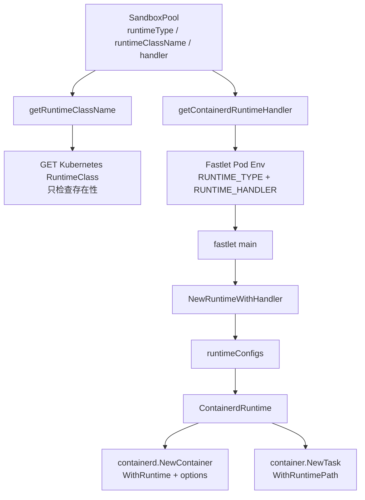
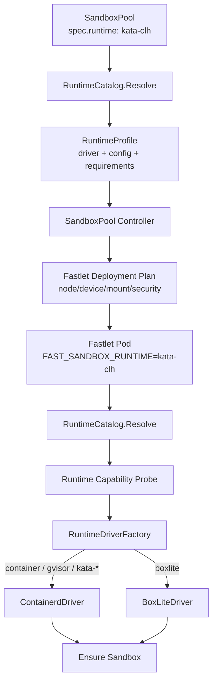

# Fast Sandbox Runtime 抽象设计

## 状态

本文记录 2026-07-19 已确认并已实现的 Sandbox Runtime 总体方案。项目尚未生产部署，因此公共 API 采用直接切换，不保留重构前字段或迁移适配层。

相关方案：

- [Fastlet 网络架构设计](./2026-05-05-fastlet-network-architecture-design.md)
- [Fast Sandbox 控制面与数据面分离设计](./2026-07-19-control-data-plane-separation-design.md)
- [多活 Fast-Path 控制面设计](./2026-07-18-multi-active-fastpath-control-plane-design.md)

## 1. 背景

当前 `SandboxPoolSpec` 同时暴露三个 runtime 相关字段：

```yaml
spec:
  runtimeType: gvisor
  runtimeClassName: gvisor
  containerdRuntimeHandler: io.containerd.runsc.v1
```

三个字段分别混合了不同层级：

| 字段 | 原始意图 | 当前实际作用 |
| --- | --- | --- |
| `runtimeType` | 用户选择的 Sandbox runtime | 决定 Fastlet 的 RuntimeConfig |
| `runtimeClassName` | Kubernetes RuntimeClass 名称 | Controller 只检查对象是否存在 |
| `containerdRuntimeHandler` | containerd handler override | 最终传给 Fastlet/containerd |

这会允许用户构造相互矛盾的配置：

```yaml
runtimeType: gvisor
runtimeClassName: kata-clh
containerdRuntimeHandler: io.containerd.runc.v2
```

随着 BoxLite 接入，问题更加明显：BoxLite 是独立 runtime backend，不是 containerd handler，也不是 Kubernetes RuntimeClass，无法继续塞入现有三字段模型。

## 2. 当前代码链路

### 2.1 当前控制链路



### 2.2 RuntimeClass 不参与 Sandbox 创建

Controller 当前对非 `container` runtime 执行：

```text
runtimeType
  -> runtimeClassName override，或默认使用 runtimeType 字符串
  -> GET node.k8s.io/v1 RuntimeClass
  -> 存在则 RuntimeReady=True
```

但 Controller 构造 Fastlet Pod 时没有设置 `pod.spec.runtimeClassName`，只注入：

```text
RUNTIME_TYPE
RUNTIME_HANDLER
RUNTIME_SOCKET
```

Fastlet Pod 不应该设置为 Sandbox 所选的 Kubernetes RuntimeClass。Fastlet 是节点级 runtime manager，需要访问 host containerd、netns、runtime state 和 `/dev/kvm`；如果把 Fastlet 本身运行在 Kata/gVisor 中，会破坏这个部署边界。

因此当前 `runtimeClassName` 到 Kubernetes RuntimeClass 存在性校验就终止了，不参与最终 Sandbox Runtime 选择。

### 2.3 真正控制创建的是 Fastlet RuntimeConfig

Fastlet 读取 `RUNTIME_TYPE` 和 `RUNTIME_HANDLER`，解析当前静态 `runtimeConfigs`：

```text
container  -> runc handler
gvisor     -> runsc handler + runsc options
kata-qemu  -> kata shim + qemu config
kata-clh   -> kata shim + clh config
kata-fc    -> kata shim + firecracker config
```

当前所有 runtime 最终都实例化为 `ContainerdRuntime`，差异通过以下私有参数表达：

```text
Handler
RuntimePath
ConfigPath
NeedsTTY
OptionsType
```

ContainerdRuntime 创建 Sandbox 时使用：

```text
containerd.WithRuntime(handler, runtimeOptions)
containerd.WithRuntimePath(runtimePath)
```

BoxLite 尚未进入 RuntimeFactory；它需要独立的 `BoxLiteDriver`，不能继续映射为 ContainerdRuntime。

### 2.4 当前 RuntimeClass 校验不足以证明 Runtime 可用

Kubernetes RuntimeClass 的 `handler` 是 CRI runtime handler 名称，Fastlet 直接调用 containerd 时使用的是 shim runtime type、runtime path 和 config path。两者不是同一个配置层。

例如：

```text
Kubernetes RuntimeClass handler: kata-clh
Fastlet containerd handler:      io.containerd.kata.v2
Fastlet configPath:              configuration-clh.toml
```

只检查 RuntimeClass 对象存在，无法证明：

- 当前 Fastlet 所在节点安装了对应 shim/runtime；
- runtime config 文件存在且有效；
- `/dev/kvm`、vsock 或其他设备可用；
- RuntimeClass handler 与 Fastlet RuntimeConfig 一致；
- RuntimeClass 的 scheduling、nodeSelector、toleration 和 overhead 已应用；
- runtime 能在当前节点实际创建 Sandbox。

## 3. 核心决策

### 3.1 Pool 只暴露一个 `spec.runtime`

新的公共 API：

```yaml
apiVersion: sandbox.fast.io/v1alpha1
kind: SandboxPool
spec:
  runtime: kata-clh
```

不再暴露：

```text
spec.runtimeType
spec.runtimeClassName
spec.containerdRuntimeHandler
```

字段命名为 `runtime`，不使用 `runtimeType`：`type` 容易被理解为 backend 类型，但当前值同时表达 container isolation、secure runtime 和 hypervisor variant。

字段也不命名为 `runtimeClass`，避免与 Kubernetes `node.k8s.io/RuntimeClass` 混淆，并且 BoxLite 本身不是 Kubernetes RuntimeClass。

### 3.2 内置 Runtime 名称

第一阶段固定以下 canonical name：

```text
container
gvisor
kata-qemu
kata-clh
kata-fc
boxlite
```

不引入 `kata-firecracker` 别名。`kata-fc` 与 `kata-clh` 命名风格一致，也与现有代码、RuntimeClass、配置文件和测试保持兼容。

语义映射：

| `spec.runtime` | 用户语义 | 当前或目标实现 |
| --- | --- | --- |
| `container` | 默认 OCI container isolation | containerd + runc |
| `gvisor` | gVisor user-space kernel isolation | containerd + runsc |
| `kata-qemu` | Kata VM isolation with QEMU | containerd + Kata shim + QEMU |
| `kata-clh` | Kata VM isolation with Cloud Hypervisor | containerd + Kata shim + CLH |
| `kata-fc` | Kata VM isolation with Firecracker | containerd + Kata shim + Firecracker |
| `boxlite` | BoxLite microVM runtime | BoxLite RuntimeDriver |

`container` 是稳定的产品语义，当前底层是 containerd+runc；不把 `containerd` 暴露为用户选择，避免未来更换底层实现时修改 Pool API。

### 3.3 删除 Pool 的底层 override

`runtimeClassName` 和 `containerdRuntimeHandler` 从 SandboxPool API 移除。普通 Pool 用户不能覆盖 handler、runtime path 或 config path。

如果未来确实需要集群自定义 runtime，应该由平台 Operator 注册受控 `RuntimeProfile`，Pool 仍然只引用一个 profile name，而不是重新把底层参数平铺到 Pool Spec。

第一阶段只实现内置 RuntimeCatalog，不在本方案中确定外部 RuntimeProfile CRD。

### 3.4 `spec.runtime` 第一阶段不可变

一个 Fastlet 进程启动时只初始化一个 RuntimeDriver，因此一个 SandboxPool 是同构 Runtime Pool：

```text
one SandboxPool
  -> one runtime
  -> one Fastlet deployment shape
  -> one RuntimeDriver
  -> homogeneous runtime capabilities
```

`container -> boxlite` 或 `gvisor -> kata-clh` 会同时改变：

- Fastlet Pod mount、device 和 securityContext；
- node scheduling 和 runtime capability；
- RuntimeDriver 和 NetworkDriver；
- Infra Artifact delivery mode；
- state recovery 和 Janitor 路径；
- capacity/admission 资源模型。

因此第一阶段 `spec.runtime` 创建后不可修改。切换 runtime 通过创建新 SandboxPool 并迁移 Sandbox 完成。后续如果需要原地修改，必须设计显式 drain 和 Fastlet rollout，不能让新旧 runtime Fastlet 混在同一个 Pool。

## 4. 真正的内部抽象：RuntimeProfile

### 4.1 RuntimeName、RuntimeProfile 和 RuntimeDriver

`spec.runtime` 只是一个稳定选择器，真正的内部抽象是解析后的 RuntimeProfile：

```text
Pool.spec.runtime
  -> RuntimeCatalog.Resolve(RuntimeName)
  -> RuntimeProfile
  -> RuntimeDriverFactory
  -> RuntimeDriver
```

概念类型：

```go
type RuntimeName string

type RuntimeProfile struct {
    Name RuntimeName

    Driver RuntimeDriverKind

    Containerd *ContainerdRuntimeConfig
    BoxLite     *BoxLiteRuntimeConfig

    DeploymentRequirements DeploymentRequirements
    Capabilities           RuntimeCapabilities
    NetworkMode            RuntimeNetworkMode
    InfraDeliveryModes     []InfraDeliveryMode
}
```

各层职责：

| 抽象 | 职责 |
| --- | --- |
| `RuntimeName` | Pool API 中的稳定名称 |
| `RuntimeProfile` | 名称解析后的完整、受控配置 |
| `RuntimeDriverKind` | 选择 containerd、boxlite 等 backend |
| `RuntimeDriver` | Ensure、Delete、Inspect、恢复等生命周期实现 |
| `ContainerdRuntimeConfig` | handler、runtime path、config path 等私有参数 |
| `DeploymentRequirements` | Fastlet Pod 的设备、mount、权限和节点要求 |
| `RuntimeCapabilities` | 网络、snapshot、infra delivery、admission 等能力 |

### 4.2 内置 RuntimeCatalog

Controller 和 Fastlet 必须共享同一份 RuntimeCatalog，避免 Controller 推导出的部署参数与 Fastlet 使用的 driver config 不一致。

概念映射：

| RuntimeName | Driver | Runtime private config | 主要要求 | Network/AccessHandle |
| --- | --- | --- | --- | --- |
| `container` | ContainerdDriver | runc v2 | containerd | Linux netns / DirectIP |
| `gvisor` | ContainerdDriver | runsc + options | runsc/config | Linux netns，需验证 |
| `kata-qemu` | ContainerdDriver | Kata shim + qemu config | KVM/Kata/QEMU | Kata network adapter |
| `kata-clh` | ContainerdDriver | Kata shim + clh config | KVM/Kata/CLH | Kata network adapter |
| `kata-fc` | ContainerdDriver | Kata shim + fc config | KVM/Kata/Firecracker/vsock | Kata network adapter |
| `boxlite` | BoxLiteDriver | BoxLite runtime config | KVM/BoxLite state/gvproxy | LocalForward |

当前 `internal/fastlet/runtime.runtimeConfigs` 可以演化为 Containerd RuntimeProfile 的一部分，但需要上提为 Controller/Fastlet 共享的单一事实来源，并增加 DriverKind、deployment、network、admission 和 infra delivery 信息。

## 5. 新的端到端链路



### 5.1 SandboxPool Controller

Controller 流程：

```text
read Pool.spec.runtime
  -> default to container
  -> RuntimeCatalog.Resolve
  -> validate immutable field and profile existence
  -> derive Fastlet DeploymentRequirements
  -> construct homogeneous Fastlet Pod
  -> inject FAST_SANDBOX_RUNTIME=<name>
  -> observe Fastlet runtime capability/readiness
  -> update Pool RuntimeReady condition
```

Controller 不再分别推导和注入 `RUNTIME_HANDLER`。Fastlet Pod 只接收稳定 runtime name，底层配置由相同 RuntimeCatalog 解析。

DeploymentRequirements 可以表达：

```text
required node labels
required devices, for example /dev/kvm
host mounts and state roots
securityContext/capabilities
runtime binaries/config paths
resource overhead hints
network and infra-delivery prerequisites
```

用户提供的 `fastletTemplate` 仍可配置通用资源和调度信息，但不能覆盖与 RuntimeProfile 冲突的关键 device、mount 和 runtime 参数。具体 merge/validation 规则在实现阶段确定。

### 5.2 Fastlet 启动

Fastlet 只读取：

```text
FAST_SANDBOX_RUNTIME=kata-clh
```

启动流程：

```text
resolve RuntimeProfile
  -> probe node/runtime capabilities
  -> create RuntimeDriver by DriverKind
  -> Initialize driver with profile private config
  -> initialize NetworkDriver/Infra Injector/Janitor adapters
  -> advertise RuntimeReady and capabilities
  -> accept Sandbox admission
```

如果 capability probe 失败，Fastlet 不进入可接单状态，并报告结构化失败原因；不能因为集群中存在一个 Kubernetes RuntimeClass 对象就宣称 runtime 可用。

### 5.3 RuntimeDriverFactory

RuntimeDriverFactory 按 DriverKind 选择 backend：

```text
DriverKindContainerd
  -> ContainerdDriver
  -> profile.Containerd handler/runtimePath/configPath/options

DriverKindBoxLite
  -> BoxLiteDriver
  -> profile.BoxLite stateRoot/backend/network configuration
```

Kata 和 gVisor 当前仍是 ContainerdDriver 的不同 RuntimeProfile，不需要为每个 hypervisor 复制完整 ContainerdDriver。BoxLite 生命周期、状态和网络模型不同，使用独立 Driver。

## 6. Runtime 能力校验

### 6.1 校验责任从 RuntimeClass 对象转向实际节点能力

推荐由 Fastlet 在实际节点执行 capability probe：

```text
container:
  containerd socket and namespace
  runc shim availability

gvisor:
  runsc/shim/config
  containerd runtime options
  netns and TTY compatibility

kata-qemu / kata-clh / kata-fc:
  /dev/kvm
  kata shim
  hypervisor-specific config and binary
  vsock/network prerequisites

boxlite:
  /dev/kvm
  BoxLite library/binary
  writable and isolated BOXLITE_HOME
  gvproxy/libslirp capability
```

Capability probe 至少区分：

```text
Configured
Available
Ready
Degraded
Unsupported
```

Pool `RuntimeReady=True` 应以实际 Fastlet capability 为依据，而不是只以 Controller 成功读取 RuntimeClass 为依据。

### 6.2 Kubernetes RuntimeClass 的新定位

Kubernetes RuntimeClass 不再是 SandboxPool API 的第二个 runtime selector。

它可以保留为：

- 集群 runtime 安装和普通 Kubernetes Pod 测试使用的资源；
- RuntimeProfile 的内部环境提示；
- 安装器/e2e 对 CRI runtime 配置的辅助校验；
- 读取 scheduling/nodeSelector/overhead 的可选来源。

但它不能：

- 代替 Fastlet 节点 capability probe；
- 直接作为 containerd `WithRuntime` 参数；
- 由普通 Pool 用户独立覆盖；
- 被设置为 Fastlet Pod 自身的 `spec.runtimeClassName`。

## 7. Runtime 与其他架构模块的关系

### 7.1 NetworkDriver

`spec.runtime` 解析出的 RuntimeProfile 同时决定默认 NetworkDriver：

```text
container/gvisor -> LinuxNetnsDriver
kata-*           -> KataNetworkDriver or verified fallback
boxlite          -> BoxLiteNetworkDriver / gvproxy
```

上层统一返回 `AccessHandle`，Sandbox Proxy 和 Fastlet Proxy 不感知 handler、hypervisor 或 guest network 实现。

### 7.2 Infra Component Runtime Augmentation

RuntimeProfile 声明支持的 Infra Artifact delivery mode：

```text
container -> BindMount / ImageLayer / Preinstalled
gvisor    -> BindMount / ImageLayer，需兼容性验证
kata-*    -> shared mount / guest image / TemplateBake / GuestCopy
boxlite   -> TemplateBake / Preinstalled / GuestCopy
```

InfraProfile 描述“需要哪些组件”，RuntimeProfile 描述“当前 runtime 能如何交付和启动这些组件”。两者在 Fastlet 创建 Sandbox 时编译为最终 Runtime Augmentation Plan。

### 7.3 Capacity、Admission 和 Janitor

RuntimeProfile 还决定 runtime-specific 资源模型：

```text
container/gvisor -> PID、CPU、memory、netns、containerd state
kata-*           -> KVM、VM memory、vCPU、tap/vsock、Kata state
boxlite          -> KVM、Box count、VM memory、disk、gvproxy、BOXLITE_HOME
```

调度和 admission 使用统一能力接口，但不能把 BoxLite/Kata 资源伪装成 containerd slot。Janitor 通过 RuntimeDriver 的 list/inspect/delete 接口清理对应 backend 状态。

## 8. Pool 不可变性和更新语义

### 8.1 创建

Pool 创建时解析并冻结 RuntimeName：

```text
spec.runtime omitted -> default container
spec.runtime valid   -> resolve built-in RuntimeProfile
spec.runtime unknown -> reject at API validation/admission
```

Pool 创建的所有 Fastlet 必须报告相同 canonical RuntimeName 和兼容 profile version。

### 8.2 修改

第一阶段拒绝：

```text
container -> gvisor
gvisor -> kata-clh
kata-clh -> boxlite
```

推荐迁移流程：

```text
create new SandboxPool with target runtime
  -> wait target Pool RuntimeReady
  -> new Sandboxes reference target Pool
  -> drain/delete old Sandboxes according to product policy
  -> delete old Pool
```

如果未来支持原地变更，需要单独定义：

- Fastlet Pod template hash；
- drain 和连接处理；
- Sandbox 是否迁移或重建；
- 新旧 RuntimeProfile 并存窗口；
- rollback；
- Pool status 中的 observed runtime generation。

这些不属于第一阶段范围。

## 9. API 切换

项目尚未生产部署，Runtime API 直接收敛到唯一 canonical contract：

- SandboxPool 必须显式写 `spec.runtime`；
- `runtimeType`、`runtimeClassName`、`containerdRuntimeHandler` 不存在于 CRD schema、Go API、CLI 或 SDK 中；
- API Server 对未知字段按结构化 CRD schema 拒绝，不做默认映射、双写、优先级或转换；
- `runtime` 缺失、值未知或更新不可变字段时直接拒绝；
- `kata-fc` 是唯一 Firecracker RuntimeName，不提供别名；
- 用户不能通过 Pool 覆盖 handler、runtime path 或 config path，这些实现参数只属于平台 RuntimeCatalog。

如果未来需要外部 RuntimeProfile，应设计新的平台受控资源和版本化契约，不能重新引入任意 handler override。

## 10. 状态和可观测性

建议 Pool/Fastlet status 和 metrics 使用 canonical RuntimeName：

```text
runtime_name=kata-clh
runtime_driver=containerd
runtime_profile_version=<version>
runtime_ready=true|false
```

RuntimeReady Condition 的失败原因至少区分：

```text
RuntimeUnknown
RuntimeImmutable
RuntimeRequirementsUnsatisfied
RuntimeDriverInitializeFailed
RuntimeCapabilityProbeFailed
RuntimeProfileVersionMismatch
```

诊断信息可以暴露 handler、config path、device probe 等 operator 信息，但这些不成为用户可配置 API。

## 11. 实施影响范围

后续实现预计涉及：

```text
api/v1alpha1/sandboxpool_types.go
config/crd/sandbox.fast.io_sandboxpools.yaml
internal/controller/sandboxpool_controller.go
cmd/fastlet/main.go
internal/fastlet/runtime/runtime.go
internal/fastlet/runtime/containerd_runtime.go
new shared RuntimeCatalog package
new BoxLiteDriver
Pool samples and Helm/config manifests
unit/e2e tests
```

主要代码变化：

1. 增加必填 `spec.runtime`，实现枚举和不可变校验；
2. 删除 `runtimeType/runtimeClassName/containerdRuntimeHandler` 及所有适配代码；
3. 建立 Controller/Fastlet 共享 RuntimeCatalog；
4. Controller 从 RuntimeProfile 生成 Fastlet Deployment Plan；
5. Fastlet 只读取 `FAST_SANDBOX_RUNTIME`；
6. RuntimeFactory 按 DriverKind 创建 ContainerdDriver 或 BoxLiteDriver；
7. 用 Fastlet capability probe 替代 RuntimeClass 存在性作为 Ready 依据；
8. 将 containerd 私有 handler/config 收敛进 Containerd RuntimeProfile；
9. 更新 samples、测试 fixture、RuntimeClass validation e2e 和部署文档。

## 12. 验证要求

### 12.1 单元测试

- canonical RuntimeName 解析；
- 未知 runtime 拒绝；
- RuntimeCatalog 每个内置 profile 的 DriverKind 和私有配置；
- `kata-fc` 保持 canonical，不接受未声明别名；
- Pool runtime 不可变；
- 缺失 runtime 和未知字段由 CRD schema 拒绝；
- DeploymentRequirements merge 和冲突校验；
- RuntimeDriverFactory 选择；
- capability probe 错误分类。

### 12.2 远端 Linux/Kubernetes 验证

以下行为依赖 containerd、KVM、Kata、gVisor 或 BoxLite，必须通过远端开发 VM 验证：

- `container` 创建、删除和恢复；
- `gvisor` handler/options/netns；
- `kata-qemu`、`kata-clh` 和 `kata-fc` shim/config/KVM/vsock；
- `boxlite` `/dev/kvm`、state root、网络和恢复；
- Fastlet capability probe 与 Pool RuntimeReady；
- Fastlet Pod 没有设置目标 Sandbox RuntimeClass；
- 缺少 runtime binary/config/device 时 fail closed；
- 多个同 Runtime Pool 的隔离和状态恢复。

## 13. 非目标

本方案当前不解决：

- 普通租户自定义 handler/runtime path/config path；
- 外部 RuntimeProfile CRD 的 API 形态；
- 一个 SandboxPool 混合多个 runtime；
- Sandbox 级 runtime override；
- Pool runtime 原地滚动切换；
- 用 Kubernetes RuntimeClass 直接启动 Fastlet 管理的 Sandbox；
- 各 runtime 的具体安装流程和 e2e 环境搭建。

## 14. 最终决策

1. SandboxPool 公共字段统一为 `spec.runtime`；
2. canonical RuntimeName 为 `container`、`gvisor`、`kata-qemu`、`kata-clh`、`kata-fc`、`boxlite`；
3. `runtimeClassName` 和 `containerdRuntimeHandler` 从 Pool API 移除；
4. `spec.runtime` 第一阶段不可变，切换 runtime 通过创建新 Pool 完成；
5. `spec.runtime` 解析为内部 RuntimeProfile，底层 handler、config、driver、network 和 deployment requirements 不进入用户 API；
6. Kubernetes RuntimeClass 降级为部署环境的辅助资源，不再作为 Pool 的第二个 runtime selector；
7. RuntimeReady 以 Fastlet 实际节点 capability 和 RuntimeDriver 初始化结果为准；
8. BoxLite 使用独立 BoxLiteDriver，不能伪装成 containerd RuntimeClass 或 handler。
